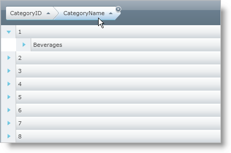
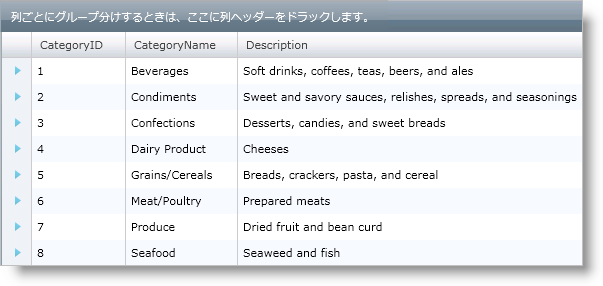

////

|metadata|
{
    "name": "xamgrid-groupby",
    "controlName": ["xamGrid"],
    "tags": ["Grids","Grouping","How Do I"],
    "guid": "{D3B841A9-4E1F-48E4-AB8C-17C01AE7571E}",  
    "buildFlags": [],
    "createdOn": "2016-05-25T18:21:55.9172007Z"
}
|metadata|
////

{XamGridHeader}

= GroupBy

xamGrid の GroupBy 機能によって、エンド ユーザーはデータをグループ化し、より読みやすく、ナビゲート可能なビューで表示できます。この機能では、列の上部または下部にセクションを表示し、エンドユーザーはそこで列をドラッグしてデータをグループ化できます。列がグループ化されると、コントロールは通常の link:{ApiPlatform}controls.grids.xamgrid{ApiVersion}~infragistics.controls.grids.row.html[Row] オブジェクトに代わって link:{ApiPlatform}controls.grids.xamgrid{ApiVersion}~infragistics.controls.grids.primitives.groupbyrow.html[GroupByRow] オブジェクトが表示されている Groupby 領域に列ヘッダーを表示します。GroupBy 行は、デフォルトでグループ内の項目の値および数を表示し、展開してその中にネストされたグループ化されたデータを表示することができます。

link:{ApiPlatform}controls.grids.xamgrid{ApiVersion}~infragistics.controls.grids.groupbysettings.html[GroupBySettings] オブジェクトを使用して xamGrid コントロール全体または個々の link:{ApiPlatform}controls.grids.xamgrid{ApiVersion}~infragistics.controls.grids.columnlayout.html[ColumnLayout] オブジェクトで GroupBy 機能を構成できます。link:{ApiPlatform}controls.grids.xamgrid{ApiVersion}~infragistics.controls.grids.groupbysettings~groupbycolumns.html[GroupByColumns] プロパティを使用、または列の link:{ApiPlatform}controls.grids.xamgrid{ApiVersion}~infragistics.controls.grids.column~isgroupby.html[IsGroupBy] プロパティを設定して列をグループ化することもできます。

注:

[NOTE]
====
link:{ApiPlatform}controls.grids.xamgrid{ApiVersion}~infragistics.controls.grids.row~childbands.html[ChildBands] プロパティは `GroupByRow` オブジェクトでサポートされません。この場合、コレクション プロパティは `null` を返します。
====

== GroupBy の動作

列が GroupBy 領域に既に存在する場合、列をドラッグすると、その列を既存の列の前または後に配置できます。矢印インジケーターは、列の配置でエンドユーザーをガイドします。同じ ColumnLayout オブジェクトの列だけを互いに順序付けることができます。

遅延スクロールが xamGrid で有効な場合、 link:{ApiPlatform}controls.grids.xamgrid{ApiVersion}~infragistics.controls.grids.deferredscrollingsettings~groupbydeferredscrolltemplate.html[GroupByDeferredScrollTemplate] プロパティを使用して、ユーザーがオンにしている現在の行などのスクロール中に、カスタム コンテンツを表示するようにテンプレートを設定します。遅延スクロールについての詳細は、 link:xamgrid-deferred-scrolling.html[「遅延スクロール」]を参照してください。

子コレクションから列を GroupBy 領域にドラッグすると、ColumnLayout オブジェクトのヘッダーが表示され、その後に GroupBy 領域の列ヘッダーが続きます。

ifdef::sl,wpf[]
image::images/sl_xamGrid_GroupBy_03.png[]
endif::sl,wpf[]

ifdef::win-rt[]
image::images/RT_xamGrid_GroupBy_03.png[]
endif::win-rt[]

列がドラッグされている間に Esc キーを押すと、GroupBy の試行がキャンセルされます。

列が以前にグループ化されている場合を除き、列のグループ化によって列は GroupByColumns コレクションに追加されます。さらに、列は並べ替えますが、この並べ替えはその後のいかなる並べ替えよりも優先度は高くなります。列がグループ化されていない場合を除き、並べ替えは削除できません。

列のグループ化を解除するには、GroupBy 領域の列ヘッダーを強調表示し、X アイコンをクリックするか列ヘッダーを GroupBy 領域の外にドラッグします。

ifdef::sl,wpf[]

endif::sl,wpf[]

ifdef::win-rt[]
image::images/RT_xamGrid_GroupBy_05.png[]
endif::win-rt[]

グループ化された列のデータを編集すると、行は再グループ化されません。再グループ化を強制するには、xamGrid の link:{ApiPlatform}controls.grids.xamgrid{ApiVersion}~infragistics.controls.grids.xamgrid~invalidatedata.html[InvalidateData] メソッドを呼び出します。

== Groupby を有効にする

以下のコードは、GroupBy 機能を有効にする方法を示します。

*Visual Basic の場合:*

----
Me.xamGrid1.GroupBySettings.AllowGroupByArea = Infragistics.Controls.Grids.GroupByAreaLocation.Top
Me.xamGrid1.Columns.ColumnLayouts("Products").GroupBySettings.IsGroupable = True
----

*C# の場合:*

----
this.xamGrid1.GroupBySettings.AllowGroupByArea = Infragistics.Controls.Grids.GroupByAreaLocation.Top;
this.xamGrid1.Columns.ColumnLayouts["Products"].GroupBySettings.IsGroupable = true;
----

ifdef::sl,wpf[]

endif::sl,wpf[]

ifdef::win-rt[]
image::images/RT_xamGrid_GroupBy_01.png[]
endif::win-rt[]

== コードでデータをグループ化

以下のコードは列に GroupBy 機能を使用する方法を 2 通り示します。ひとつは列の IsGroupBy プロパティを設定する方法で、もうひとつは GroupByColumns コレクションに列を追加するという方法です。

*Visual Basic の場合:*

----
' 列 1
Dim col1 As Column = Me.xamGrid1.Columns.DataColumns(0)
' 列 2
Dim col2 As Column = Me.xamGrid1.Columns.DataColumns(1)
' 列 1 を groupby コレクションに追加して列 1 をグループ化します
Me.xamGrid1.GroupBySettings.GroupByColumns.Add(col1)
' その GroupBy プロパティを設定して列 2 をグループ化します
col2.IsGroupBy = True
----

*C# の場合:*

----
// 列 1
Column col1 = this.xamGrid1.Columns.DataColumns[0];
// 列 2
Column col2 = this.xamGrid1.Columns.DataColumns[1];
// 列 1 を groupby コレクションに追加して列 1 をグループ化します
this.xamGrid1.GroupBySettings.GroupByColumns.Add(col1);
// その GroupBy プロパティを設定して列 2 をグループ化します
Col2.IsGroupBy = true;
----

ifdef::sl,wpf[]
image::images/sl_xamGrid_GroupBy_02.png[]
endif::sl,wpf[]

ifdef::win-rt[]
image::images/RT_xamGrid_GroupBy_02.png[]
endif::win-rt[]

==== 特定のグループ化された行の行数を表示します。

{ProductVersion} リリースから、特定のグループ化された行の行数を表示できます。カウントの表示はデフォルトの振る舞いですが、以下のコード スニペットに示されるように、 link:{ApiPlatform}controls.grids.xamgrid{ApiVersion}~infragistics.controls.grids.groupbysettings.html[GroupBySettings]オブジェクトの link:{ApiPlatform}controls.grids.xamgrid{ApiVersion}~infragistics.controls.grids.groupbysettings~displaycountongroupedrow.html[DisplayCountOnGroupedRow] プロパティを False に設定することにより簡単に無効にできます。

*XAML の場合:*

----
<ig:XamGrid.GroupBySettings>
   <ig:GroupBySettings AllowGroupByArea="Top" DisplayCountOnGroupedRow=" />
</ig:XamGrid.GroupBySettings>
----

*Visual Basic の場合:*

----
dataGrid.GroupBySettings.DisplayCountOnGroupedRow = false
----

*C# の場合:*

----
dataGrid.GroupBySettings.DisplayCountOnGroupedRow = false;
----

以下のスクリーンショットは、各グループ化された行の行数を表示します。

ifdef::sl,wpf[]
image::images/Display_Record_Counts_on_xamGrid_GroupBy_Headers_01.png[]
endif::sl,wpf[]

ifdef::win-rt[]
image::images/RT_Display_Record_Counts_on_xamGrid_GroupBy_Headers_01.png[]
endif::win-rt[]

== 関連トピック

link:xamgrid-custom-groupby.html[カスタム GroupBy]

link:xamgrid-custom-groupby-row-display.html[カスタム GroupBy 行の表示]

link:xamgrid-customize-groupby-deferred-scrolling-template.html[GroupBy の遅延スクロール テンプレートのカスタマイズ]

pick:[win-rt=" link:bb45cdbe-7149-49bc-a63a-1a77676c6986[タッチ サポート]"]