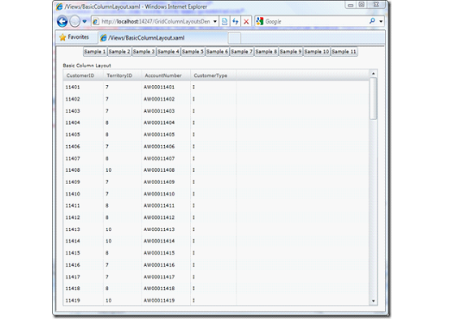

////

|metadata|
{
    "name": "xamgrid-manually-defining-a-basic-column-structure",
    "controlName": ["xamGrid"],
    "tags": ["Grids","How Do I","Layouts"],
    "guid": "b2442224-ae13-4a12-8da1-00fbffa8cf58",  
    "buildFlags": [],
    "createdOn": "2016-05-25T18:21:56.2941814Z"
}
|metadata|
////

{XamGridHeader}

= 基本的な列構造を手動で定義

xamGrid に表示される列をさらに制御するには、列構造コントロールを定義します。単純なフラットのオブジェクト構造を持つ場合、コントロールの link:{ApiPlatform}controls.grids.xamgrid{ApiVersion}~infragistics.controls.grids.xamgrid~columns.html[Columns] コレクション内で列を定義できます。

*XAML の場合:*

[source,xaml]
----
<ig:XamGrid x:Name="xamGrid1" AutoGenerateColumns="False"
    ItemsSource="{Binding Source={StaticResource categoryData}, Path=CategoriesAndProducts}">
    <ig:XamGrid.Columns>
    <ig:TextColumn Key="CategoryID" />
    <ig:TextColumn Key="CategoryName" />
    <ig:TextColumn Key="Description" />
    </ig:XamGrid.Columns>
    </ig:XamGrid>
----

ifdef::sl,wpf[]

endif::sl,wpf[]

ifdef::win-rt[]
image::images/RT_xamGrid_Define_Column_Layout_02.png[]
endif::win-rt[]

行ったのは自身の列レイアウトの定義で、この場合は xamGrid のルート レベルのレイアウトの定義です。列レイアウトの各 link:{ApiPlatform}controls.grids.xamgrid{ApiVersion}~infragistics.controls.grids.column.html[Column] オブジェクトは、データ ソース オブジェクトによって公開されるプロパティに一致するキーを提供することを求めます。

キーが定義されているが対応するプロパティがデータ オブジェクトで見つからない場合、グリッドは *InvalidColumnKeyException* エラーを表示します。また、列のコレクションを定義するが *AutoGenerateColumns* を無効にしない場合、グリッドに明示的に定義した列を含むだけでなく、明示的に定義された列を持たないデータ ソースによって公開されたプロパティの列も自動的に生成されます。

== 関連トピック

link:xamgrid-auto-generate-columns.html[列の自動生成]

link:xamgrid-defining-a-self-related-hierarchical-structure.html[自己関係の階層構造の定義]

link:xamgrid-defining-hierarchical-layouts.html[階層的レイアウトの定義]

link:xamgrid-defining-unstructured-column-layout-collections.html[構造化されていない列レイアウト コレクションの定義]

link:xamgrid-targettypename-resolution.html[TargetTypeName の解決]