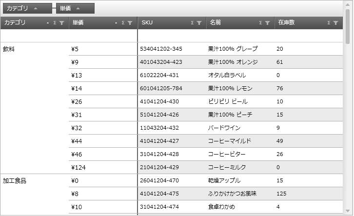
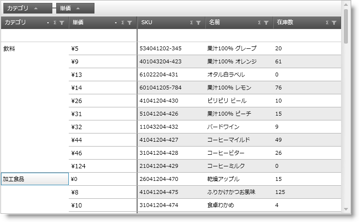
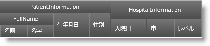
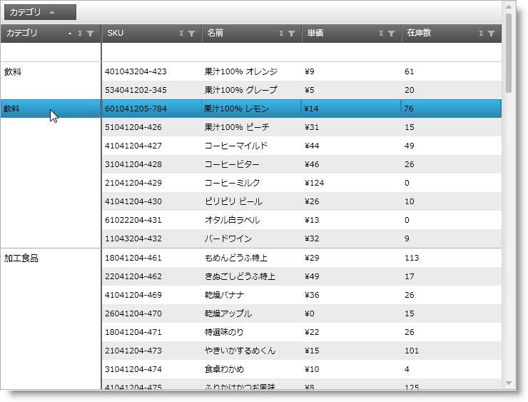

////

|metadata|
{
    "name": "xamgrid-merged-cells",
    "controlName": ["xamGrid"],
    "tags": ["Data Presentation","Grids","Layouts","Styling"],
    "guid": "218b4e28-3309-44d9-9991-fd25917e95be",  
    "buildFlags": [],
    "createdOn": "2016-05-25T18:21:56.4581999Z"
}
|metadata|
////

{XamGridHeader}

= 結合セル

セル結合機能は、グループ化されたデータの代替えのビューを提供します。グループは、 link:xamgrid-groupby.html[GroupBy] 機能を使用している場合、縮小されたグループ ヘッダーとして表示されるのではなく、結合されたセルとして表示されます (図 1)。

ifdef::sl,wpf[]

endif::sl,wpf[]

ifdef::win-rt[]
image::images/RT_xamGrid_CellMerging_01.png[]
endif::win-rt[]

図 1: セル結合機能を使用してグリッド内でグループ化された列

*セル結合を有効にする*

link:{ApiPlatform}controls.grids.xamgrid{ApiVersion}~infragistics.controls.grids.groupbysettings.html[GroupBySettings] のオブジェクトの link:{ApiPlatform}controls.grids.xamgrid{ApiVersion}~infragistics.controls.grids.groupbysettings~groupbyoperation.html[GroupByOperation] プロパティを link:{ApiPlatform}controls.grids.xamgrid{ApiVersion}~infragistics.controls.grids.groupbyoperation.html[MergeCells] に設定することで、xamGrid コントロールのセル結合を有効にできます。GroupBySettings オブジェクトの link:{ApiPlatform}controls.grids.xamgrid{ApiVersion}~infragistics.controls.grids.groupbysettings~allowgroupbyarea.html[AllowGroupByArea] プロパティを設定すると、データをグループ化するためにユーザーが列をドラッグできるグリッドの場所が決定されます。

*XAML の場合:*

----
xmlns:ig="http://schemas.infragistics.com/xaml"
<!-- セル結合を有効にします
     グリッドで GroupBy 領域を設定します -- > 
<ig:XamGrid.GroupBySettings>
   <ig:GroupBySettings AllowGroupByArea="Top" GroupByOperation="MergeCells" />
</ig:XamGrid.GroupBySettings>
----

*Visual Basic の場合:*

----
Imports Infragistics.Controls.Grids
' セル結合を有効にします
MyDataGrid.GroupBySettings.GroupByOperation = GroupByOperation.MergeCells
' グリッドで GroupBy 領域を設定します
MyDataGrid.GroupBySettings.AllowGroupByArea = GroupByAreaLocation.Top
----

*C# の場合:*

----
using Infragistics.Controls.Grids;
// セル結合を有効にします
MyDataGrid.GroupBySettings.GroupByOperation = GroupByOperation.MergeCells;
// グリッドで GroupBy 領域を設定します
MyDataGrid.GroupBySettings.AllowGroupByArea = GroupByAreaLocation.Top;
----

*セルの結合動作*

グリッドの列がセル結合機能を使用してグループ化される場合、グリッドの他の機能の一部は影響を受けて、動作が異なります。

以下のセクションは、セル結合機能によってグリッドのそれぞれの主要機能がどのように影響を受けるかについて説明しています。また、特定の機能がセル結合とどのように相互に作用するかについても説明します。

[NOTE]
====
*注:*

セル結合機能は、 link:xamgrid-filtering.html[フィルタリング]および link:xamgrid-add-new-row.html[新規行追加]機能の動作に影響を与えません。
====

link:xamgrid-activation.html[アクティブ化]キーボードを使用して結合されたセル列をナビゲートしている場合、非表示のセルを見ることができます。結合された列内のセルは MergedContentControl コントロールの下に配置されるので、エンドユーザーがコントロールを選択すると、下に隠されているセルがアクティブになり、行に表示されます(図 2)

ifdef::sl,wpf[]

endif::sl,wpf[]

ifdef::win-rt[]
image::images/RT_xamGrid_CellMerging_Activation_01.png[]
endif::win-rt[]

図 2: アクティブ セルのある xamGrid コントロール

*代替行スタイリング*

代替行スタイリングは、結合された列には表示されません。

link:xamgrid-column-moving.html[列移動]

ユーザーは結合された列を結合された列領域またはグリッドの他の領域内で移動できません。結合されていない列を結合された列領域に移動することもできません。

link:xamgrid-conditional-formatting.html[条件付き書式]

セルの結合機能が有効である場合、条件付き書式を実装できます。ただし、条件付き書式は MergedContentControl コントロールの下に隠れている個々のセルに表示されるので、結合されたセルは新しいスタイリングを表示しません。

link:xamgrid-editing-data.html[データの編集]

結合されていない列のセルを編集するのと同じように、結合された列内でセルを編集できます。結合された列のセルを編集すると、新しい値に基づいて、新しいグループに表示されます。

link:xamgrid-fixed-columns.html[固定列]

固定列は、結合された列の右に表示されます (図 2)。同じ FixedBorderIndicator コントロールが、個別の固定列および結合された列をグリッドの残りの列から分離するために使用されます。グリッドに結合された列および固定列が含まれる場合、FixedBorderIndicator コントロールは固定列の右に一度だけ表示します。

ユーザーは結合された列を固定できません。固定されたインジケーターは結合された列に表示されません。

ifdef::sl,wpf[]
image::images/xamGrid_CellMerging_FixedColumn_01.png[]
endif::sl,wpf[]

ifdef::win-rt[]
image::images/RT_xamGrid_CellMerging_FixedColumn_01.png[]
endif::win-rt[]

図 3: セルの結合および固定列が有効になった xamGrid コントロール

link:xamgrid-group-column.html[グループ列]

タイプ GroupColumn の列は結合できませんが、GroupColumn 列の子は結合できます。たとえば、以下のスクリーンショットに基づき、ユーザーは PatientInformation および FullName 列を結合できませんが、First Name および Last Name 列は結合できます。

図 4: GroupColumns が有効になった xamGrid コントロール

ユーザーが GroupColumn 列の子列を結合すると、特定の子列がグループから削除されます。その列の結合が解除されると、オリジナルのグループに戻ります。

ホバー

xamGrid コントロールの RowHover プロパティが Row に設定されている場合、マウスを結合された列の上に置くとその行のデータが表示されます(図 3)

ifdef::sl,wpf[]

endif::sl,wpf[]

ifdef::win-rt[]
image::images/RT_xamGrid_CellMerging_RowHover_01.png[]
endif::win-rt[]

図 5: 結合された列にホバーすると、その行のデータが表示

link:xamgrid-paging.html[ページング]

ページングおよびセル結合機能が xamGrid コントロールで有効である場合、ページングは期待通りに動作します。ページングのメカニズムは、結合された列の情報を分割して次ページに移動するため、結合された列の値は次ページでも表示されます。

link:xamgrid-sorting.html[並べ替え]

並べ替えおよびセル結合機能が xamGrid コントロールで有効である場合、すべての結合された列は、他の並べ替えられた列より優先されます。

link:xamgrid-summaries.html[集計]

集計およびセル結合機能が xamGrid コントロールで有効である場合、追加の集計行がそれぞれの結合されたグループで表示されます。集計値は、図 4 に示すように各グループに表示されます。

ifdef::sl,wpf[]
image::images/xamGrid_CellMerging_Summaries_01.png[]
endif::sl,wpf[]

ifdef::win-rt[]
image::images/RT_xamGrid_CellMerging_Summaries_01.png[]
endif::win-rt[]

図 6: 各グループに集計値を表示

*スタイリング ポイント*

セル結合機能では以下の 3 つの主なコントロールが使用されます。

* link:{ApiPlatform}controls.grids.xamgrid{ApiVersion}~infragistics.controls.grids.primitives.fixedbordercellcontrol.html[FixedBorderCellControl] - 結合された列を xamGrid コントロールの残りの列から分離する線
* link:{ApiPlatform}controls.grids.xamgrid{ApiVersion}~infragistics.controls.grids.primitives.mergedcontentcontrol.html[MergedContentControl] - 結合を表示するために使用されるセル
* link:{ApiPlatform}controls.grids.xamgrid{ApiVersion}~infragistics.controls.grids.primitives.mergedsummarycellcontrol.html[MergedSummaryCellControl] - 結合されたセルで使用される SummaryRows。これによって、これらの集計行を通常の集計行とは別にスタイルすることができます。

これらのコントロールを対象とするために使用できるプロパティはありません。代わりに、以下のコードで示すように、コントロールをスタイルするための暗示的なスタイリングを使用できます(図 5)

ifdef::sl,wpf[]
image::images/xamGrid_CellMerging_Styling_01.png[]
endif::sl,wpf[]

ifdef::win-rt[]
image::images/RT_xamGrid_CellMerging_Styling_01.png[]
endif::win-rt[]

図 7: コード例で実装されたスタイリング

ifdef::wpf[]

*XAML の場合:*

----
xmlns:igPrim="http://schemas.infragistics.com/xaml/primitives"
----

endif::wpf[]

*XAML の場合:*

----
xmlns:igPrim="http://schemas.infragistics.com/xaml/primitives"

----

== *関連トピック*

link:xamgrid-custom-display-for-merged-cells.html[結合されたセルのカスタム表示]

link:xamgrid-custom-merged-cells.html[カスタムの結合セル]