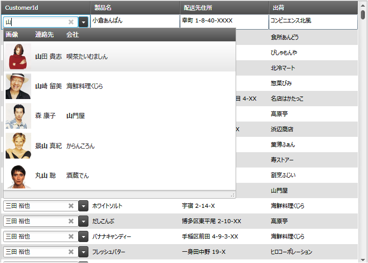

////
|metadata|
{
    "name": "xamgrid-multicolumncombo-column",
    "controlName": ["xamGrid"],
    "tags": ["Data Presentation","Grids","Layouts"],
    "guid": "c25379f4-3fb0-48a6-9bc8-c2aa6a9789ee",
    "buildFlags": [],
    "createdOn": "2016-05-25T18:21:56.5981981Z"
}
|metadata|
////

{XamGridHeader}

= MultiColumnCombo 列

=== 使用目的

このトピックでは、xamGrid™ コントロールで使用可能な MultiColumnCombo 列タイプについてご紹介します。xamGrid コントロール内での列の使用方法も説明します。

=== 前提条件

以下の表に、このトピックを理解するための前提条件として求められるトピックをリストします。

[options="header", cols="a,a"]
|====
|_トピック_|_目的_

| link:xamgrid-define-column-layout.html[列レイアウトの定義]
|このトピックでは、xamGrid コントロールを使用して列を作成する方法について説明します。

|====

== 概要

=== MultiColumnCombo 列の概要

MultiColumnCombo 列は、ドロップダウン リストで複数列を表示する列タイプです。xamGrid コントロールのセル値を編集するには、項目に事前設定されたドロップダウン リストから値を選択します。MultiColumnCombo 列と ComboBoxEditor 列の違いは、MultiColumnCombo は、グリッドのように複数列を制御することで、各データ項目に対してより多くの情報を表示できます。

=== 要件

MultiColumnCombo 列を XamGrid に追加するには、以下の NuGet パッケージ参照を追加する必要があります。

* Infragistics.WPF.Controls.Grids.MultiColumnComboColumn

NuGet フィードのセットアップと NuGet パッケージの追加の詳細については、link:nuget-feeds.html[NuGet フィード] ドキュメントを参照してください。

== MultiColumnCombo 列の構成 - 概念的概要

=== 概要

MultiColumnCombo 列は、他のあらゆるタイプの列と同じ方法で xamGrid に追加されます。MultiColumnCombo の link:{ApiPlatform}controls.grids.multicolumncombocolumn{ApiVersion}~infragistics.controls.grids.multicolumncombocolumn~autogeneratecolumns.html[AutoGenerateColumns] プロパティを設定することによって、列の手動追加または自動追加を選択できます (データソースによって異なる)。

*  _False_   - MultiColumnCombo タイプの列は手動で追加されます。
*  _True_   - 列は、データソースに基づいて自動的に生成されます。

=== プロパティ設定

以下の表は、推奨の構成/ビヘイビアーをプロパティ設定にマップしています。

[options="header", cols="a,a,a"]
|====
|以下を行うために:|プロパティ|次に設定

|データ ソースを設定します
| link:{ApiPlatform}controls.grids.multicolumncombocolumn{ApiVersion}~infragistics.controls.grids.multicolumncombocolumn~itemssource.html[ItemsSource]
|IEnumerable データ ソース

|列に複数列を生成させます
| link:{ApiPlatform}controls.grids.multicolumncombocolumn{ApiVersion}~infragistics.controls.grids.multicolumncombocolumn~autogeneratecolumns.html[AutoGenerateColumns]
|
* _True_ - 列は、データ ソースに基づいて自動的に生成されます 

* _False_ - 列を手動で追加します 

|ドロップダウンを閉じたときにどちらの値を表示するかを設定します
| link:{ApiPlatform}controls.grids.multicolumncombocolumn{ApiVersion}~infragistics.controls.grids.multicolumncombocolumn~displaymemberpath.html[DisplayMemberPath]
|ItemsSource からのキー

|コントロールのドロップダウンに表示される列を定義します (AutoGenerateColumns が _False_ に設定されている場合)
| link:{ApiPlatform}controls.grids.multicolumncombocolumn{ApiVersion}~infragistics.controls.grids.multicolumncombocolumn~columns.html[Columns]
|ComboColumns のコレクション

|ドロップダウンで選択した値を設定します
| link:{ApiPlatform}controls.grids.multicolumncombocolumn{ApiVersion}~infragistics.controls.grids.multicolumncombocolumn~selectedvaluepath.html[SelectedValuePath]
|ドロップダウンで選択した項目の値として使用される、ItemsSource からのキー

|====

== MultiColumnCombo 列の構成- コード例

=== 説明

ここでは例として、MultiColumnCombo 列を xamGrid コントロールに追加し、そのキー プロパティを設定する方法をとりあげます。また、項目のドロップ ダウン リストに列タイプを追加する方法についても説明します。以下の列タイプを追加できます。

* link:{ApiPlatform}controls.editors.xamcomboeditor{ApiVersion}~infragistics.controls.editors.imagecombocolumn_members.html[ImageComboColumn]
* link:{ApiPlatform}controls.editors.xamcomboeditor{ApiVersion}~infragistics.controls.editors.checkboxcombocolumn_members.html[CheckboxComboColumn]
* link:{ApiPlatform}controls.editors.xamcomboeditor{ApiVersion}~infragistics.controls.editors.datecombocolumn_members.html[DateComboColumn]
* link:{ApiPlatform}controls.editors.xamcomboeditor{ApiVersion}~infragistics.controls.editors.textcombocolumn_members.html[TextComboColumn]

以下のスクリーンショットは、次のような設定により、MultiColumnCombo が xamGrid コントロール内でどのように見えるかを示しています。

[options="header", cols="a,a"]
|====
|プロパティ|値

| link:{ApiPlatform}controls.grids.multicolumncombocolumn{ApiVersion}~infragistics.controls.grids.multicolumncombocolumn~itemssource.html[ItemsSource]
|StaticResource customerlist

| link:{ApiPlatform}controls.grids.multicolumncombocolumn{ApiVersion}~infragistics.controls.grids.multicolumncombocolumn~autogeneratecolumns.html[AutoGenerateColumns]
|False

| link:{ApiPlatform}controls.grids.multicolumncombocolumn{ApiVersion}~infragistics.controls.grids.multicolumncombocolumn~displaymemberpath.html[DisplayMemberPath]
|ContactName

| link:{ApiPlatform}controls.grids.multicolumncombocolumn{ApiVersion}~infragistics.controls.grids.multicolumncombocolumn~selectedvaluepath.html[SelectedValuePath]
|CustomerId

| link:{ApiPlatform}controls.grids.multicolumncombocolumn{ApiVersion}~infragistics.controls.grids.multicolumncombocolumn~columns.html[Columns]
|ImageComboColumn および TextComboColumn などの、追加された ComboColumns のコレクション

|====

=== コード

*XAML の場合:*

[source,xaml]
----
<ig:XamGrid x:Name="dataGrid"
            AutoGenerateColumns="False"
            ColumnWidth="*">
   <ig:XamGrid.Columns>
      <!--MultiColumnComboColumn を追加-->
      <ig:MultiColumnComboColumn Key="CustomerId" x:Name="customerList"
                                 ItemsSource="{StaticResource customerList}"
                                 AutoGenerateColumns="False"
                                 DisplayMemberPath="ContactName"
                                 SelectedValuePath="CustomerId">
       <!--Combo 列を Columns コレクションへ追加-->
       <ig:MultiColumnComboColumn.Columns>
            <ig:ImageComboColumn Key="ImagePath"
                                 MaximumWidth="60"
                                 ImageWidth="50" >
            </ig:ImageComboColumn>
            <ig:TextComboColumn Key="ContactName" />
            <ig:TextComboColumn Key="Company" />
         </ig:MultiColumnComboColumn.Columns>
      </ig:MultiColumnComboColumn>
   </ig:XamGrid.Columns>
</ig:XamGrid>
----

== 関連コンテンツ

以下のトピックでは、このトピックに関連する情報を提供しています。

[options="header", cols="a,a"]
|====
|トピック|目的

| link:xamgrid-columns.html[列]
|このセクションでは、xamGrid コントロール内で使用できるさまざまな列について説明します

| link:xammulticolumncomboeditor.html[xamMultiColumnComboEditor]
|このトピックは、xamMultiColumnComboEditor コントロールに関する情報を提供します

|====
