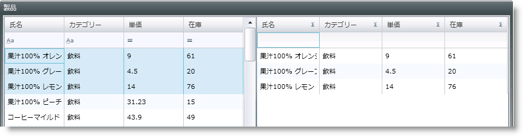

////

|metadata|
{
    "name": "xamgrid-paste-event-and-event-arguments",
    "controlName": ["xamGrid"],
    "tags": ["Events","Grids","How Do I"],
    "guid": "f459a7f9-cd8c-436e-a5c6-af9538ea9b88",  
    "buildFlags": [],
    "createdOn": "2016-05-25T18:21:56.2641793Z"
}
|metadata|
////

{XamGridHeader}

= 貼り付けイベントおよびイベント引数

xamGrid コントロールで貼り付けのサポートが有効で、エンドユーザーが貼り付け操作を開始すると、 link:{ApiPlatform}controls.grids.xamgrid{ApiVersion}~infragistics.controls.grids.xamgrid~clipboardpasting_ev.html[ClipboardPasting] イベントが起動されます。これはキャンセル可能なイベントではなく、一度だけ実行されます。

link:{ApiPlatform}controls.grids.xamgrid{ApiVersion}~infragistics.controls.grids.clipboardpastingeventargs.html[ClipboardPastingEventArgs] には以下の 2 つのプロパティがあります。

* link:{ApiPlatform}controls.grids.xamgrid{ApiVersion}~infragistics.controls.grids.clipboardpastingeventargs~clipboardvalue.html[ClipboardValue] - 貼り付けられるオリジナルのクリップボード コンテンツを含みます。
* link:{ApiPlatform}controls.grids.xamgrid{ApiVersion}~infragistics.controls.grids.clipboardpastingeventargs~values.html[Values] - 解析されたクリップボード文字列を含み、設定可能なプロパティです。

以下の例のコードは、ClipboardPasting イベントの使用を示します。この例では、選択されたデータは最初の xamGrid コントロールからコピーされ、2 番目の xamGrid コントロールに貼り付けられます。2 番目の xamGrid コントロールにデータが貼り付けられる前に簡単な計算が行われます。

この例では、開発者に提供される link:resources-datautil.html[DataUtil] クラスを使用します。

1.まず、2 つの xamGrid コントロールを {PlatformName} ページ内の Grid コンテナーに追加します。2 番目の xamGrid コントロールには、最初の xamGrid コントロールからの UnitPrice および UnitsInStock 列の乗じた値の結果が含まれます。複数行のコピー操作は、ソース xamGrid コントロールで有効となり、貼り付け操作は 2 番目のコントロールで有効となります。

*XAML の場合:*

----
<Grid x:Name="LayoutRoot">
    <Grid.Resources>
        <data:DataUtil x:Key="DataUtil" />
    </Grid.Resources>
    <Grid.ColumnDefinitions>
        <ColumnDefinition Width="*" />
        <ColumnDefinition Width="*" />
    </Grid.ColumnDefinitions>
    <ig:XamGrid Width="450" Height="300" Grid.Column="0" 
 x:Name="sourceXamGrid" AutoGenerateColumns="False" 
 ItemsSource="{Binding Source={StaticResource DataUtil}, Path=Products}">
        <ig:XamGrid.Columns>
            <ig:TextColumn Key="ProductID" />
            <ig:TextColumn Key="ProductName" />
            <ig:TextColumn Key="UnitPrice" FormatString="{}{0:C}" />
            <ig:TextColumn Key="UnitsInStock" />
        </ig:XamGrid.Columns>
        <ig:XamGrid.SelectionSettings>
            <ig:SelectionSettings CellClickAction="SelectRow" 
                                  RowSelection="Multiple" />
            </ig:XamGrid.SelectionSettings>
        <ig:XamGrid.ClipboardSettings>
            <ig:ClipboardSettings AllowCopy="True" 
                                  CopyOptions="ExcludeHeaders" />
        </ig:XamGrid.ClipboardSettings>
    </ig:XamGrid>
    <ig:XamGrid Width="400" Height="300" Grid.Column="1" 
                x:Name="targetXamGrid" AutoGenerateColumns="False"
                ClipboardPasting="targetXamGrid_ClipboardPasting" >
        <ig:XamGrid.Columns>
            <ig:TextColumn Key="ProductID" />
            <ig:TextColumn Key="ProductName" />
            <ig:TextColumn Key="TotalPrice" FormatString="{}{0:C}" />   
        </ig:XamGrid.Columns>
        <ig:XamGrid.ClipboardSettings>
            <ig:ClipboardSettings AllowPaste="True" />
        </ig:XamGrid.ClipboardSettings>
    </ig:XamGrid>
</Grid>
----

2.追加フィールドで、例で使用される Product クラスを拡張します。

*Visual Basic の場合:*

----
Public Class ProductExtended Inherits Product
    Private m_totalPrice As Decimal
    Public Property TotalPrice() As Decimal
        Get
            Return m_totalPrice
        End Get
        Set(ByVal value As Decimal)
            m_TotalPrice = Value
        End Set
    End Property
End Class
----

*C# の場合:*

----
public class ProductExtended : Product
{
// このメンバーは、UnitPrice および UnitsInStock 値の乗じた値 を含みます
    public Decimal TotalPrice { get; set; }
}
----

3.最後に、実装を ClipboardPasting イベント ハンドラーに追加します。

*Visual Basic の場合:*

----
Private Sub targetXamGrid_ClipboardPasting(ByVal sender As Object, ByVal e As Infragistics.Controls.Grids.ClipboardPastingEventArgs)
    Dim collection As New ObservableCollection(Of ProductExtended)()
    For Each row In e.Values
        Dim productData = New ProductExtended()
        productData.ProductID = Convert.ToInt32(row(0))
        productData.ProductName = row(1)
        productData.TotalPrice = 
(Convert.ToDecimal(row(2))) $$*$$ (Convert.ToDecimal(row(3)))
        collection.Add(productData)
    Next
    targetXamGrid.ItemsSource = collection
End Sub
----

*C# の場合:*

----
void targetXamGrid_ClipboardPasting(object sender, 
Infragistics.Controls.Grids.ClipboardPastingEventArgs e)
{
    ObservableCollection<ProductExtended> collection = 
new ObservableCollection<ProductExtended>()
    foreach (var row in e.Values)
    {
        ProductExtended productData = new ProductExtended();
        productData.ProductID = Convert.ToInt32(row[0]);
        productData.ProductName = row[1];
        productData.TotalPrice = (Convert.ToDecimal(row[2])) $$*$$ (Convert.ToDecimal(row[3]));
        collection.Add(productData);
    }
    targetXamGrid.ItemsSource = collection;
}
----

4.{PlatformName} プロジェクトを実行します。

ifdef::sl,wpf[]

endif::sl,wpf[]

ifdef::win-rt[]
image::images/RT_xamGrid_PasteExample.png[]
endif::win-rt[]