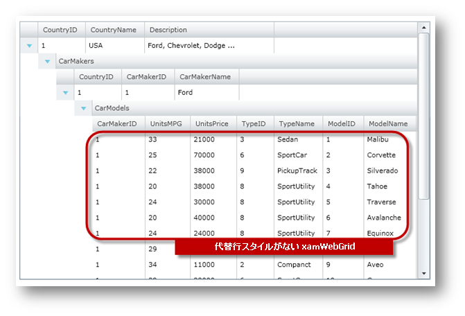

////

|metadata|
{
    "name": "xamgrid-remove-alternative-row-styling",
    "controlName": ["xamGrid"],
    "tags": ["Grids","Styling"],
    "guid": "{54419B35-8119-4E86-8C84-8AEF48CB13BF}",  
    "buildFlags": [],
    "createdOn": "2016-05-25T18:21:56.1172114Z"
}
|metadata|
////

{XamGridHeader}

= 代替え行スタイリングの削除

xamGrid コントロールは、代替行のスタイルを削除するシンプルな方法を提供します。これを実現するには、 link:{ApiPlatform}controls.grids.xamgrid{ApiVersion}~infragistics.controls.grids.xamgrid~isalternaterowsenabled.html[IsAlternateRowsEnabled] プロパティを False に設定します。この構成では、すべての行は同じスタイルを使用して描画されます。

以下のコードは、隔行のスタイルを削除する方法を示します。

*XAML の場合:*

----
<ig:XamGrid x:Name="xamGrid"
    ItemsSource="{Binding Source={StaticResource DataToolCars}, Path=CountryCarMakers}"
    IsAlternateRowsEnabled=" />
----

*Visual Basic の場合:*

----
Imports Infragistics
Imports Infragistics.Controls.Grids
' ...
Dim xamGrid As New XamGrid()
' 隔行のスタイルを削除します。
xamGrid.IsAlternateRowsEnabled = False
xamGrid.ItemsSource = DataTool.CategoriesAndProducts
' xamGrid オブジェクトをコントロールのグリッドに追加します
Me.LayoutRoot.Children.Add(xamGrid)
----

*C# の場合:*

----
using Infragistics;
using Infragistics.Controls.Grids;
// ...
xamGrid xamGrid = new XamGrid();
xamGrid.IsAlternateRowsEnabled = false;
xamGrid.ItemsSource = DataTool.CategoriesAndProducts;
// xamGrid オブジェクトをコントロールのグリッドに追加します
this.LayoutRoot.Children.Add(xamGrid);
----

以下の画像は、代替行のスタイルを設定しない場合、xamGrid コントロールがどのように表示されるのかを示します。

ifdef::sl,wpf[]

endif::sl,wpf[]

ifdef::win-rt[]
image::images/RT_xamGrid_Remove_Alternative_Row_Styling_01.png[]
endif::win-rt[]

== 関連トピック

link:xamgrid-add-new-row.html[新規行の追加]

link:xamgrid-add-row-commands.html[行コマンドの追加]

link:xamgrid-auto-expand-data-rows-and-child-bands.html[データ行と子バンドの自動展開]

link:xamgrid-change-row-hover-type.html[行ホバー タイプの変更]

link:xamgrid-row-deletion.html[行の削除]