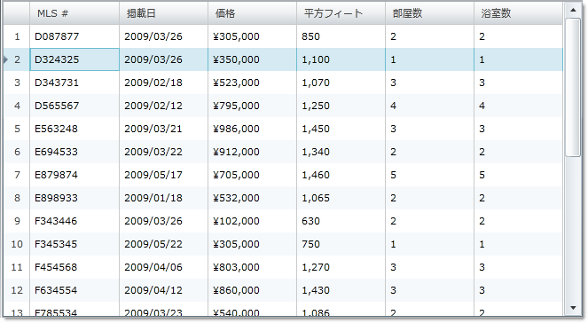

////

|metadata|
{
    "name": "xamgrid-row-selectors",
    "controlName": ["xamGrid"],
    "tags": ["Grids","How Do I","Selection"],
    "guid": "{1ABB13B7-B489-42E3-8E4C-1CE2606AF36B}",  
    "buildFlags": [],
    "createdOn": "2016-05-25T18:21:55.7331897Z"
}
|metadata|
////

{XamGridHeader}

= 行セレクター

行セレクターは xamGrid で各行の前に現れる要素です。行セレクターは行を選択またはアクティブ化するために主に使用されます。ところが、行セレクターをクリックすると、行セレクターのイベントを処理することによって、その行でカスタム アクションを実行できます。詳細は「行セレクターイベントの処理」を参照してください。行セレクターで行番号を表示することもできます。

クリックした時に行を自動的に選択するように行セレクターを構成するには、行選択を有効にする必要があります。詳細は link:xamgrid-selection.html[「選択」]トピックを参照してください。

アクティブ化が有効の間行セレクターをクリックするとその行の最初のセルをアクティブにします。アクティブ化を有効にする詳細は、 link:xamgrid-activation.html[「アクティブ化」]トピックを参照してください。

以下のコードで示すように、 link:{ApiPlatform}controls.grids.xamgrid{ApiVersion}~infragistics.controls.grids.rowselectorsettings.html[RowSelectorSettings] オブジェクトの link:{ApiPlatform}controls.grids.xamgrid{ApiVersion}~infragistics.controls.grids.visualsettingsbase~visibility.html[Visibility] プロパティを Visible に設定することで、xamGrid で行セレクターを有効にできます。

*XAML の場合:*

----
<ig:XamGrid x:Name="MyGrid" AutoGenerateColumns="False">
   <ig:XamGrid.RowSelectorSettings>
      <ig:RowSelectorSettings Visibility="Visible"/>
   </ig:XamGrid.RowSelectorSettings>
   …
</ig:XamGrid>
----

*Visual Basic の場合:*

----
Imports Infragistics.Controls.Grids
...
Me.MyGrid.RowSelectorSettings.Visibility = Visibility.Visible
----

*C# の場合:*

----
using Infragistics.Controls.Grids;
...
this.MyGrid.RowSelectorSettings.Visibility = Visibility.Visible;
----

以下のスクリーン ショットは、行セレクターがデフォルト設定の xamGrid を示しています。

ifdef::sl,wpf[]

endif::sl,wpf[]

ifdef::win-rt[]
image::images/RT_xamGrid_Enable_Row_Selectors_01.png[]
endif::win-rt[]

== 関連トピック

link:xamgrid-disable-row-numbering.html[行の番号付けを無効にする]

link:xamgrid-row-selector-events.html[行セレクター イベント]