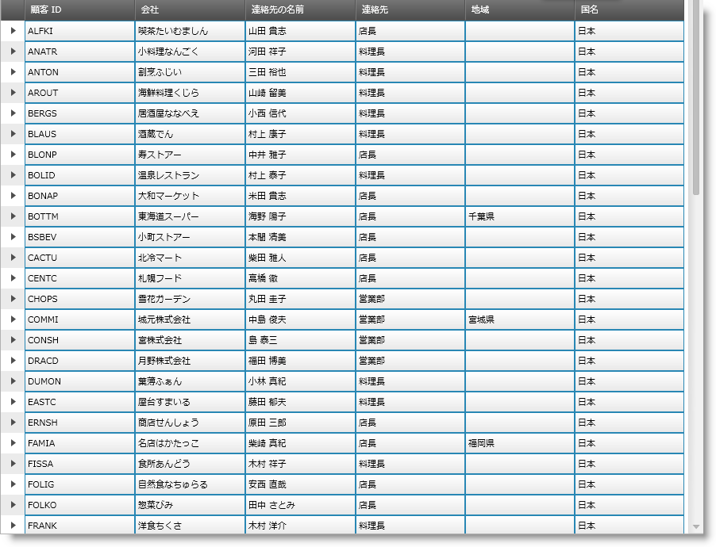
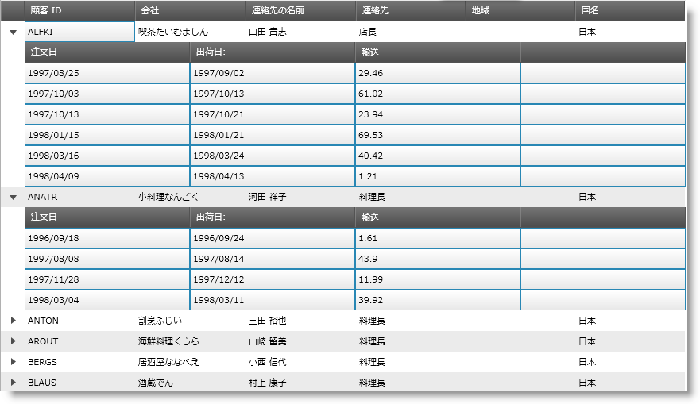
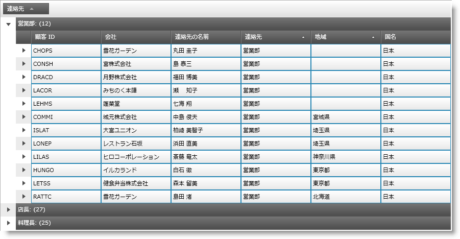

////

|metadata|
{
    "name": "xamgrid-select-all-xamgrid-rows-in-groups-bands-and-at-the-root",
    "controlName": ["xamGrid"],
    "tags": ["Grids","Grouping","How Do I","Selection"],
    "guid": "eec34d1d-2f95-49a8-861e-0c45caad33cf",  
    "buildFlags": [],
    "createdOn": "2016-05-25T18:21:56.4932032Z"
}
|metadata|
////

{XamGridHeader}

= すべての xamGrid 行をグループ、バンドおよびルートで選択

== トピックの概要

== 目的

このトピックは、 link:{ApiPlatform}controls.grids.xamgrid{ApiVersion}~infragistics.controls.grids.rowcollection.html[RowCollection] の link:{ApiPlatform}controls.grids.xamgrid{ApiVersion}~infragistics.controls.grids.rowcollection~selectall.html[SelectAll] メソッドを使用する方法を紹介します。SelectAll メソッドを使用し、以下を実行できます。

* xamGrid コントロールのルート レベルにあるすべての行を取得します。
* 特定の子バンドに対するすべての行を選択します。
* 特定のグループ化に対するすべての行を選択します。

== 必要な背景

まず以下のトピックを読む必要があります。

* link:xamgrid-adding-xamgrid-to-your-page.html[xamGrid をページに追加]
* link:xamgrid-selection.html[選択]
* link:xamgrid-groupby.html[GroupBy]

== グリッド内の行を選択する

== 概要

この手順では、xamGrid コントロールの行を選択する方法を示します。メソッドは、RowsCollection に追加され、以下を実行するために使用できます。

* グリッドのルート レベルにあるすべての行を選択します。
* 特定の子バンドに対するすべての行を選択します。
* 特定のグループに対するすべての行を選択します。

SelectAll メソッドを呼び出すと、 link:{ApiPlatform}controls.grids.xamgrid{ApiVersion}~infragistics.controls.grids.xamgrid~selectedrowscollectionchanged_ev.html[SelectedRowsCollectionChanged] イベントが発生します。

== プレビュー

以下は最終結果のプレビューです。

以下のスクリーンショットは、ルート レベルのすべての行が選択された状態の xamGrid コントロールを示します。

ifdef::sl,wpf[]

endif::sl,wpf[]

ifdef::win-rt[]
image::images/RT_Select_All_xamGrid_Rows_in_Groups_Bands_and_at_the_Root_01.png[]
endif::win-rt[]

以下のスクリーンショットは、特定の子バンドの行が選択された状態の xamGrid を示します。

ifdef::sl,wpf[]

endif::sl,wpf[]

ifdef::win-rt[]
image::images/RT_Select_All_xamGrid_Rows_in_Groups_Bands_and_at_the_Root_02.png[]
endif::win-rt[]

以下のスクリーンショットは、特定のグループ化の行が選択された状態の xamGrid を示します。

ifdef::sl,wpf[]

endif::sl,wpf[]

ifdef::win-rt[]
image::images/RT_Select_All_xamGrid_Rows_in_Groups_Bands_and_at_the_Root_03.png[]
endif::win-rt[]

== 要件

手順を完了するには、以下が必要です:

* xamGrid コントロールは階層データにバインドされます。
* GroupBy が有効

== 概要

以下はプロセスの概念的概要です。

* xamGrid コントロールのルート レベルにあるすべての行を選択します。
* 特定の子バンドに対するすべての行を選択します。
* 特定のグループ化に対するすべての行を選択します。

== 手順

*xamGrid コントロールのルート レベルにあるすべての行を選択します。*

xamGrid の link:{ApiPlatform}controls.grids.xamgrid{ApiVersion}~infragistics.controls.grids.xamgrid~rows.html[Rows] において SelectAll メソッドを呼び出すことにより実行されます。

*C# の場合:*

----
dataGrid.Rows.SelectAll();
----

*Visual Basic の場合:*

----
dataGrid.Rows.SelectAll()
----

*特定の子バンドに対するすべての行を選択します。*

特定の子バンドの link:{ApiPlatform}controls.grids.xamgrid{ApiVersion}~infragistics.controls.grids.childbandrowsmanager~rows.html[Rows] において SelectAll メソッドを呼び出すことにより実行されます。

注:

[NOTE]
====
link:{ApiPlatform}controls.grids.xamgrid{ApiVersion}~infragistics.controls.grids.row~childbands.html[ChildBands] プロパティは `GroupByRow` オブジェクトでサポートされません。この場合、コレクション プロパティは `null` を返します。
====

*C# の場合:*

----
dataGrid.Rows[0].ChildBands[0].Rows.SelectAll();
----

*Visual Basic の場合:*

----
dataGrid.Rows(0).ChildBands(0).Rows.SelectAll()
----

*特定のグループに対するすべての行を選択します。*

特定のグループ化の行において SelectAll メソッドを呼び出すことにより実行されます。

*C# の場合:*

----
((GroupByRow)dataGrid.Rows[0]).Rows.SelectAll();
----

*Visual Basic の場合:*

----
CType(dataGrid.Rows(0),GroupByRow).Rows.SelectAll()
----

== *関連トピック*

以下は、その他の役立つトピックです。

link:xamgrid-selection.html[選択]

link:xamgrid-adding-xamgrid-to-your-page.html[xamGrid をページに追加]

link:xamgrid-groupby.html[GroupBy]