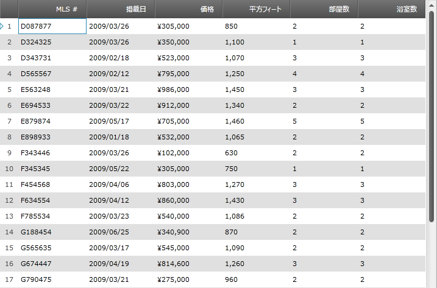

////

|metadata|
{
    "name": "xamgrid-set-the-text-alignment-on-column-headers",
    "controlName": ["xamGrid"],
    "tags": ["Grids","Styling"],
    "guid": "9745d893-9f8d-4559-8b6f-e4191f03dd0f",  
    "buildFlags": [],
    "createdOn": "2016-05-25T18:21:56.1632139Z"
}
|metadata|
////

{XamGridHeader}

= 列ヘッダーでテキストの配置を設定

link:{ApiPlatform}controls.grids.xamgrid{ApiVersion}~infragistics.controls.grids.column~headertexthorizontalalignment.html[HeaderTextHorizontalAlignment] および link:{ApiPlatform}controls.grids.xamgrid{ApiVersion}~infragistics.controls.grids.column~headertextverticalalignment.html[HeaderTextVerticalAlignment] プロパティを設定することによって、列ヘッダーのテキスト配置を設定できます。xamGrid コントロール、列、または ColumnLayout でこのプロパティを設定できます。

列でのプロパティ設定は、ColumnLayout でのプロパティ設定よりも優先されます。

ColumnLayout でのプロパティ設定は、xamGrid でのプロパティ設定よりも優先されます。

列および ColumnLayout には、2 つの追加のプロパティがあります:

* link:{ApiPlatform}controls.grids.xamgrid{ApiVersion}~infragistics.controls.grids.column~headertexthorizontalalignmentresolved.html[HeaderTextHorizontalAlignmentResolved]
* link:{ApiPlatform}controls.grids.xamgrid{ApiVersion}~infragistics.controls.grids.column~headertextverticalalignmentresolved.html[HeaderTextVerticalAlignmentResolved]

これらの読み取り専用の 2 つのプロパティは、特定の ColumnLayout または列の実際の値を検証するために使用されます。

[NOTE]
====
*注:* ColumnLayout と列の HeaderTextHorizontalAlignment および HeaderTextVerticalAlignment は null を使用できる列挙体であるため、XAML ではこれらに対するインテリセンスはありません。ただし、xamGrid の HeaderTextHorizontalAlignment および HeaderTextVerticalAlignment プロパティは null を使用できないため、インテリセンスがあります。
====

*XAML の場合:*

----
<ig:XamGrid x:Name="MyDataGrid" ItemsSource="{Binding Source={StaticResource DataUtil}, Path=CategoriesAndProducts}" 
                           AutoGenerateColumns="False" HeaderTextHorizontalAlignment="Right">
   <ig:XamGrid.Columns>
      <ig:TextColumn Key="CategoryID"/>
      <ig:TextColumn HeaderTextHorizontalAlignment="Left" Key="CategoryName"/>
   </ig:XamGrid.Columns>
</ig:XamGrid>
----

*Visual Basic の場合:*

----
MyDataGrid.HeaderTextHorizontalAlignment = HorizontalAlignment.Right
MyDataGrid.Columns.DataColumns("CategoryName").HeaderTextHorizontalAlignment = HorizontalAlignment.Left
----

*C# の場合:*

----
MyDataGrid.HeaderTextHorizontalAlignment = HorizontalAlignment.Right;
MyDataGrid.Columns.DataColumns["CategoryName"].HeaderTextHorizontalAlignment = HorizontalAlignment.Left;
----

ifdef::sl,wpf[]

endif::sl,wpf[]

ifdef::win-rt[]
image::images/RT_xamWebGrid_Set_Column_Text_Alignment_01.png[]
endif::win-rt[]