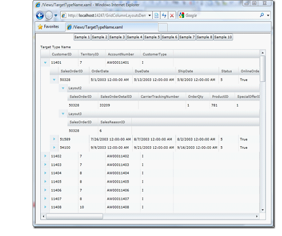

////

|metadata|
{
    "name": "xamgrid-targettypename-resolution",
    "controlName": ["xamGrid"],
    "tags": ["Data Binding","Data Presentation","Grids","How Do I"],
    "guid": "34f30d79-a510-46eb-bb03-4c69357eb0f9",  
    "buildFlags": [],
    "createdOn": "2016-05-25T18:21:56.312187Z"
}
|metadata|
////

{XamGridHeader}

= TargetTypeName の解決

これまでは列レイアウトの定義のためのすべての例で、バインドされたデータ ソース内の特定のプロパティ名に対応するキーが求められます。しかし、特定のプロパティ名を知らなかったり、または場合によっては複数のプロパティが同じオブジェクト タイプを返すことがあるため、両方が同じ列レイアウトを使用することを確認したい場合があります。これらのシナリオでは、 link:{ApiPlatform}controls.grids.xamgrid{ApiVersion}~infragistics.controls.grids.columnlayout~targettypename.html[TargetTypeName] プロパティを使用して ColumnLayout オブジェクトをデータ ソース プロパティにマッピングすることを考えることができます。

TargetTypeName プロパティによって、ColumnLayout オブジェクトとデータ ソース プロパティ間のマッピングを指定できます。これは、データ ソース プロパティが公開するコレクションに含まれるオブジェクトの Type 名に TargetTypeName 値を一致させるように xamGrid を指示することによって行います。

TargetTypeName プロパティを含むように Customers サンプルを変更できます。今度は、Products と呼ばれるプロパティを探す代わりに、xamGrid は Product オブジェクトのコレクションを公開する任意のプロパティを探します。

*XAML の場合:*

[source,xaml]
----
<ig:XamGrid x:Name="xamGrid1" AutoGenerateColumns="False"
    ItemsSource="{Binding Source={StaticResource categoryData}, Path=CategoriesAndProducts}">
        <ig:XamGrid.Columns>
    <ig:TextColumn Key="CategoryID" />
    <ig:TextColumn Key="CategoryName" />
    <ig:TextColumn Key="Description" />
    </ig:XamGrid.Columns>
    <ig:XamGrid.ColumnLayouts >
    <ig:ColumnLayout TargetTypeName="Product" Key="Layout1">
    <ig:ColumnLayout.Columns>
    <ig:TextColumn Key="ProductID" />
    <ig:TextColumn Key="ProductName" />
    <ig:TextColumn Key="UnitPrice"/>
    </ig:ColumnLayout.Columns>
    </ig:ColumnLayout>
    </ig:XamGrid.ColumnLayouts>
    </ig:XamGrid>
----

このサンプルを実行すると、期待したのと同じ階層表示が得られます。

ifdef::sl,wpf[]

endif::sl,wpf[]

ifdef::win-rt[]
image::images/RT_xamGrid_Define_Column_Layout_07.png[]
endif::win-rt[]

TargetTypeName プロパティを使用には、Key プロパティの値を提供することが必要ですが、今度は Key は任意の文字列を使用できます。データ ソース プロパティにマップする必要はなくなりました。

== 関連トピック

link:xamgrid-auto-generate-columns.html[列の自動生成]

link:xamgrid-defining-a-self-related-hierarchical-structure.html[自己関連階層構造の定義]

link:xamgrid-defining-hierarchical-layouts.html[階層的レイアウトの定義]

link:xamgrid-defining-unstructured-column-layout-collections.html[構造化されていない列レイアウト コレクションの定義]

link:xamgrid-manually-defining-a-basic-column-structure.html[基本的な列構造を手動で定義]