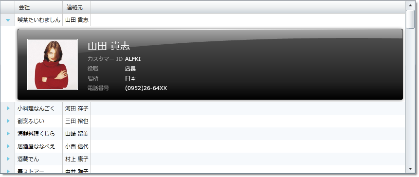

////

|metadata|
{
    "name": "xamgrid-template-column-layout",
    "controlName": ["xamGrid"],
    "tags": ["Grids","How Do I","Layouts"],
    "guid": "{0DE914B0-002D-403D-9D9B-0D6A924EE990}",  
    "buildFlags": [],
    "createdOn": "2016-05-25T18:21:56.0882081Z"
}
|metadata|
////

{XamGridHeader}

= テンプレート列のレイアウト

特定のケースでは、xamGrid コントロールは多くの情報を含む大きなデータ構造を視覚化しなければならない場合があります。ほとんどの場合、エンドユーザーは集計表示だけを必要とします。他の場合、エンドユーザーは特定の項目の詳細にドリルする必要ことも必要となります。

Template Column Layout は、行データの詳細表示をコントロールに追加することを可能にする xamGrid コントロールの機能です。この機能によって、テンプレートを使用してカスタムでレイアウトを定義できます。

テンプレート列のレイアウトが列レイアウトに含まれていると、展開インジケーターが各行に表示されます。展開インジケーターをクリックすると、テンプレートを表示できるようにするために行が展開され、もう一度クリックするとテンプレートが縮小されます。

たとえば、人の名前が付いた列を含むグリッドがあり、その人の情報をグリッド内の別の列として表示せずに、エンド ユーザーが必要に応じて情報を確認できるようにしたいとします。これを実現するには、この情報を含む列テンプレート レイアウトを作成します。エンド ユーザーが展開インジケーターをクリックすると、追加情報がエンド ユーザーに対して表示されます。

以下のコードは、テンプレート列のレイアウトを xamGrid に追加する方法を示します。

*XAML の場合:*

----
<ig:XamGrid Grid.Row="0" x:Name="MyDataGrid"  AutoGenerateColumns="False">
   <ig:XamGrid.Columns>
      <ig:TextColumn Key="ProductID"/>
      <ig:TextColumn Key="ProductName"/>
      <ig:TemplateColumnLayout Key="UnitPrice">
         <ig:TemplateColumnLayout.Template>
            <DataTemplate>
               <Grid>
                  <TextBox Text="{Binding UnitPrice}"/>
               </Grid>
            </DataTemplate>
         </ig:TemplateColumnLayout.Template>
      </ig:TemplateColumnLayout>
   </ig:XamGrid.Columns>
</ig:XamGrid>
----

ifdef::sl,wpf[]

endif::sl,wpf[]

ifdef::win-rt[]
image::images/RT_xamGrid_Template_Column_Layout_01.png[Sorting]
endif::win-rt[]