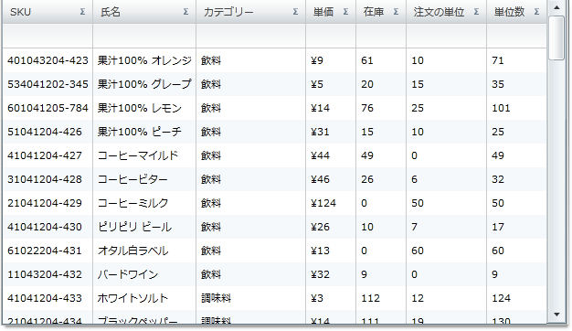

////

|metadata|
{
    "name": "xamgrid-unbound-column",
    "controlName": ["xamGrid"],
    "tags": ["Data Presentation","Getting Started","Grids","How Do I","Layouts"],
    "guid": "{28BE8D77-5EA6-4AA5-A885-7A5515475A93}",  
    "buildFlags": [],
    "createdOn": "2016-05-25T18:21:56.0752109Z"
}
|metadata|
////

{XamGridHeader}

= 非バインド列

非バインド列によって、特定なデータにバインドしない xamGrid コントロールに列を追加できます。ただし、計算された値を表示するためには代わりに ValueConverter を使用します。

*非バインド列の作成*

UnboundColumn タイプを使用することによって、非バインド列を xamGrid に追加できます。バンド / ColumnLayout に一意の列に link:{ApiPlatform}controls.grids.xamgrid{ApiVersion}~infragistics.controls.grids.columnbase~key.html[Key] プロパティを割り当てる必要があります。列にデータを表示するには、ValueConverter を実装する必要があります。

以下のコードは、ValueConverter プロパティが ValueConverter に設定された非バインド列を作成する方法を示します。

*XAML の場合:*

----
<!-- 開始 UserControl タグに ValueConverter の名前空間宣言を追加します。 -- >
xmlns:helper="clr-namespace:xamSamples_XAML"
<!--コンバーターのリソースを追加します。 -->
<UserControl.Resources>
   <helper:TotalUnitsConverter x:Key="TotalUnitsConverter"/>
</UserControl.Resources>
<Grid x:Name="LayoutRoot" Background="White">
   <ig:XamGrid Grid.Row="0" x:Name="MyDataGrid"
   AutoGenerateColumns="False" ColumnWidth="*">
      <ig:XamGrid.Columns>
         <ig:TextColumn Key="ProductID"/>
         <ig:TextColumn Key="ProductName"/>
         <ig:TextColumn Key="QuantityPerUnit"/>
         <ig:TextColumn Key="UnitPrice"/>
         <ig:TextColumn Key="UnitsInStock"/>
         <ig:TextColumn Key="UnitsOnOrder"/>
         <ig:TextColumn Key="ReorderLevel"/>
         <ig:TextColumn Key="Discontinued"/>
         <!--非バインド列を作成し、ValueConverter にフックアップします。 -->
         <ig:UnboundColumn Key="Total Units" ValueConverter="{StaticResource TotalUnitsConverter}"/>
      </ig:XamGrid.Columns>
   </ig:XamGrid>
</Grid>
----

*Visual Basic の場合:*

----
Dim MyColumn As New UnboundColumn()
MyColumn.Key = "Total Units"
MyColumn.ValueConverter = New TotalUnitsConverter()
Me.MyDataGrid.Columns.Add(MyColumn)
----

*C# の場合:*

----
this.MyDataGrid.Columns.Add(new UnboundColumn() {Key = "Total Units", ValueConverter = new TotalUnitsConverter()});
----

以下のコードは、前述の例で使用された ValueConverter です。このコンバーターは、UnitsInStock および UnitsOnOrder 列を追加することによって、合計ユニットを表示します。

*Visual Basic の場合:*

----
Public Class TotalUnitsConverter
    Implements IValueConverter
    Public Function Convert(ByVal value As Object, ByVal targetType As Type, ByVal parameter As Object, ByVal culture As System.Globalization.CultureInfo) As Object
        Dim p As NorthwindServiceReference.Product = CType(value, NorthwindServiceReference.Product)
        If (Not (p) Is Nothing) Then
            Return (p.UnitsInStock + p.UnitsOnOrder)
        End If
        Return Nothing
    End Function
    Public Function ConvertBack(ByVal value As Object, ByVal targetType As Type, ByVal parameter As Object, ByVal culture As System.Globalization.CultureInfo) As Object
        Throw New NotImplementedException
    End Function
End Class
----

*C# の場合:*

----
public class TotalUnitsConverter : IValueConverter
{
   public object Convert(object value, Type targetType, object parameter, System.Globalization.CultureInfo culture)
   {
      NorthwindServiceReference.Product p = value as NorthwindServiceReference.Product;
      if (p != null)
      {
         return p.UnitsInStock + p.UnitsOnOrder;
      }
      return null;
   }
   public object ConvertBack(object value, Type targetType, object parameter, System.Globalization.CultureInfo culture)
   {
      throw new NotImplementedException();
   }
}
----

ifdef::sl,wpf[]

endif::sl,wpf[]

ifdef::win-rt[]
image::images/RT_xamGrid_Unbound_Column_01.png[Sorting]
endif::win-rt[]

*非バインド列の移動、リサイズおよび固定*

列の移動、列のサイズ変更、および列の固定などの基本的な xamGrid 列の機能はすべて、追加の操作なしに非バインド列で機能します。これらの機能の詳細は、 link:xamgrid-column-moving.html[列の移動]、 link:xamgrid-column-resizing.html[列のサイズ変更] および link:xamgrid-fixed-columns.html[固定列]トピックを参照してください。

*非バインド列のフィルタリングおよび集計*

デフォルトでは、 link:{ApiPlatform}controls.grids.xamgrid{ApiVersion}~infragistics.controls.grids.column~isfilterable.html[IsFilterable] および link:{ApiPlatform}controls.grids.xamgrid{ApiVersion}~infragistics.controls.grids.column~issummable.html[IsSummable] プロパティは非バインド列で False に設定されています。これは、カスタム フィルターおよび集計が非バインド列に書き込まれる必要があるからです。非バインド列でフィルタリングおよび集計を有効にするには、列の IsFilterable および IsSummable プロパティを True に設定し、カスタム フィルターまたは集計を書き込む必要があります。詳細は、 link:xamgrid-create-a-custom-filter.html[カスタム フィルターの作成]および link:xamgrid-create-a-custom-summary.html[カスタム集計の作成]トピックを参照してください。

.注:
[NOTE]
====
UnboundColumn の場合、xamGrid フィルター メニューでフィルター機能は無効です。
====

==== 関連トピック

link:xamgrid-sorting-unbound-columns.html[非バインド列の並べ替え]

link:xamgrid-itemtemplate-binding.html[ItemTemplate のバインド]

link:xamgrid-editing-unbound-columns.html[非バインド列の編集]