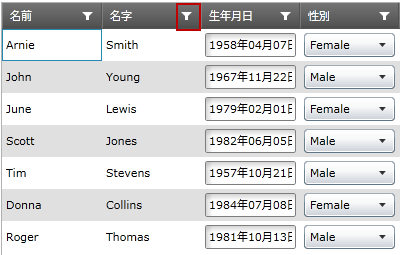
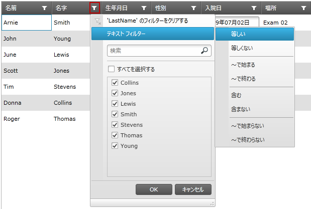
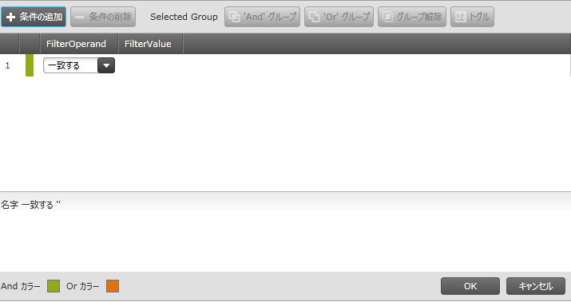

////

|metadata|
{
    "name": "xamgrid-using-the-custom-filter-dialog",
    "controlName": ["xamGrid"],
    "tags": ["Filtering","Grids"],
    "guid": "9a784b79-eddb-4ed4-9330-e4d05d8d34f0",  
    "buildFlags": [],
    "createdOn": "2016-05-25T18:21:56.5842021Z"
}
|metadata|
////

{XamGridHeader}

= カスタム フィルター ダイアログの使用

== トピックの概要

=== 目的

このトピックでは、xamGrid™ のカスタム フィルター ダイアログ機能、およびエンド ユーザーがダイアログ インターフェイスを使って列のデータに複合フィルターを作成する方法について説明します。

=== 前提条件

以下の表に、このトピックを理解するための前提条件として求められるトピックをリストします。

[options="header", cols="a,a"]
|====
|トピック|目的

| link:xamgrid-filtering.html[フィルター処理]
|このトピックでは、エンド ユーザーが xamGrid コントロールに含まれるデータをフィルターする方法を説明します。

|====

=== 本トピックの内容

このトピックには次のセクションがあります。

* <<_Ref319878370, コントロールの構成の概要 >>
* <<_Ref319878380, カスタム フィルター ダイアログの有効化 >>
* <<_Ref319878389, ユーザー相互作用と操作性 >>
* <<_Ref319878405, 関連コンテンツ >>

[[_Ref319878370]]
== コントロールの構成の概要

=== コントロールの構成の概要

以下の表は、xamGrid コントロールのカスタム フィルター ダイアログのフィルタリングおよび効化の構成可能な特性を示しています。詳細については、概要表の後をご覧ください。

[options="header", cols="a,a,a"]
|====
|構成可能な特性|詳細|プロパティ

|カスタム フィルター ダイアログの有効化
|エンド ユーザーがカスタム フィルター ダイアログにアクセスできるようにするには、FilterMenu を通してフィルタリングを有効にする必要があります。
| link:{ApiPlatform}controls.grids.xamgrid{ApiVersion}~infragistics.controls.grids.filteringsettings~allowfiltering.html[AllowFiltering]

|====

[[_Ref319878380]]
== カスタム フィルター ダイアログの有効化

=== 概要

xamGrid コントロールのフィルタリングおよびフィルター メニューを有効にすると、 エンド ユーザーはカスタム フィルター ダイアログにアクセスできます。

=== プロパティ設定

以下の表では、希望の構成をプロパティ設定にマップしています。

[options="header", cols="a,a,a"]
|====
|以下を行うために:|プロパティ|次に設定

|カスタム フィルター ダイアログを有効にします
| link:{ApiPlatform}controls.grids.xamgrid{ApiVersion}~infragistics.controls.grids.filteringsettings~allowfiltering.html[AllowFiltering]
| _FilterMenu_ 

|====

=== 例

以下のスクリーンショットは、以下の設定によってフィルタリングを有効にした後の、フィルター メニューおよびカスタム フィルター ダイアログの外観を示しています。

[options="header", cols="a,a"]
|====
|プロパティ|値

| link:{ApiPlatform}controls.grids.xamgrid{ApiVersion}~infragistics.controls.grids.filteringsettings~allowfiltering.html[AllowFiltering]
| _FilterMenu_ 

|====

ifdef::sl,wpf[]

endif::sl,wpf[]

ifdef::win-rt[]
image::images/RT_xamGrid-Using_the_Custom_Filter_Dialog_1.png[]
endif::win-rt[]

図 1 FilterMenu アイコン

ifdef::sl,wpf[]

endif::sl,wpf[]

ifdef::win-rt[]
image::images/RT_xamGrid-Using_the_Custom_Filter_Dialog_2.png[]
endif::win-rt[]

図 2 フィルター メニューを開く

ifdef::sl,wpf[]

endif::sl,wpf[]

ifdef::win-rt[]
image::images/RT_xamGrid-Using_the_Custom_Filter_Dialog_3.png[]
endif::win-rt[]

図 3 カスタム フィルター メニュー

[[_Ref319878389]]
== ユーザー相互作用と操作性

=== ユーザー相互作用の概要

以下の表は、xamGrid コントロールのカスタム フィルター ダイアログの、ユーザー インタラクション機能の概要を示しています。表の後に、その他の詳細が紹介されています。

[options="header", cols="a,a,a,a"]
|====
|ユーザーは以下を実行できます...|次の使用...|詳細|クライアント/サーバー設定

|新しいフィルタリング条件の追加
|_条件の追加_ ボタン
|このボタンをクリックすると、フィルタリング条件グリッドに新規エントリが作成されます。
|image::images/xamGrid-Using_the_Custom_Filter_Dialog_4.png[]

|フィルタ オペランドの編集
|フィルタ オペランド フィールドのコンボ ボックス
|フィルタ オペランド フィールドには編集可能なコンボ ボックスが含まれており、フィルターされた列のデータ タイプに適切なすべてのオペランドが表示されます。
|image::images/xamGrid-Using_the_Custom_Filter_Dialog_4.png[]

|フィルター値の編集
|フィルター値 フィールドのエディター
|フィルター値 フィールドには、フィルターされた列のデータ タイプ用の特定のエディターが含まれています。
|image::images/xamGrid-Using_the_Custom_Filter_Dialog_4.png[]

|選択された条件を削除します
|_条件の削除_ ボタン
|このボタンをクリックすると、選択した条件が削除されます。
|image::images/xamGrid-Using_the_Custom_Filter_Dialog_4.png[]

|And グループで 2 つ以上の選択した条件を組み合わせます
|And Group ボタン
|このボタンをクリックすると、2 つ以上の選択した条件が AND 演算子と結合され、括弧でグループが囲まれます。
|image::images/xamGrid-Using_the_Custom_Filter_Dialog_4.png[]

|Or グループで 2 つ以上の選択した条件を組み合わせます
|*Or Group* ボタン
|このボタンをクリックすると、2 つ以上の選択した条件が OR 演算子と結合され、括弧でグループが囲まれます。
|image::images/xamGrid-Using_the_Custom_Filter_Dialog_4.png[]

|論理演算子 AND および OR を切り替えます
|Toggle ボタン
|このボタンをクリックすると、選択した条件の間で論理演算子が切り替わります
|image::images/xamGrid-Using_the_Custom_Filter_Dialog_4.png[]

|新しく作成した複合フィルターの承認および適用
|Accept ボタン
|このボタンをクリックすると、新しく作成した複合フィルターが列データに適用されます。
|image::images/xamGrid-Using_the_Custom_Filter_Dialog_4.png[]

|作成したフィルターを適用せずにダイアログを閉じます
|Cancel ボタン
|このボタンをクリックすると、作成したフィルターを列データに適用せずにダイアログが閉じます。
|image::images/xamGrid-Using_the_Custom_Filter_Dialog_4.png[]

|====

[[_Ref319878405]]
== 関連コンテンツ

=== トピック

以下のトピックでは、このトピックに関連する情報を提供しています。

[options="header", cols="a,a"]
|====
|トピック|目的

| link:xamgrid-filtering-events.html[イベントのフィルタリング]
|このトピックは、xamGrid コントロールのフィルタリング イベントについて説明します。

| link:xamgrid-programmatically-create-a-filter.html[プログラムによってフィルターを作成]
|このトピックでは、フィルターをプログラムで作成する方法を示します。

| link:xamgrid-create-a-custom-filter.html[カスタム フィルターの作成]
|このトピックでは、xamGrid コントロールに新しいカスタム フィルターを追加する方法を示します。

| link:xamgrid-filter-operands.html[フィルター オペランド]
|このトピックでは、特定のフィルタ オペランドの変更方法、または特定のフィルタ オペランドをフィルター行から削除する方法を示します。

ifdef::win-rt[]
| link:xamgrid-touch-support.html[タッチ サポート]
|このトピックでは、xamGrid コントロールの利用可能なタッチ インタラクションを説明します。
endif::win-rt[]

|====