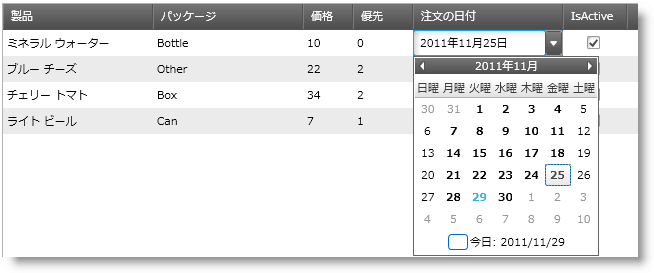

////
|metadata|
{
    "name": "xaminputs-using-xaminput-controls-in-xamgrid-cells-for-data-editing",
    "controlName": ["xamInputs"],
    "tags": ["Editing","Grids","How Do I"],
    "guid": "c83b3b39-4be2-4800-a28b-559dfb9291bb",
    "buildFlags": [],
    "createdOn": "2016-05-25T18:21:56.9152169Z"
}
|metadata|
////

{XamInputHeader}

= データ編集用の xamGrid セルにおける xamInput コントロールの使用

== 目的

このトピックでは、xamGrid のセルの値を編集する際に、様々な xamInput コントロールの編集機能を活用する方法を説明します。

== 本トピックの内容

このドキュメントには次のセクションが含まれています:

* 前提条件
* はじめに
* 概要
* 手順

== 前提条件

まず以下のトピックを読む必要があります。

* link:xamgrid-about-xamgrid.html[xamGrid について]
* link:xamgrid-adding-xamgrid-to-your-page.html[xamGrid をページに追加]
* link:xamgrid-create-a-template-column.html[テンプレート列の作成]
* link:xamgrid-editing-data-in-a-template-column.html[テンプレート列でデータを編集]
* link:xammaskedinput-using.html[xamMaskedInput の使用]

== xamGrid コントロールで xamInputs をセルとして使用

== はじめに

xamInput コントロールの重要な特徴は、xamGrid コントロールと組み合わせて使用できることです。この機能によって、ユーザーは、セルの値を編集しながら入力コントロールを最大限に活用でき、それと同時に入力されたデータが事前定義された条件を満たしているかどうかを確認することができます。

このトピックでは、xamGrid コントロールが xamInput コントロールと連動して動作するアプリケーションの作成方法を説明します。xamInputs をグリッドのテンプレート列と共に使用する方法を理解できるようになることに主眼を置いています。

== プレビュー

以下は、Date Ordered フィールドの日付ピッカーを提供するために xamDateTimeInput コントロールを xamGrid 内で使用した最終結果のプレビューです。

== 概要

以下はプロセスの概念的概要です。

[start=1]
. link:xaminputs-using-xaminput-controls-in-xamgrid-cells-for-data-editing.html#CreateProject[プロジェクトの作成と必要な参照の追加]
[start=2]
. link:xaminputs-using-xaminput-controls-in-xamgrid-cells-for-data-editing.html#AddDataSource[データ ソースの追加]
[start=3]
. link:xaminputs-using-xaminput-controls-in-xamgrid-cells-for-data-editing.html#AddNamespace[XAML Infragistics 名前空間の追加]
[start=4]
. link:xaminputs-using-xaminput-controls-in-xamgrid-cells-for-data-editing.html#AddXamGrid[xamGrid コントロールのインスタンスの追加]
[start=5]
. link:xaminputs-using-xaminput-controls-in-xamgrid-cells-for-data-editing.html#EnableEditing[編集を有効にする]
[start=6]
. link:xaminputs-using-xaminput-controls-in-xamgrid-cells-for-data-editing.html#CreateColumns[テンプレート列の定義]
[start=7]
. link:xaminputs-using-xaminput-controls-in-xamgrid-cells-for-data-editing.html#CreateColumns[xamGrid の ItemsSource の設定]
[start=8]
. link:xaminputs-using-xaminput-controls-in-xamgrid-cells-for-data-editing.html#Build[プロジェクトの構築と実行]

== 手順

[[CreateProject]]
[start=1]
. *プロジェクトの作成*

{PlatformName} プロジェクトを作成します。次に、以下の NuGet パッケージ参照をプロジェクトに追加します。

** Infragistics.WPF.Controls.Editors.XamDateTimeInput
** Infragistics.WPF.Controls.Grids.XamGrid

+
NuGet フィードのセットアップと NuGet パッケージの追加の詳細については、link:nuget-feeds.html[NuGet フィード] ドキュメントを参照してください。

[[AddDataSource]]
[start=2]
. *データ ソースを追加します。*

.. *データ ソース クラスを追加します。*

MainWindow.xaml.cs ファイルで、 link:xaminputs-using-xaminput-controls-in-xamgrid-cells-for-data-editing.html#Listing1[リスト 1] からのクラス定義を追加します。

.. *XML コンテンツ ファイルの追加*

... link:resources-productdeliverytask.html[ProductDeliveryTask.xml] をダウンロードし、それを {PlatformName} プロジェクトのディレクトリにコピーします。
... Visual Studio の ソリューション エクスプローラーで、プロジェクトを右クリックして [追加] > [既存の項目] を選択します。
... ウィンドウで link:resources-productdeliverytask.html[ProductDeliveryTask.xml]ファイルを見つけ、[追加] をクリックします。このファイルには xamGrid のサンプルデータが含まれています。
... そのプロパティを開き、その Build Action を Content (1) に設定します。
... Copy to OutputDirectory プロパティを Copy if newer (2) に設定します。

image::images/xamInputs_xamInputsInGrid_BuildAction.png[]

[[AddNamespace]]
[start=3]
. *XAML Infragistics 名前空間の追加*

MainWindow.xaml を開き、以下の名前空間を Window タグに追加します。

*XAML の場合:*

[source,xaml]
----
xmlns:ig="http://schemas.infragistics.com/xaml"
xmlns:editors="http://schemas.infragistics.com/xaml"
----

[[AddXamGrid]]
[start=4]
. *xamGrid コントロールのインスタンスの追加*

メインのレイアウト Grid コントロール内に xamGrid を挿入し、後で参照するために、それに x:Name の値を与えます。グリッド宣言は次のようになります。

*XAML の場合:*

[source,xaml]
----
<ig:XamGrid x:Name="myGrid"> <ig:XamGrid/>
----

[[EnableEditing]]
[start=5]
. *編集を有効にする*

デフォルトでは、xamGrid のコンテンツは編集できません。これを変更するには次の手順を実行します。

.. xamGrid の EditingSettings プロパティのタグを宣言します。
.. タグ内の EditingSettings オブジェクトを追加します。
.. EditingSettings オブジェクトの AllowEditing プロパティを None 以外の値に設定します。

[[CreateColumns]]
[start=6]
. *テンプレート列の定義*

次に、指定したデータ ソースに従い、テンプレート列を作成します。

.. *xamGrid の Columns プロパティのタグを宣言します。*
.. *Product 名の TemplateColumn を列コレクションに追加します。*

TemplateColumns は、ItemTemplate および EditorTemplate プロパティを公開し、これによってセルのコンテンツの表示・編集方法を指定することができます。これには、セルのコンテンツをデータ テンプレートのインスタンスに設定する必要があります。項目とエディター テンプレートのデータ コンテキストは、現在の行が表すデータ オブジェクトです。

... Key プロパティを設定します。

TemplateColumn の Key は、datasource オブジェクトのパブリック プロパティの名前と一致する必要があります。ProductDeliveryTask オブジェクトの場合、最初のテンプレート列の Key は「Name」になります。オプションで、TemplateColumn の HeaderText プロパティを設定することもできます。これを省略すると、Key は列のヘッダーとして使用されます。
... TemplateColumn.ItemTemplate を設定します。

列の項目テンプレートとして設定されたデータ テンプレートを使用して、データを表示します。選択できるアプローチの 1 つは項目テンプレート内の xamInput コントロールの使用で、もう 1 つは EditorTemplate 内の xamInput コントロールの使用です。以下の例では、2 番目のアプローチが示されています。そのため、データを表示するために、その Text プロパティがデータ コンテキスト オブジェクトの Name プロパティにバインドされているテキスト ボックスを使用できます。
... TemplateColumn.EditorTemplate を設定します。

これは、構成プロセスの最も重要な手順です。セル値の編集のために xamInput コントロールを使用するには、対応する列のエディター テンプレートとして設定されたデータ テンプレートにそのコントロールを追加する必要があります。使用する xamInput コントロールは、編集することになるデータのタイプによって異なります。Product 列に最も適した xamInput コントロールは xamMaskedInput です。これは、製品名はテキスト プロパティであるためです。列のエディター テンプレートで xamMaskedInput を追加した後、datasource オブジェクトの対応するプロパティ (この例では Name) にその値プロパティをバインドする必要があります。これによって、ユーザーがこの列のセルのコンテンツを編集するとき、xamMaskedEditor が使用されるようになります。また、ニーズに合うように適宜 xamMaskedInput コントロールを構成することができます。たとえば、通常は少なくともマスク プロパティは設定します。

これは Product 列の宣言です。

*XAML の場合:*

[source,xaml]
----
<ig:TemplateColumn HeaderText="Product" Key="Name">
    <ig:TemplateColumn.ItemTemplate>
        <DataTemplate>
            <TextBlock Text="{Binding Name}" />
        </DataTemplate>
    </ig:TemplateColumn.ItemTemplate>
    <ig:TemplateColumn.EditorTemplate>
        <DataTemplate>
            <editors:XamMaskedInput 
                Value="{Binding Name, Mode=TwoWay}"  
                Mask="CCCCCCCCCCCCCCCCCCCCCC" />
        </DataTemplate>
    </ig:TemplateColumn.EditorTemplate>
</ig:TemplateColumn>
----

.. *残りの TemplateColumns を追加します。*

前の手順で説明されたプロセスを使用して、ProductDeliveryTask オブジェクトの PriorityLevel、Package、Price および DateOrdered プロパティにテンプレート列を追加します。完成した xaml は、 link:xaminputs-using-xaminput-controls-in-xamgrid-cells-for-data-editing.html#Listing2[リスト 2] を参照してください。

[[SetItemsSource]]
[start=7]
. *xamGrid の ItemsSource の設定*

次に、ProductDeliveryTask オブジェクトを設定し、これらを xamGrid の ItemsSource として設定します。link:xaminputs-using-xaminput-controls-in-xamgrid-cells-for-data-editing.html#Listing3[リスト 3] は、LINQ to XML を使用して ProductDeliveryTask.xml ファイルのデータをグリッドに投入する方法を示しています。
[[Build]]
[start=8]
. *プロジェクトの構築と実行*

== コード例

=== 例の概要

以下の表は、以下に提供されたコード例を示しています。

[options="header", cols="a,a"]
|====
|例|説明

| link:xaminputs-using-xaminput-controls-in-xamgrid-cells-for-data-editing.html#Listing1[データ ソース クラスの宣言]
|xamGrid のデータ ソースとして使用されるクラスのコード。

| link:xaminputs-using-xaminput-controls-in-xamgrid-cells-for-data-editing.html#Listing2[テンプレート列の定義]
|xamGrid に Template 列を作成するために使用されるコード。

| link:xaminputs-using-xaminput-controls-in-xamgrid-cells-for-data-editing.html#Listing3[xamGrid の ItemsSource の設定]
|ProductDeliveryTask.xml ファイルのデータを使用して、ProductDeliveryTask オブジェクトのリストを作成するためのコード。

|====

リスト 1: データ ソース クラスの定義

[[Listing1]]

*VB の場合:*

----
Public Class ProductDeliveryTask
        Public Property Name() As String
                Get
                        Return m_Name
                End Get
                Set(value As String)
                        m_Name = Value
                End Set
        End Property
        Private m_Name As String
        Public Property PriorityLevel() As Integer
                Get
                        Return m_PriorityLevel
                End Get
                Set(value As Integer)
                        m_PriorityLevel = Value
                End Set
        End Property
        Private m_PriorityLevel As Integer
        Public Property Package() As String
                Get
                        Return m_Package
                End Get
                Set(value As String)
                        m_Package = Value
                End Set
        End Property
        Private m_Package As String
        Public Property Price() As Decimal
                Get
                        Return m_Price
                End Get
                Set(value As Decimal)
                        m_Price = Value
                End Set
        End Property
        Private m_Price As Decimal
        Public Property DateOrdered() As System.Nullable(Of DateTime)
                Get
                        Return m_DateOrdered
                End Get
                Set(value As System.Nullable(Of DateTime))
                        m_DateOrdered = Value
                End Set
        End Property
        Private m_DateOrdered As System.Nullable(Of DateTime)
        Public Property IsActive() As Boolean
                Get
                        Return m_IsActive
                End Get
                Set(value As Boolean)
                        m_IsActive = Value
                End Set
        End Property
        Private m_IsActive As Boolean
End Class      
----

*C# の場合:*               
[source,csharp]
----
public class ProductDeliveryTask
    {
        public string Name { get; set; }
        public int PriorityLevel { get; set; }
        public Packaging Package { get; set; }
        public decimal Price { get; set; }
        public DateTime? DateOrdered { get; set; }
        public bool IsActive { get; set; }
    }
----

リスト 2: テンプレート列の作成

[[Listing2]]

*XAML の場合:*

[source]
----
<ig:XamGrid ItemsSource="{Binding}">
    <ig:XamGrid.EditingSettings>
        <ig:EditingSettings AllowEditing="Hover"/>
    </ig:XamGrid.EditingSettings>
    <ig:XamGrid.Columns>
        <ig:TemplateColumn HeaderText="Product" Key="Name">
            <ig:TemplateColumn.ItemTemplate>
                <DataTemplate>
                    <TextBlock Text="{Binding Name}"/>
                </DataTemplate>
            </ig:TemplateColumn.ItemTemplate>
            <ig:TemplateColumn.EditorTemplate>
                <DataTemplate>
                    <editors:XamMaskedInput                         
                        Mask="CCCCCCCCCCCCCCCCCCCCCC"                      
                        Value="{Binding Name, Mode=TwoWay}" />
                  </DataTemplate>
              </ig:TemplateColumn.EditorTemplate>
          </ig:TemplateColumn>
          <ig:TemplateColumn HeaderText="Packaging" Key="Package" >
              <ig:TemplateColumn.ItemTemplate>
                  <DataTemplate>
                      <TextBlock Text="{Binding Package}"/>
                  </DataTemplate>
              </ig:TemplateColumn.ItemTemplate>
              <ig:TemplateColumn.EditorTemplate>
                  <DataTemplate>
                      <editors:XamMaskedInput                         
                          Mask="CCCCCC"
                          Value="{Binding Package, Mode=TwoWay}" />
                  </DataTemplate>
              </ig:TemplateColumn.EditorTemplate>
          </ig:TemplateColumn>
          <ig:TemplateColumn HeaderText="Price" Key="Price">
              <ig:TemplateColumn.ItemTemplate>
                  <DataTemplate>
                       <TextBlock Text="{Binding Price}"/>
                   </DataTemplate>
               </ig:TemplateColumn.ItemTemplate>
               <ig:TemplateColumn.EditorTemplate>
                  <DataTemplate>
                      <editors:XamCurrencyInput                       
                          Mask="{}{currency:3.2}"
                          Value="{Binding Price, Mode=TwoWay}" />
                  </DataTemplate>
               </ig:TemplateColumn.EditorTemplate>
          </ig:TemplateColumn>
          <ig:TemplateColumn HeaderText="Priority" Key="ProrityLevel" >
              <ig:TemplateColumn.ItemTemplate>
                  <DataTemplate>
                      <TextBlock Text="{Binding PriorityLevel}"/>
                  </DataTemplate>
              </ig:TemplateColumn.ItemTemplate>
              <ig:TemplateColumn.EditorTemplate>
                  <DataTemplate>
                      <editors:XamNumericInput                        
                          Mask="{}{number:0-4}"
                          Value="{Binding PriorityLevel, Mode=TwoWay}" />
                  </DataTemplate>
              </ig:TemplateColumn.EditorTemplate>
          </ig:TemplateColumn>
          <ig:TemplateColumn HeaderText="DateOrdered" Key="DateOrdered">
              <ig:TemplateColumn.ItemTemplate>
                  <DataTemplate>
                      <TextBlock Text="{Binding DateOrdered}"/>
                  </DataTemplate>
              </ig:TemplateColumn.ItemTemplate>
              <ig:TemplateColumn.EditorTemplate>
                  <DataTemplate>
                      <editors:XamDateTimeInput                       
                          DropDownButtonDisplayMode="Always"
                          Value="{Binding DateOrdered, Mode=TwoWay}" />
                  </DataTemplate>
              </ig:TemplateColumn.EditorTemplate>
          </ig:TemplateColumn>
      </ig:XamGrid.Columns>
</ig:XamGrid>               
----

リスト 3: xamGrid コントロールの ItemSource の設定

[[Listing3]]

*Visual Basic の場合:*
[source,vb]
----
Imports System.Linq
Imports System.Xml.Linq
...
Public Sub MainWindow_Loaded(sender As Object, e As RoutedEventArgs)
        Dim doc As XDocument = XDocument.Load("ProductDeliveryTask.xml")
        Dim datasource = (From d In doc.Descendants("ProductDeliveryTask")
                          Select New ProductDeliveryTask() With { _
      .Name = d.Element("Name").Value, _
      .Package = d.Element("Package").Value, _
      .PriorityLevel = Integer.Parse(d.Element("PriorityLevel").Value), _
      .Price = Decimal.Parse(d.Element("Price").Value), _
      .DateOrdered = DateTime.Parse(d.Element("DateOrdered").Value), _
      .IsActive = Boolean.Parse(d.Element("IsActive").Value) _
       })
        Me.myGrid.ItemsSource = datasource.ToList()
End Sub
----

*C# の場合:*
[source,csharp]
----
using System;
using System.Linq;
using System.Xml.Linq;
...
void MainWindow_Loaded(object sender, RoutedEventArgs e)
{
    XDocument doc = XDocument.Load("ProductDeliveryTask.xml");
    var datasource = (from d in doc.Descendants("ProductDeliveryTask")
                      select new ProductDeliveryTask
                      {
                        Name = d.Element("Name").Value,
                        Package = d.Element("Package").Value,
                        PriorityLevel = int.Parse(d.Element("PriorityLevel").Value),
                        Price = decimal.Parse(d.Element("Price").Value),
                        DateOrdered = DateTime.Parse(d.Element("DateOrdered").Value),
                        IsActive = bool.Parse(d.Element("IsActive").Value)
                      });
    this.myGrid.ItemsSource = datasource.ToList();
}
----

== 関連トピック

以下は、その他の役立つトピックです。

* link:xamgrid-about-xamgrid.html[xamGrid について]
* link:xamgrid-adding-xamgrid-to-your-page.html[xamGrid をページに追加]
* link:xamgrid-create-a-template-column.html[テンプレート列の作成]
* link:xamgrid-editing-data-in-a-template-column.html[テンプレート列でデータを編集]
* link:xammaskedinput-using.html[xamMaskedInput の使用]