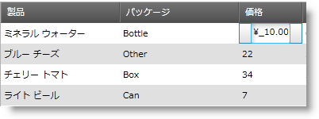

////

|metadata|
{
    "name": "xammaskededitor-using-xammaskededitor-as-a-field-in-xamdatagrid",
    "controlName": ["xamMaskedEditor"],
    "tags": ["Grids","How Do I"],
    "guid": "{3779CC76-40C8-41D3-9F45-22AD81C5E4B9}",  
    "buildFlags": [],
    "createdOn": "2012-09-05T19:05:30.2029781Z"
}
|metadata|
////

= xamDataGrid でフィールドとして xamMaskedEditor を使用

xamCurrencyEditor コントロールの重要な機能は、xamDataGrid link:{ApiPlatform}datapresenter{ApiVersion}~infragistics.windows.datapresenter.field.html[フィールド] に組み込むことができることです。この機能によって、セルの値を修正する間にエンドユーザーはエディターの機能を十分に活用することができます。xamMaskedEditor もマスクを使用して値を書式設定するため、より効果的に視覚化できます。

これらの手順に従って、xamDataGrid の Field に xamMaskedEditor を表示します。

[start=1]
. Microsoft® Windows® Presentation Foundation Window または Page プロジェクトを作成します。
[start=2]
. 以下の名前空間宣言を開始の Page タグまたは Window タグに配置します。これらの宣言によって、 xamDataGrid、xamMaskedEditor を参照してタイプを定義することができます (つまり Int32、Boolean)。

*XAML の場合:*

----
xmlns:igDP="http://infragistics.com/DataPresenter"
xmlns:igEditors="http://infragistics.com/Editors"
xmlns:sys="clr-namespace:System;assembly=mscorlib"
----

[start=3]
. XmlDataProvider を定義するリソース セクションを作成します。XmlDataProvider は link:resources-employees.html[Employees] XML ファイルを参照します。Grid パネル内に以下の XAML を配置します。

*XAML の場合:*

----
<Grid.Resources>
        <XmlDataProvider Source="../Data/Employees.xml" 
          x:Key="EmployeeData" XPath="/employees" />
</Grid.Resources>
----

[start=4]
. XamDataGrid のインスタンスを作成して名前を指定し、前述の手順で作成された XmlDataProvider に DataSource プロパティを設定します。

*XAML の場合:*

----
<igDP:XamDataGrid x:Name="XamDataGrid1" 
  DataSource="{Binding Source={StaticResource EmployeeData}, XPath=employee}">
        ...      
</igDP:XamDataGrid>
----

[start=5]
. link:{ApiPlatform}datapresenter{ApiVersion}~infragistics.windows.datapresenter.fieldlayoutsettings~autogeneratefields.html[FieldLayoutSettings] オブジェクトの link:{ApiPlatform}datapresenter{ApiVersion}~infragistics.windows.datapresenter.fieldlayoutsettings.html[AutoGenerateFields] プロパティを False に設定します。前述の手順で作成されたタグの間に以下の XAML を配置します。

*XAML の場合:*

----
...
<igDP:XamDataGrid.FieldLayoutSettings>
  <igDP:FieldLayoutSettings AutoGenerateFields="False" />
</igDP:XamDataGrid.FieldLayoutSettings>
...
----

[start=6]
. Field のカスタム エディターを定義する時に、そのエディターのスタイルを指定するように link:{ApiPlatform}datapresenter{ApiVersion}~infragistics.windows.datapresenter.fieldsettings~editorstyle.html[EditorStyle] プロパティを設定しなければならない場合があります。これによって、マスクなどのエディターにプロパティを設定することも可能です。以下の XAML は XamMaskedEditor のインスタンスをターゲットとする Style を設定し、このスタイルを EditorStyle に設定します。エディターの link:{ApiPlatform}editors{ApiVersion}~infragistics.windows.editors.xammaskededitor~mask.html[Mask] プロパティを設定するために setter を使用します。

以下の例で、Mask は社会保障番号のフォーマットの入力を受け付けます。このコードを前述の手順のコードの下に配置します。

*XAML の場合:*

----
...
<igDP:XamDataGrid.FieldLayouts>
        <igDP:FieldLayout>
                <igDP:FieldLayout.Fields>
                        <igDP:Field Name="name" Label="Employee's Name"/>
                        <igDP:Field Name="department" Label="Department"/>
                        <igDP:Field Name="Social" Label="Social Security Number" BindingType="Unbound">
                                <igDP:Field.Settings>
                                        <igDP:FieldSettings 
                                          EditAsType="{x:Type sys:String}">
                                                <igDP:FieldSettings.EditorStyle>
                                                        
                                                </igDP:FieldSettings.EditorStyle>
                                        </igDP:FieldSettings>
                                </igDP:Field.Settings>
                        </igDP:Field>
                </igDP:FieldLayout.Fields>
        </igDP:FieldLayout>
</igDP:XamDataGrid.FieldLayouts>
...
----

[start=7]
. プロジェクトをビルドして実行します。Social Security Number フィールドのセルを選択します。xamMaskedEditor は 9 桁の数字のみを受け付け、数字をハイフンで自動的に分けて社会保障番号のように表示されます。

