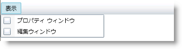

////

|metadata|
{
    "name": "xammenu-adding-check-boxes-to-xammenuitems",
    "controlName": ["xamMenu"],
    "tags": ["Getting Started","How Do I"],
    "guid": "2e589c89-4fcd-4eec-8e00-e25046bc9532",  
    "buildFlags": [],
    "createdOn": "2016-05-25T18:21:57.3962439Z"
}
|metadata|
////

= チェックボックスを XamMenuItems に追加

xamMenu の項目のそれぞれにチェックボックスを表示できます。これには、XamMenuItem オブジェクトで link:{ApiPlatform}controls.menus.xammenu{ApiVersion}~infragistics.controls.menus.xammenuitem~ischeckable.html[IsCheckable] プロパティを true に設定する必要があります。各 XamMenuItem オブジェクトには、エンドユーザーが項目をチェックする時にカスタム機能を提供するために処理できる Checked イベントがあります。さらに、各項目には、コードでチェック状態を決定またはチェック状態を設定するために使用できる link:{ApiPlatform}controls.menus.xammenu{ApiVersion}~infragistics.controls.menus.xammenuitem~ischecked.html[IsChecked] プロパティがあります。

以下のコード例は、xamMenu で項目にチェックボックスを表示する方法を示します。

*XAML の場合:*

----
<ig:XamMenu x:Name="xamMenu1" Height="25" MenuOrientation="Horizontal">
   <!-- TODO: メニュー項目を追加します -->
   <ig:XamMenuItem Header="View">
       <ig:XamMenuItem Header="Property Window" IsCheckable="True" />
       <ig:XamMenuItem Header="Editing Window" IsCheckable="True" />
   </ig:XamMenuItem>
</ig:XamMenu>
----

*Visual Basic の場合:*

----
' メニューを作成します
Dim menu1 As New XamMenu()
Me.LayoutRoot.Children.Add(menu1)
menu1.Height = 25
' Shop メニュー項目を作成します
Dim parentItem As New XamMenuItem()
parentItem.Header = "View"
menu1.Items.Add(parentItem)
' 子メニュー項目を作成します
Dim childItem As New XamMenuItem()
childItem.Header = "Property Window"
childItem.IsCheckable = True
parentItem.Items.Add(childItem)
' 子メニュー項目を作成します
childItem = New XamMenuItem()
childItem.Header = "Editing Window"
childItem.IsCheckable = True
parentItem.Items.Add(childItem)
----

*C# の場合:*

----
// メニューを作成します
XamMenu menu1 = new XamMenu();
this.LayoutRoot.Children.Add(menu1);
menu1.Height = 25;
// Shop メニュー項目を作成します
XamMenuItem parentItem = new XamMenuItem();
parentItem.Header = "View";
menu1.Items.Add(parentItem);
// 子メニュー項目を作成します
XamMenuItem childItem = new XamMenuItem();
childItem.Header = "Property Window";
childItem.IsCheckable = true;
parentItem.Items.Add(childItem);
// 子メニュー項目を作成します
childItem = new XamMenuItem();
childItem.Header = "Editing Window";
childItem.IsCheckable = true;
parentItem.Items.Add(childItem);
----

== 関連トピック

link:xammenu-binding-to-data.html[データにバインドする]

link:xammenu-layout-settings.html[レイアウト設定]

link:xammenu-navigating-pages-using-xammenu.html[xamMenu を使用してページをナビゲート]

link:xammenu-adding-and-removing-items.html[項目の追加と削除]

link:xammenu-adding-separators-between-xammenuitems.html[セパレーターを XamMenuItems 間に追加]

link:xammenu-adding-icons-to-xammenuitems.html[アイコンを XamMenuItems に追加]