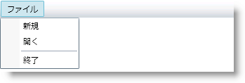

////

|metadata|
{
    "name": "xammenu-adding-separators-between-xammenuitems",
    "controlName": ["xamMenu"],
    "tags": ["Getting Started","How Do I","Layouts"],
    "guid": "b61f310f-ef3c-40c4-8a60-b49fe78b64a0",  
    "buildFlags": [],
    "createdOn": "2016-05-25T18:21:57.3842428Z"
}
|metadata|
////

= セパレーターを XamMenuItems 間に追加

セパレーターの線は、xamMenu コントロールまたは xamContextMenu コントロールで異なるオプションを区別するのに役立ちます。セパレーターの追加では、 link:{ApiPlatform}controls.menus.xammenu{ApiVersion}~infragistics.controls.menus.xammenuseparator.html[xamMenuSeparator] オブジェクトを作成し、それを Items コレクションに追加する必要があります。

以下のコード例は、xamMenu で項目間にセパレーターを追加する方法を示します。

*XAML の場合:*

----
<ig:XamMenu x:Name="xamMenu1" Height="25">
   <ig:XamMenuItem Header="File">
       <ig:XamMenuItem Header="New" />
       <ig:XamMenuItem Header="Open" />
       <!-- セパレーターの線-->
       <ig:XamMenuSeparator />
       <ig:XamMenuItem Header="Exit" />
   </ig:XamMenuItem>
</ig:XamMenu>
----

*Visual Basic の場合:*

----
' セパレーターを追加します
Dim separator1 As New XamMenuSeparator()
parentMenuItem.Items.Add(separator1)
----

*C# の場合:*

----
// セパレーターを追加します
XamMenuSeparator separator1 = new XamMenuSeparator();
parentMenuItem.Items.Add(separator1);
----

== 関連トピック

link:xammenu-binding-to-data.html[データにバインドする]

link:xammenu-layout-settings.html[レイアウト設定]

link:xammenu-navigating-pages-using-xammenu.html[xamMenu を使用してページをナビゲート]

link:xammenu-adding-and-removing-items.html[項目の追加と削除]

link:xammenu-adding-icons-to-xammenuitems.html[アイコンを XamMenuItems に追加]

link:xammenu-adding-check-boxes-to-xammenuitems.html[チェックボックスを XamMenuItems に追加]