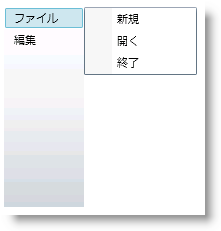

////

|metadata|
{
    "name": "xammenu-layout-settings",
    "controlName": ["xamMenu"],
    "tags": ["Getting Started","How Do I","Layouts"],
    "guid": "{9C16CB3C-2ECD-4505-9CD5-133F3D148D68}",  
    "buildFlags": [],
    "createdOn": "2016-05-25T18:21:57.3582549Z"
}
|metadata|
////

= レイアウト設定

xamMenu™ コントロールによって、その項目に異なるレイアウト オプションが可能となり、メニュー項目は垂直または水平方向にすることができます。このレイアウトは、メニューおよび各メニュー項目に存在する link:{ApiPlatform}controls.menus.xammenu{ApiVersion}~infragistics.controls.menus.xammenu~menuorientation.html[MenuOrientation] プロパティによって制御されます。

サブメニュー項目が表示する場所を指定することもできます。各 XamMenuItem オブジェクトの link:{ApiPlatform}controls.menus.xammenu{ApiVersion}~infragistics.controls.menus.xammenuitem~submenupreferredlocation.html[SubmenuPreferredLocation] プロパティは、子項目の位置を制御します。それを Auto、Bottom、Left、Right、または Top に設定できます。

さらに、サブメニュー項目が表示される方法を制御できます。デフォルトでは、項目をクリックするとメニュー項目の子項目が表示されますが、xamMenu で link:{ApiPlatform}controls.menus.xammenu{ApiVersion}~infragistics.controls.menus.xammenu~expandonhover.html[ExpandOnHover] プロパティを True に設定することで、子項目をホーバーで表示するように変更できます。また、エンドユーザーがサブメニュー内でメニュー項目をクリックすると、サブメニューは閉じます。XamMenuItem オブジェクトの link:{ApiPlatform}controls.menus.xammenu{ApiVersion}~infragistics.controls.menus.xammenuitem~staysopenonclick.html[StaysOpenOnClick] プロパティを True に設定することで、このデフォルト動作をオーバーライドし、メニュー項目を開いたままにできます。

[NOTE]
====
*注:* xamMenu でカスタム ItemsPanelTempate オブジェクトを StackPanel 以外に設定すると、MenuOrientation プロパティは無視されます。
====

以下のコードはメニューの方向、拡張オプション、およびメニュー項目の位置を設定する方法を示します。

*XAML の場合:*

----
<ig:XamMenu x:Name="xamMenu1" Height="200" Width="40" MenuOrientation="Vertical" ExpandOnHover="True">
   <!-- TODO: メニュー項目を追加します -->
   <ig:XamMenuItem Header="File" SubmenuPreferredLocation="Right">
      <ig:XamMenuItem Header="New" StaysOpenOnClick="True"/>
      <ig:XamMenuItem Header="Open" />
      <ig:XamMenuItem Header="Exit" />
   </ig:XamMenuItem>
   <ig:XamMenuItem Header="Edit" SubmenuPreferredLocation="Right">
      <ig:XamMenuItem Header="Cut" />
      <ig:XamMenuItem Header="Copy" />
      <ig:XamMenuItem Header="Paste" />
   </ig:XamMenuItem>
</ig:XamMenu>
----

*Visual Basic の場合:*

----
Private Sub UserControl_Loaded(ByVal sender As System.Object, ByVal e As System.Windows.RoutedEventArgs)
   ' メニューを作成します
   Dim menu1 As New XamMenu()
   Me.LayoutRoot.Children.Add(menu1)
   ' メニューのレイアウト オプションを設定します
   menu1.Height = 200
   menu1.Width = 40
   menu1.MenuOrientation = Orientation.Vertical
   menu1.ExpandOnHover = True
   ' TODO: メニュー項目を追加します
   ' File メニュー項目を作成します
   Dim parentMenuItem As New XamMenuItem()
   parentMenuItem.Header = "File"
   ' 単一項目のレイアウト設定
   parentMenuItem.SubmenuPreferredLocation = MenuItemPosition.Right
   menu1.Items.Add(parentMenuItem)
   ' 子項目を File メニュー項目に追加します
   Dim childMenuItem As New XamMenuItem()
   childMenuItem.Header = "New"
   ' 単一項目のレイアウト設定
   childMenuItem.StaysOpenOnClick = True
   parentMenuItem.Items.Add(childMenuItem)
   childMenuItem = New XamMenuItem()
   childMenuItem.Header = "Open"
   parentMenuItem.Items.Add(childMenuItem)
   childMenuItem = New XamMenuItem()
   childMenuItem.Header = "Exit"
   parentMenuItem.Items.Add(childMenuItem)
   ' Edit メニュー項目を作成します
   parentMenuItem = New XamMenuItem()
   parentMenuItem.Header = "Edit"
   ' 単一項目のレイアウト設定
   parentMenuItem.SubmenuPreferredLocation = MenuItemPosition.Right
   menu1.Items.Add(parentMenuItem)
   ' 子項目を Edit メニュー項目に追加します
   childMenuItem = New XamMenuItem()
   childMenuItem.Header = "Cut"
   parentMenuItem.Items.Add(childMenuItem)
   childMenuItem = New XamMenuItem()
   childMenuItem.Header = "Copy"
   parentMenuItem.Items.Add(childMenuItem)
   childMenuItem = New XamMenuItem()
   childMenuItem.Header = "Paste"
   parentMenuItem.Items.Add(childMenuItem)
End Sub
----

*C# の場合:*

----
private void UserControl_Loaded(object sender, RoutedEventArgs e)
{
   // メニューを作成します
   XamMenu menu1 = new XamMenu();
   this.LayoutRoot.Children.Add(menu1);
   // メニューのレイアウト オプションを設定します
   menu1.Height = 200;
   menu1.Width = 40;
   menu1.MenuOrientation = Orientation.Vertical;
   menu1.ExpandOnHover = true;
   // TODO: メニュー項目を追加します
   // File メニュー項目を作成します
   XamMenuItem parentMenuItem = new XamMenuItem();
   parentMenuItem.Header = "File";
   // 単一項目のレイアウト設定
   parentMenuItem.SubmenuPreferredLocation = MenuItemPosition.Right;
   menu1.Items.Add(parentMenuItem);
   // 子項目を File メニュー項目に追加します
   XamMenuItem childMenuItem = new XamMenuItem();
   childMenuItem.Header = "New";
   // 単一項目のレイアウト設定
   childMenuItem.StaysOpenOnClick = true;
   parentMenuItem.Items.Add(childMenuItem);
   childMenuItem = new XamMenuItem();
   childMenuItem.Header = "Open";
   parentMenuItem.Items.Add(childMenuItem);
   childMenuItem = new XamMenuItem();
   childMenuItem.Header = "Exit";
   parentMenuItem.Items.Add(childMenuItem);
   // Edit メニュー項目を作成します
   parentMenuItem = new XamMenuItem();
   parentMenuItem.Header = "Edit";
   // 単一項目のレイアウト設定
   parentMenuItem.SubmenuPreferredLocation = MenuItemPosition.Right;
   menu1.Items.Add(parentMenuItem);
   // 子項目を Edit メニュー項目に追加します
   childMenuItem = new XamMenuItem();
   childMenuItem.Header = "Cut";
   parentMenuItem.Items.Add(childMenuItem);
   childMenuItem = new XamMenuItem();
   childMenuItem.Header = "Copy";
   parentMenuItem.Items.Add(childMenuItem);
   childMenuItem = new XamMenuItem();
   childMenuItem.Header = "Paste";
   parentMenuItem.Items.Add(childMenuItem);
}
----

== 関連トピック

link:xammenu-binding-to-data.html[データにバインドする]

link:xammenu-navigating-pages-using-xammenu.html[xamMenu を使用してページをナビゲート]

link:xammenu-adding-and-removing-items.html[項目の追加と削除]

link:xammenu-adding-separators-between-xammenuitems.html[セパレーターを XamMenuItems 間に追加]

link:xammenu-adding-icons-to-xammenuitems.html[アイコンを XamMenuItems に追加]

link:xammenu-adding-check-boxes-to-xammenuitems.html[チェックボックスを XamMenuItems に追加]