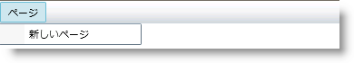
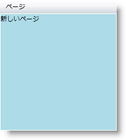

////
|metadata|
{
    "name": "xammenu-navigating-pages-using-xammenu",
    "controlName": ["xamMenu"],
    "tags": ["Getting Started","How Do I","Navigation"],
    "guid": "{032BC8D9-A246-4909-822B-A538DA10F492}",
    "buildFlags": [],
    "createdOn": "2016-05-25T18:21:57.3712479Z"
}
|metadata|
////

= xamMenu を使用してページをナビゲート

== 始める前に

ifdef::sl[]
Microsoft® Silverlight は、Web ページのナビゲーションとまったく同じように、同一の Silverlight アプリケーション内で異なる XAML ページへのナビゲーションを可能にする Navigation Framework を導入します。このフレームワークは、Page と Frame という 2 つのコントロールを Silverlight に導入します。Page コントロールにはアプリケーションのコンテンツが含まれます。Frame コントロールは、ページを表示する場所を指定します。
endif::sl[]

xamMenu™ コントロールは、 link:{ApiPlatform}controls.menus.xammenu{ApiVersion}~infragistics.controls.menus.xammenuitem~navigationuri.html[NavigationUri] および link:{ApiPlatform}controls.menus.xammenu{ApiVersion}~infragistics.controls.menus.xammenuitem~navigationelement.html[NavigationElement] プロパティを提供することで {PlatformName} のナビゲーション機能を利用します。アプリケーションで異なるページにナビゲートしたい場合、XamMenuItem オブジェクトの NavigationUri をページの場所に、また NavigationElement を Frame コントロールとして設定します。

== 達成すること

xamMenu コントロールを使用して新しい XAML ページにナビゲートする方法を学びます。

== 次の手順を実行します

[start=1]
. Microsoft® Visual Studio® で {PlatformName} アプリケーションを新規作成します。
[start=2]
. 以下の NuGet パッケージへの参照を追加します。

** Infragistics.WPF.Menus

+
さらに、以下の Microsoft アセンブリへの参照を追加します。

** System.Windows.Controls.Navigation

+
NuGet フィードのセットアップと NuGet パッケージの追加の詳細については、link:nuget-feeds.html[NuGet フィード] ドキュメントを参照してください。

[start=3]
. 開始の UserControl タグ内で以下の名前空間宣言を追加します。

*XAML の場合:*

----
xmlns:ig="http://schemas.infragistics.com/xaml" 
xmlns:navigation="clr-namespace:System.Windows.Controls;assembly=System.Windows.Controls.Navigation"
----

[start=4]
. xamMenu コントロールをユーザー コントロールに追加します。
[start=5]
. メニュー項目を追加してそれを Pages と呼びます。

*XAML の場合:*

----
<ig:XamMenu x:Name="xamMenu1" Height="23">
   <ig:XamMenuItem Header="Pages">
       <!-- TODO: XAML ページにリンクするネストされたメニュー項目を追加します -->
   </ig:XamMenuItem>
</ig:XamMenu>
----

[start=6]
. xamMenu コントロールの下に Frame コントロールを追加して、新しいページを表示します。

*XAML の場合:*

----
<navigation:Frame Grid.Row="1" x:Name="menuFrame"></navigation:Frame>
----

[start=7]
. アプリケーションで新しい Page コントロールを作成します。

.. ソリューション エクスプローラーで現在のプロジェクトを右クリックし、[追加] を強調表示します。
.. サブメニューで [新しい項目] を選択します。[新しい項目の追加] ダイアログが表示します。
.. {PlatformName} Page を選択します。
.. ページに NavigationPage.xaml と名前を付けて、[追加] をクリックします。

[start=8]
. 背景を水色にし、"New Page" というテキストを指定した TextBlock コントロールを NavigationPage.xaml に追加します。

*XAML の場合:*

----
<Grid x:Name="LayoutRoot" Background="LightBlue">
   <TextBlock Text="New Page" />
</Grid>
----

[start=9]
. Frame コントロールを使用して上記の手順で作成したページにリンクするネストされたメニュー項目を追加します。

.. NavigationUri プロパティをページの相対パスに設定します。
.. NavigationElement プロパティを Frame コントロールに設定します。
.. link:{ApiPlatform}controls.menus.xammenu{ApiVersion}~infragistics.controls.menus.xammenuitem~navigationonclick.html[NavigationOnClick] プロパティを True に設定します。

*XAML の場合:*

----
<ig:XamMenuItem Header="New Page" NavigationOnClick="True" NavigationElement="{Binding ElementName=menuFrame}" NavigationUri="/NavigationPage.xaml"/>
----

[start=10]
. アプリケーションを実行します。Pages メニュー項目を強調表示し、New Page 項目をクリックします。新しいページがメニューの下に表示されます。

== 関連トピック

link:xammenu-layout-settings.html[レイアウト設定]

link:xammenu-binding-to-data.html[データにバインドする]

link:xammenu-adding-and-removing-items.html[項目の追加と削除]

link:xammenu-adding-separators-between-xammenuitems.html[セパレーターを XamMenuItems 間に追加]

link:xammenu-adding-icons-to-xammenuitems.html[アイコンを XamMenuItems に追加]

link:xammenu-adding-check-boxes-to-xammenuitems.html[チェックボックスを XamMenuItems に追加]