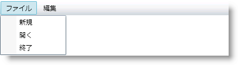

////

|metadata|
{
    "name": "xammenu-understanding-xammenu",
    "controlName": ["xamMenu"],
    "tags": ["Getting Started"],
    "guid": "{48D954FD-C6BF-4FC1-8E08-EFBC79BEFDB5}",  
    "buildFlags": [],
    "createdOn": "2016-05-25T18:21:57.3332399Z"
}
|metadata|
////

= xamMenu について

xamMenu コントロールは、アプリケーション固有のコマンドまたはタスクを表す項目のリストを表示します。一般的にメニューで項目をクリックするとサブメニューが開くか、アプリケーション ロジックが実行されます。

このコントロールの重要な機能の一部を以下にリストします。

* *アイコン* - 各メニュー項目の目的を示す支援をするためにアイコンを追加します。
* *テンプレート* - 広範なテンプレート機能は詳細なカスタマイズ オプションおよび楽しいユーザー エクスペリエンスへと導きます。
* *チェックボックス* - エンドユーザーが複数の項目を選択できるようにチェックボックスを追加します。
* *メニューの方向* - 方向と位置だけでなく、メニュー項目自体をどのように表示するかをカスタマイズします。
* *階層データ* - 任意の階層の深さでメニュー項目をすばやく表示するためにデータを追加またはバインドします。
* *スムーズなスライディング* - スムーズなアニメーションにより優れたルック アンド フィールが可能となります。

== 関連トピック

link:xammenu-getting-started-with-xammenu.html[xamMenu をページに追加]

link:xammenu-using-xammenu.html[xamMenu の使用]