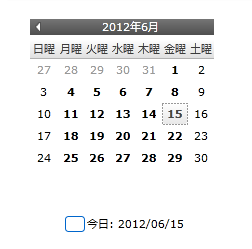

////

|metadata|
{
    "name": "xammonthcalendar-about-styling-xammonthcalendar",
    "controlName": ["xamMonthCalendar"],
    "tags": ["Styling"],
    "guid": "{307D907A-2746-4BC1-A159-E66881BB47D6}",  
    "buildFlags": [],
    "createdOn": "2012-01-30T19:39:53.9771485Z"
}
|metadata|
////

= xamMonthCalendar のスタイリングについて

Microsoft® Windows® Presentation Foundation のコントロールのように Styles および ControlTemplates を使用して xamMonthCalendar™ を再スタイルできます。ただし、xamMonthCalendar を構成するさまざまなクラスは、Style または ControlTemplate の Key プロパティとして使用できる静的なプロパティを公開することによってより簡単にスタイリングできます。xamMonthCalendar が事前に定義されたキーを使用する Style または ControlTemplate を見つけると、xamMonthCalendar コントロールは自動的にユーザーが作成した Style または ControlTemplate を使用します。

以下の表は、ユーザーの Styles および ControlTemplates を作成する時にユーザーがキーとして使用できる静的プロパティをリストしています。各セクションの見出しは、プロパティが公開するクラスです。プロパティ名が「TemplateKey」で終わっている場合、その要素をスタイルするために ControlTemplate を作成する必要があります。プロパティ名が "StyleKey" で終わっている場合、その要素をスタイルするために Style を作成する必要があります。たとえば、「Today」というラベルのある Button コントロールをスタイルしたい場合、以下の表を使用してクラスとプロパティ名を最初に見つけます。プロパティが見つかれば、そのプロパティの名前に基づいて ControlTemplate または Style を作成します。マークアップ拡張を使用してプロパティに ControlTemplate または Style の Key プロパティを設定します。

*XAML の場合:*

----
<!--プロパティ名が「StyleKey」で終わっているのでスタイルを作成します。
コントロール テンプレートの Key プロパティを XamMonthCalendar クラスによって公開されている静的プロパティに設定します。
コントロール テンプレートの TargetType プロパティを Button に設定します。-->

----

== link:{ApiPlatform}editors{ApiVersion}~infragistics.windows.editors.xammonthcalendar.html[XamMonthCalendar] クラス (スタイルおよびコントロールテンプレート キー)

[options="header", cols="a,a"]
|====
|プロパティ名|ターゲット タイプ

| link:{ApiPlatform}editors{ApiVersion}~infragistics.windows.editors.xammonthcalendar~scrollpreviousrepeatbuttonstylekey.html[ScrollPreviousRepeatButtonStyleKey]
|RepeatButton

| link:{ApiPlatform}editors{ApiVersion}~infragistics.windows.editors.xammonthcalendar~scrollnextrepeatbuttonstylekey.html[ScrollNextRepeatButtonStyleKey]
|RepeatButton

| link:{ApiPlatform}editors{ApiVersion}~infragistics.windows.editors.xammonthcalendar~todaybuttonstylekey.html[TodayButtonStyleKey]
|Button

|====

== link:{ApiPlatform}editors{ApiVersion}~infragistics.windows.editors.calendaritem.html[CalendarItem] クラス (オブジェクト キー)

CalendarItem クラスは、現在の日付と選択した日付の角の半径を変更するために使用できるキーを公開します。角の半径を変更するには、Style または ControlTemplate を作成する必要はありません。CornerRadius オブジェクトをリソース ディクショナリに追加し、その Key プロパティを静的な CornerRadiusKey プロパティに設定することだけが必要です。

[options="header", cols="a,a"]
|====
|プロパティ名|オブジェクト タイプ

| link:{ApiPlatform}editors{ApiVersion}~infragistics.windows.editors.calendaritem~cornerradiuskey.html[CornerRadiusKey]
|CornerRadius

|====