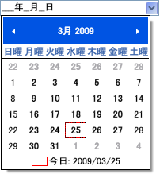
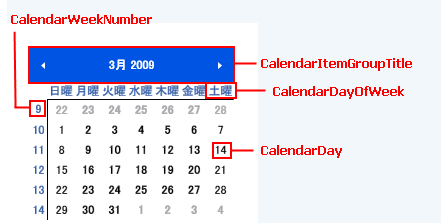
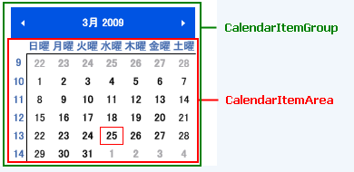
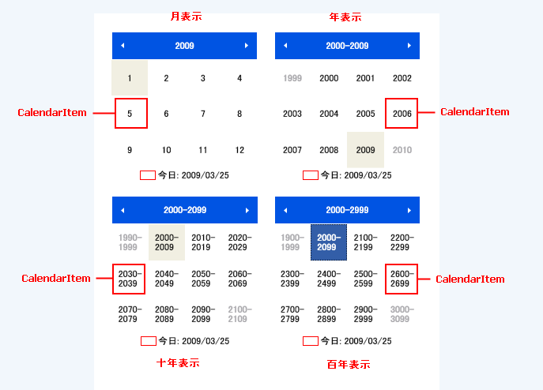

////

|metadata|
{
    "name": "xammonthcalendar-about-xammonthcalendar",
    "controlName": ["xamMonthCalendar"],
    "tags": ["Getting Started"],
    "guid": "{FED00DDE-6619-4281-AB0E-DCD26BB70D2D}",  
    "buildFlags": [],
    "createdOn": "2012-01-30T19:39:53.9801491Z"
}
|metadata|
////

= xamMonthCalendar について

xamMonthCalendar™ コントロールは 1 つまたは複数の月を一度に表示します。xamMonthCalendar コントロールは以下の機能を提供します。

* *様々なビュー* - xamMonthCalendar コントロールは、月の中に日を示すことで開始します。各位ユーザーはズームアウトして、年内の月、10 年内の年、世紀内の 10 年、1000 年内の世紀を表示できます。
* *単一/複数の日付選択* - xamMonthCalendar コントロールは、単一日の選択および複数日の選択をサポートします。
* *xamDateTimeEditor™ のドロップダウン編集* - xamDateTimeEditor コントロールは、エンド ユーザーがドロップダウンの矢印をクリックした時に、xamMonthCalendar コントロールを表示でき、それによってエンド ユーザーは xamMonthCalendar の月表示を使用して日付を選択できます。

== xamDateTimeEditor のドロップダウン カレンダー

== 関連トピック

link:xammonthcalendar-getting-started-with-xammonthcalendar.html[xamMonthCalendar をページに追加]

link:xammonthcalendar-using-xammonthcalendar.html[xamMonthCalendar の使用]