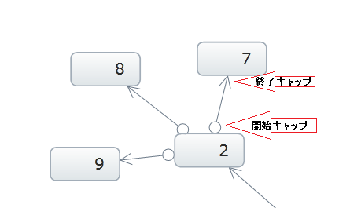
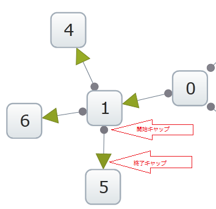

////

|metadata|
{
    "name": "xamnetworknode-relationship-between-nodes",
    "controlName": ["xamNetworkNode"],
    "tags": [],
    "guid": "ddca9fba-ecde-4dfa-9075-765ec9e3cd66",  
    "buildFlags": [],
    "createdOn": "2016-05-25T18:21:57.5242505Z"
}
|metadata|
////

= ノード間の関係

== トピックの概要

== 目的

このドキュメントの目的は、 link:{ApiPlatform}controls.maps.xamnetworknode{ApiVersion}~infragistics.controls.maps.xamnetworknode.html[xamNetworkNode]内で接続されたノードのソースとターゲットを示すアイコンで接続されたノードに対するさまざまな関係タイプをどのように設定できるかを示すことです。

== 前提条件

[options="header", cols="a,a"]
|====
|背景タイプ|コンテンツ

|*概念*
|以下の概念を理解する必要があります。 

* xamNetworkNode コントロールを接続ノードでのデータ ソースへバインドすること 

|*トピック*
|まず以下のトピックを読む必要があります。 

link:xamnetworknode-getting-started-with-xamnetworknode.html[xamNetworkNode を使用した作業の開始]

|====

== コントロールの構成の概要

== コントロールの構成チャート

以下の表はソース ノードとターゲット ノード間の関係、スタイル、対応するアイコンのサイズの構成可能な視覚的表現をマップします。

[options="header", cols="a,a,a"]
|====
|構成可能な画面要素とビヘイビアー|構成の詳細|構成プロパティ

|*ソース ノードとターゲット ノードを示すアイコン*
|線分の開始と終了を示す視覚的表現がソース ノードとターゲット ノードを接続します。
| link:{ApiPlatform}controls.maps.xamnetworknode{ApiVersion}~infragistics.controls.maps.xamnetworknode~linestartcap.html[LineStartCap] 

link:{ApiPlatform}controls.maps.xamnetworknode{ApiVersion}~infragistics.controls.maps.xamnetworknode~lineendcap.html[LineEndCap]

|*LineStartCap と LineEndCap アイコンのためのスタイル*
|LineStartCap と LineEndCap アイコンのためのユーザー定義スタイル。
| link:{ApiPlatform}controls.maps.xamnetworknode{ApiVersion}~infragistics.controls.maps.xamnetworknode~linestartcapstyle.html[LineStartCapStyle] 

link:{ApiPlatform}controls.maps.xamnetworknode{ApiVersion}~infragistics.controls.maps.xamnetworknode~lineendcapstyle.html[LineEndCapStyle]

|*LineStartCap と LineEndCap アイコンのためのサイズ*
|LineStartCap と LineEndCap アイコンのためのユーザー定義サイズ。
| link:{ApiPlatform}controls.maps.xamnetworknode{ApiVersion}~infragistics.controls.maps.xamnetworknode~linestartcapsize.html[LineStartCapSize] 

link:{ApiPlatform}controls.maps.xamnetworknode{ApiVersion}~infragistics.controls.maps.xamnetworknode~lineendcapsize.html[LineEndCapSize]

|====

== LineStartCap/LineEndCap

ソースは線の始まる位置を示し、ターゲットは線の終点を示します。ソースは、ターゲットとして子ノードをポイントする親ノードから開始されます

== LineStartCap/LineEndCap プロパティ設定

以下の表はソース ノードとターゲット ノード間の関係の視覚的表現のための設定をマップします。

[options="header", cols="a,a,a"]
|====
|目的|プロパティ|設定値

|*ソース ノードとターゲット ノードをアイコンで示す*
|
* link:{ApiPlatform}controls.maps.xamnetworknode{ApiVersion}~infragistics.controls.maps.xamnetworknode~linestartcap.html[LineStartCap] 

* link:{ApiPlatform}controls.maps.xamnetworknode{ApiVersion}~infragistics.controls.maps.xamnetworknode~lineendcap.html[LineEndCap] 

|
* Arrow 

* Cross 

* Diamond 

* Ellipse 

* SolidArrow 

* Square 

* Tee 

* None 

|====

== LineStartCap/LineEndCap の例

以下の画像とコード例は LineStartCap/LineEndCap の設定を説明します。LineStartCap をもつソースノードが LineEndCap をもつターゲットノードに結び付けられる

== コード例:

*XAML の場合:*

----
<ig:XamNetworkNode LineStartCap="Ellipse" LineEndCap="Arrow">
----

*C# の場合:*

----
xnn.LineEndCap = LineCap.Arrow;
xnn.LineStartCap = LineCap.Ellipse;
----

*Visual Basic の場合:*

----
xnn.LineEndCap = LineCap.Arrow
xnn.LineStartCap = LineCap.Ellipse
----

== LineStartCapStyle/LineEndCapStyle

== LineStartCapStyle/LineEndCapStyle プロパティ設定

以下の表は接続ノードに対応するアイコンのスタイルの設定をマップします。

[options="header", cols="a,a,a"]
|====
|目的|使用するプロパティ|設定値

|*LineStartCap と LineEndCap アイコンのためのスタイルの変更*
|
* link:{ApiPlatform}controls.maps.xamnetworknode{ApiVersion}~infragistics.controls.maps.xamnetworknode~linestartcapstyle.html[LineStartCapStyle] 

* link:{ApiPlatform}controls.maps.xamnetworknode{ApiVersion}~infragistics.controls.maps.xamnetworknode~lineendcapstyle.html[LineEndCapStyle] 

|XAML で定義されたスタイルに基づく

|====

== LineStartCapStyle/LineEndCapStyle 例

以下の画像とコード例は LineStartCapStyle/LineEndCapStyle の設定を説明します:

== コード例:

*XAML の場合:*

----

----

== LineStartCapSize/LineEndCapSize

== LineStartCapSize/LineEndCapSize プロパティ設定

以下の表は接続ノードに対応するアイコンのサイズの設定をマップします。

[NOTE]
====
*注:* LineStartCapSize と LineEndCapSize の値が同じ場合には、LineCapSize プロパティを代わりに使用できます。値はスタートキャップとエンドキャップに提供されます。
====

[options="header", cols="a,a,a"]
|====
|目的|プロパティ|設定値

|*LineStartCap と LineEndCap アイコンのためのサイズの変更*
|
* link:{ApiPlatform}controls.maps.xamnetworknode{ApiVersion}~infragistics.controls.maps.xamnetworknode~linestartcapsize.html[LineStartCapSize] 

* link:{ApiPlatform}controls.maps.xamnetworknode{ApiVersion}~infragistics.controls.maps.xamnetworknode~lineendcapsize.html[LineEndCapSize] 

|double

|====

== LineStartCapSize/LineEndCapSize 例

以下の画像とコード例は LineStartCapSize/LineEndCapSize の設定を説明します:

image::images/xamNetworkNode_Relationship_Between_Nodes_03.png[]

== コード例:

*XAML の場合:*

----
<ig:XamNetworkNode LineEndCapSize="15" LineStartCapSize="5">
----

*C# の場合:*

----
xnn.LineEndCapSize = 15;
xnn.LineStartCapSize = 5;
----

*Visual Basic の場合:*

----
xnn.LineEndCapSize = 15
xnn.LineStartCapSize = 5
----

== 関連トピック

* link:xamnetworknode-getting-started-with-xamnetworknode.html[xamNetworkNode を使用した作業の開始]

* link:xamnetworknode-using-xamnetworknode.html[xamNetworkNode の使用]