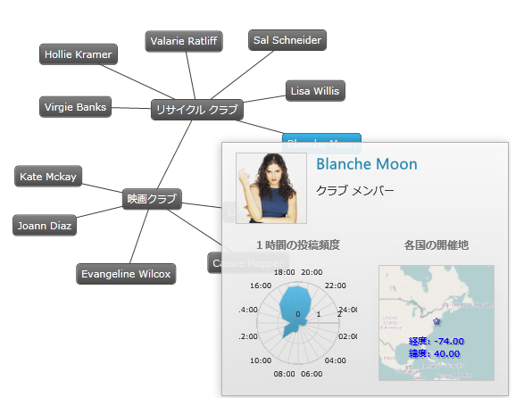

////

|metadata|
{
    "name": "xamnetworknode",
    "controlName": ["xamNetworkNode"],
    "tags": [],
    "guid": "ef2c17c6-62d9-404e-b235-ca924f621d10",  
    "buildFlags": [],
    "createdOn": "2016-05-25T18:21:57.5302512Z"
}
|metadata|
////

= xamNetworkNode

Network Node コントロールは、無向グラフを描画するためにすぐに使用できるデータ バインドされたコントロールです。link:{ApiPlatform}controls.maps.xamnetworknode{ApiVersion}~infragistics.controls.maps.xamnetworknode.html[xamNetworkNode] コントロールによって描画されたグラフ例を図 1 に示します。

図 1: Network Node コントロールで描画されたグラフ

== 使用される用語

この文書では、グラフを構成する頂点を「ノード」と呼び、ノード間の分岐を「コネクション」と呼びます。

== 機能

Network Node コントロールは以下の機能を提供します:

* テーマ
* ツールチップ
* ノード テンプレート
* 条件付き書式
* イベント
* 複数選択
* 要素の位置変更

== はじめに

Network Node コントロールを使用した作業の開始するには、 link:xamnetworknode-getting-started-with-xamnetworknode.html[「xamNetworkNode を使用した作業の開始」]を参照してください。

== 関連トピック

* link:xamnetworknode-conditional-formatting.html[条件付き書式]
* link:xamnetworknode-node-relocation.html[ノードの移動]
* link:xamnetworknode-selection.html[選択]
* link:xamnetworknode-templates.html[テンプレート]
* link:xamnetworknode-tooltips.html[ツールチップ]