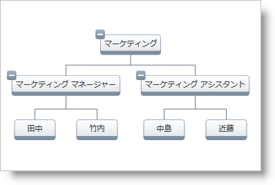

////
|metadata|
{
    "name": "xamorgchart-adding-xamorgchart-to-your-application",
    "controlName": ["xamOrgChart"],
    "tags": ["Getting Started"],
    "guid": "e49e46bc-f65f-44e3-a93f-f5d27745866f",
    "buildFlags": [],
    "createdOn": "2016-05-25T18:21:57.6392953Z"
}
|metadata|
////

= xamOrgChart をアプリケーションに追加

このトピックは、 link:{ApiPlatform}controls.maps.xamorgchart{ApiVersion}~infragistics.controls.maps.xamorgchart.html[xamOrgChart] を追加するための要件を説明し、プロシージャの追加の概要を述べます。最後に、詳細説明へのリンクが提供されます (XAML とプロシージャの C#/ VB コードの両方を対象とします)。

== プレビュー

以下は、サンプル コード (以下の「詳細説明」のセクションにリストされたトピックで提供されている) によって生成された最終結果のプレビューです。

図 1: xamOrgChart コントロールの実装例

== 要件

コントロールを追加するには、以下が必要です。

* Microsoft® {PlatformName} アプリケーション。
* プロジェクトに追加された以下の NuGet パッケージ参照:

** Infragistics.WPF.OrgChart

* オブジェクト データ モデル

NuGet フィードのセットアップと NuGet パッケージの追加の詳細については、link:nuget-feeds.html[NuGet フィード] ドキュメントを参照してください。

詳細説明 (以下参照) に提供されているトピックは、単純なサンプル データ オブジェクト モデルを使用しますが、それに代わって自分で作成して使用できます (サンプル データ モデルは link:resources-departmentviewmodel.html[Department View Model] でダウンロードできます)。

== 概要

xamOrgChart をユーザーのアプリケーションに追加する手順の概念的な概要:

[start=1]
. xamOrgChart コントロールをユーザーのアプリケーションに追加し、データ モデルにバインドします。
[start=2]
. ノード レイアウトを OrgChart に追加します。

== 詳細説明

xamOrgChart の追加についての詳細説明は、サンプル コードとともに以下のトピックを参照してください。

* link:xamorgchart-adding-xamorgchart-using-xaml-code.html[XAML コードを使用して xamOrgChart を追加]
* link:xamorgchart-adding-xamorgchart-using-procedural-code.html[プロシージャ コードを使用して xamOrgChart を追加] (C#、VB)

== *関連トピック*

link:xamorgchart-understanding-xamorgchart.html[xamOrgChart の理解]

link:xamorgchart-using-xamorgchart.html[xamOrgChart の使用]

link:xamorgchart-api-overview.html[API の概要]