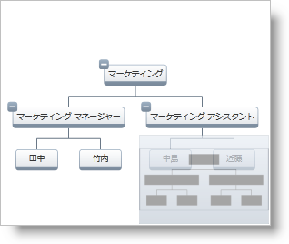
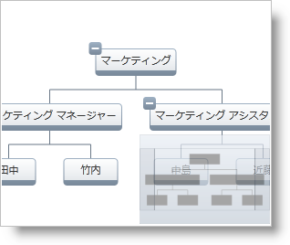

////

|metadata|
{
    "name": "xamorgchart-configuring-panning-and-zooming",
    "controlName": ["xamOrgChart"],
    "tags": ["How Do I"],
    "guid": "5a451f11-7741-4922-b8b3-97c90ac1068c",  
    "buildFlags": [],
    "createdOn": "2016-05-25T18:21:57.7322708Z"
}
|metadata|
////

= パンとズームの構成

このトピックは、xamOrgChart コントロールのパンとズーム設定を構成する方法を説明します。

== パンとズームの許可

パンとズームは、xamOrgChart コントロールの link:{ApiPlatform}datavisualization{ApiVersion}~infragistics.controls.navigationsettings.html[ナビゲーション設定]の以下の Boolean プロパティによって制御されます。

* link:{ApiPlatform}datavisualization{ApiVersion}~infragistics.controls.navigationsettings~allowpan.html[AllowPan] - True の時、マウスによるパンニングが有効です。
* link:{ApiPlatform}datavisualization{ApiVersion}~infragistics.controls.navigationsettings~allowzoom.html[AllowZoom] - True の時、マウスによるズームが有効です。

[NOTE]
====
*注:*

AllowPan と AllowZoom を False に設定した場合、パンとズームは、コード ビハインドまたは link:xamoverviewplusdetailpane.html[xamOverviewPlusDetailPane] コントロールを使用して実行できます。
====

以下のコードはパンとズームの両方を許可する方法を示します。

*XAML の場合:*

[source,xaml]
----
<ig:XamOrgChart>
    <ig:XamOrgChart.NavigationSettings>
        <ig:NavigationSettings AllowPan="True" AllowZoom="True" />
    </ig:XamOrgChart.NavigationSettings>            
</ig:XamOrgChart>
----

*Visual Basic の場合:*

----
Dim orgChart As New XamOrgChart()
Dim navigationSettings As New NavigationSettings()
navigationSettings.AllowPan = True
navigationSettings.AllowZoom = True
orgChart.NavigationSettings = navigationSettings
----

*C# の場合:*

----
XamOrgChart orgChart = new XamOrgChart();
NavigationSettings navigationSettings = new NavigationSettings();
navigationSettings.AllowPan = true;
navigationSettings.AllowZoom = true;
orgChart.NavigationSettings = navigationSettings;
----

== ズーム レベルの構成

ズーム レベルは、xamOrgChart コントロールのズーム レベル プロパティによって制御されます。これらすべてのプロパティで、有効な値は少数を含むゼロよりも大きい数字です。ズームレベル値に 100 を掛けると、ズーム スケールはパーセンテージで表されます。つまり、

____
_ズーム レベル $$*$$100 = ズーム %。_
____

たとえば、値 1 はノードを 100% にスケールします。

xamOrgChart コントロールのズーム レベルプロパティは以下のとおりです。

* link:{ApiPlatform}datavisualization{ApiVersion}~infragistics.controls.surfaceviewer~minimumzoomlevel.html[最小ズーム レベル] - 組織図のコンテンツの最小スケール
* link:{ApiPlatform}datavisualization{ApiVersion}~infragistics.controls.surfaceviewer~zoomlevel.html[ズーム レベル] - 組織図のコンテンツの現在のスケール
* link:{ApiPlatform}datavisualization{ApiVersion}~infragistics.controls.surfaceviewer~maximumzoomlevel.html[最大ズーム レベル] - 組織図のコンテンツの最大スケール

以下のコードは、ズーム設定を次のように構成します。

* 最大ズーム レベル - 300%
* 最小ズーム レベル - 50%
* 現在のズーム レベル - 100%

*XAML の場合:*

[source,xaml]
----
<ig:XamOrgChart
    MaximumZoomLevel="3"
    MinimumZoomLevel="0.5"
    ZoomLevel="1">
</ig:XamOrgChart>
----

*Visual Basic の場合:*

----
Dim orgChart As New XamOrgChart()
orgChart.MaximumZoomLevel = 3
orgChart.MinimumZoomLevel = 0.5
orgChart.ZoomLevel = 1
----

*C# の場合:*

----
XamOrgChart orgChart = new XamOrgChart();
orgChart.MaximumZoomLevel = 3;
orgChart.MinimumZoomLevel = 0.5;
orgChart.ZoomLevel = 1;
----

== コード例

以下のコードは、 link:{ApiPlatform}datavisualization{ApiVersion}~infragistics.controls.surfaceviewer~scaletofit.html[Scale-to-Fit] および link:{ApiPlatform}datavisualization{ApiVersion}~infragistics.controls.surfaceviewer~zoomto100.html[Zoom-to-100%] 機能を実装する方法を示します。Scale to Fit 機能は、xamOrgChart のコンテンツをスケールして、表示可能領域に合わせます。Zoom to 100% は組織図のコンテンツを 100% (ZoomLevel=1 に等しい) にスケールします。

図 1: Scale-to-Fit 機能

図 2: Zoom-to-100% 機能

*Visual Basic の場合:*

----
Dim orgChart As New XamOrgChart()
orgChart.ScaleToFit()
orgChart.ZoomTo100()
‘10% ズーム インを実行します in.
orgChart.ZoomIn()
‘10% ズーム アウトを実行します
orgChart.ZoomOut()
----

*C# の場合:*

----
XamOrgChart orgChart = new XamOrgChart();
orgChart.ScaleToFit();
orgChart.ZoomTo100();
//10% ズーム インを実行します
orgChart.ZoomIn();
//10% ズーム アウトを実行します
orgChart.ZoomOut();
----

== *関連トピック*

link:xamorgchart-using-xamorgchart.html[xamOrgChart の使用]