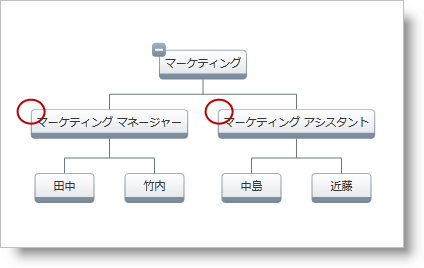

////

|metadata|
{
    "name": "xamorgchart-expansion-indicators-visibility",
    "controlName": ["xamOrgChart"],
    "tags": ["How Do I","Templating"],
    "guid": "37aa49e0-30bc-4122-9871-e4d4ddb1b5e7",  
    "buildFlags": [],
    "createdOn": "2016-05-25T18:21:57.6892697Z"
}
|metadata|
////

= 展開インジケーターの表示状態を構成

このトピックは、ノード、ノード レイアウトおよび xamOrgChart コントロールの展開インジケーターの表示状態を構成する方法を示します。

トピックは以下のとおりです。

* <<priorities,展開インジケーターの構成の優先度>>
* <<node,ノードの展開インジケーターの表示状態の構成>>
* <<node_layout,ノード レイアウトの展開インジケーターの表示状態の構成>>
* <<orgchart,xamOrgChart の展開インジケーターの表示状態の構成>>

[[priorities]]
== 展開インジケーターの構成の優先度

展開インジケーターの表示状態は以下のオブジェクトで構成できます (優先度が高から低の順)。

[start=1]
. link:{ApiPlatform}controls.maps.xamorgchart{ApiVersion}~infragistics.controls.maps.orgchartnode.html[ノード] - 各ノードに展開インジケーターの表示状態を個別に設定できます。
[start=2]
. link:{ApiPlatform}controls.maps.xamorgchart{ApiVersion}~infragistics.controls.maps.orgchartnodelayout.html[ノード レイアウト] - ノード レイアウトによって認識されるノード
[start=3]
. link:{ApiPlatform}controls.maps.xamorgchart{ApiVersion}~infragistics.controls.maps.xamorgchart.html[XamOrgChart] - すべてのノードに影響する

図 1: 丸が付けられたノードは非表示の展開インジケーターが付いている

[NOTE]
====
*注:*

この図とコード例は link:xamorgchart-adding-xamorgchart-to-your-application.html[「xamOrgChart をアプリケーションに追加」]で作成された組織図を使用します。
====

[[node]]
== ノードの展開インジケーターの表示状態の構成

以下の例は、特定の OrgChartNode オブジェクト (クリックされたノードなど) で展開インジケーターの表示状態を設定する方法を示します。

*XAML の場合:*

[source,xaml]
----
<ig:XamOrgChart
    NodeMouseLeftButtonDown="XamOrgChart_NodeMouseLeftButtonDown">
</ig:XamOrgChart>
----

*Visual Basic の場合:*

----
Private Sub XamOrgChart_NodeMouseLeftButtonDown(sender As Object, e As OrgChartNodeClickEventArgs)
    e.Node.Node.ExpansionIndicatorVisibility = Visibility.Collapsed
End Sub
----

*C# の場合:*

----
private void XamOrgChart_NodeMouseLeftButtonDown(object sender, OrgChartNodeClickEventArgs e)
{
    e.Node.Node.ExpansionIndicatorVisibility = Visibility.Collapsed;
}
----

[[node_layout]]
== ノード レイアウトの展開インジケーターの表示状態の構成

各ノード レイアウトは展開インジケーターの表示状態を認識するノードに適用します。

*XAML の場合:*

[source,xaml]
----
<ig:OrgChartNodeLayout
    TargetTypeName="EmployeePosition"
    DisplayMemberPath="JobTitle"
    Key="Employees"
    ExpansionIndicatorVisibility="Collapsed" />
----

[[orgchart]]
== xamOrgChart の展開インジケーターの表示状態の構成

*XAML の場合:*

[source,xaml]
----
<ig:XamOrgChart
    ExpansionIndicatorVisibility="Collapsed" />
</ig:XamOrgChart>
----

== *関連トピック*

link:xamorgchart-using-xamorgchart.html[xamOrgChart の使用]