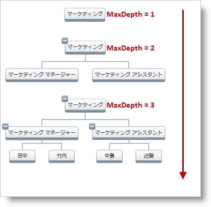

////

|metadata|
{
    "name": "xamorgchart-maximum-node-depth",
    "controlName": ["xamOrgChart"],
    "tags": ["How Do I"],
    "guid": "b1726951-13d2-4969-a2b6-de6101b84fac",  
    "buildFlags": [],
    "createdOn": "2016-05-25T18:21:57.7262709Z"
}
|metadata|
////

= ノードの最大の深さ

link:{ApiPlatform}controls.maps.xamorgchart{ApiVersion}~infragistics.controls.maps.xamorgchart~maxdepth.html[MaxDepth] プロパティで xamOrgChart に表示されるレベルの最大数を管理できます。実際に表示されるレベルの数は link:{ApiPlatform}controls.maps.xamorgchart{ApiVersion}~infragistics.controls.maps.xamorgchart~actualdepth.html[ActualDepth] プロパティに保存されます (このプロパティは読み取り専用です)。図 1 は、MaxDepth プロパティのさまざまな値の効果を説明します。

図 1: MaxDepth プロパティの設定に基づき、xamOrgChart コントロールによってさまざまな深さレベルが表示される

以下のコードは、 link:xamorgchart-adding-xamorgchart-to-your-application.html[「xamOrgChart をアプリケーションに追加」]で作成した組織図の実装を使用します。

*XAML の場合:*

----
<ig:XamOrgChart MaxDepth="4">
</ig:XamOrgChart>
----

*Visual Basic の場合:*

----
Dim orgChart As New XamOrgChart()
orgChart.MaxDepth = 4
Dim acturalDepth As Integer = orgChart.ActualDepth
----

*C# の場合:*

----
XamOrgChart orgChart = new XamOrgChart();
orgChart.MaxDepth = 4;
int acturalDepth = orgChart.ActualDepth;
----

== *関連トピック*

link:xamorgchart-using-xamorgchart.html[xamOrgChart の使用]