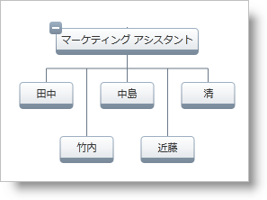
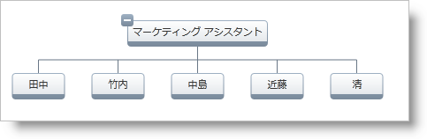
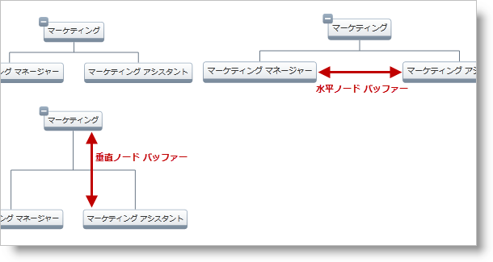

////

|metadata|
{
    "name": "xamorgchart-node-arrangement-settings",
    "controlName": ["xamOrgChart"],
    "tags": ["How Do I"],
    "guid": "8f7e0fc5-11a2-4ad5-ad17-87c5243873b1",  
    "buildFlags": [],
    "createdOn": "2016-05-25T18:21:57.7752648Z"
}
|metadata|
////

= ノード配置の設定

xamOrgChart コントロールにはノードの配置に影響する設定があります。作成できるセクションは以下のとおりです。

* link:{ApiPlatform}controls.maps.xamorgchart{ApiVersion}~infragistics.controls.maps.xamorgchart~nodearrangementstrategy.html[ノード配置方法]
* link:{ApiPlatform}controls.maps.xamorgchart{ApiVersion}~infragistics.controls.maps.xamorgchart~nodeflowdirection.html[ノード フロー方向]
* link:{ApiPlatform}controls.maps.xamorgchart{ApiVersion}~infragistics.controls.maps.xamorgchart~horizontalnodebuffer.html[水平方向]および link:{ApiPlatform}controls.maps.xamorgchart{ApiVersion}~infragistics.controls.maps.xamorgchart~verticalnodebuffer.html[垂直方向]のノード バッファ

== ノード配置方法

ノード配置方法は、xamOrgChart ノードが配置される方法を決定します。

* link:{ApiPlatform}controls.maps.xamorgchart{ApiVersion}~infragistics.controls.maps.nodearrangementstrategy.html[Stagger] (図 1) - ノードを最もコンパクトに配置します。大きいデータ セットに適しています。
* link:{ApiPlatform}controls.maps.xamorgchart{ApiVersion}~infragistics.controls.maps.nodearrangementstrategy.html[Orthogonal] (図 2) - きれいに配置された組織図を作ります。小さいデータ セットに適しています。

図 1: Stagger ノード配置方法

図 2: Orthogonal ノード配置方法

== ノード フロー方向

ノード フロー方向は、親に相対して子ノードの配置を決定します。以下の方向に設定できます。

* link:{ApiPlatform}controls.maps.xamorgchart{ApiVersion}~infragistics.controls.maps.nodeflowdirection.html[上] (親の上の子、下から上へのフロー方向) (図 3)
* link:{ApiPlatform}controls.maps.xamorgchart{ApiVersion}~infragistics.controls.maps.nodeflowdirection.html[下] (親の下の子、上から下へのフロー方向) (図 4)
* link:{ApiPlatform}controls.maps.xamorgchart{ApiVersion}~infragistics.controls.maps.nodeflowdirection.html[左] (親の左の子、右から左へのフロー方向) (図 5)
* link:{ApiPlatform}controls.maps.xamorgchart{ApiVersion}~infragistics.controls.maps.nodeflowdirection.html[右] (親の右の子、左から右へのフロー方向) (図 6)

[cols="a,a"]
|====

|image::images/xamOrgChart_Node_Arrangement_Settings_03.png[] 

図 3: 上

|image::images/xamOrgChart_Node_Arrangement_Settings_04.png[] 

図 4: 下

|image::images/xamOrgChart_Node_Arrangement_Settings_05.png[] 

図 5: 左

|image::images/xamOrgChart_Node_Arrangement_Settings_06.png[] 

図 6: 右

|====

== 水平方向および 垂直方向のノード バッファ

水平および垂直のノード バッファーはノード間の最小スペースを制御します(図 7)

図 7: 水平および垂直のノード バッファーの概略図

[NOTE]
====
*注:*

水平および垂直のノード バッファーを link:{ApiPlatform}controls.maps.xamorgchart{ApiVersion}~infragistics.controls.maps.orgchartnodelayout.html[OrgChartNodeLayout] オブジェクトに設定することも可能です。これはグローバル ノード バッファーをオーバーライドします。
====

*XAML の場合:*

[source,xaml]
----
<ig:OrgChartNodeLayout
    HorizontalNodeBuffer="50"
    VerticalNodeBuffer="50">                
</ig:OrgChartNodeLayout>
----

== コード例

*XAML の場合:*

[source,xaml]
----
<ig:XamOrgChart
    NodeArrangementStrategy="Orthogonal" 
    NodeFlowDirection="Above"
    HorizontalNodeBuffer="50"
    VerticalNodeBuffer="50">
</ig:XamOrgChart>
----

*Visual Basic の場合:*

----
Dim orgChart As  XamOrgChart = New XamOrgChart()
orgChart.NodeArrangementStrategy = NodeArrangementStrategy.Orthogonal
orgChart.NodeFlowDirection = NodeFlowDirection.Above
orgChart.HorizontalNodeBuffer = 50
orgChart.VerticalNodeBuffer = 50
----

*C# の場合:*

----
XamOrgChart orgChart = new XamOrgChart();
orgChart.NodeArrangementStrategy = NodeArrangementStrategy.Orthogonal;
orgChart.NodeFlowDirection = NodeFlowDirection.Above;
orgChart.HorizontalNodeBuffer = 50;
orgChart.VerticalNodeBuffer = 50;
----

== *関連トピック*

link:xamorgchart-using-xamorgchart.html[xamOrgChart の使用]