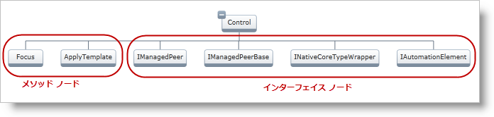
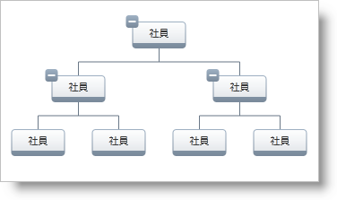
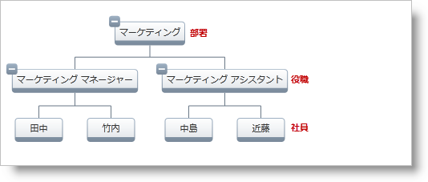

////

|metadata|
{
    "name": "xamorgchart-node-layouts-and-data",
    "controlName": ["xamOrgChart"],
    "tags": ["Data Binding","How Do I"],
    "guid": "201fc5a7-6d47-4b66-8110-604d8e360db7",  
    "buildFlags": [],
    "createdOn": "2016-05-25T18:21:57.7382719Z"
}
|metadata|
////

= ノード レイアウトおよびデータへのバインド

このトピックは、組織図をデータにバインドする方法を示します。

トピックは以下のとおりです。

* <<introduction,概要>>
* <<using_layouts,ノード レイアウトの使用>>

** <<hierarchical,階層ノード レイアウト>>
** <<global,グローバル ノード レイアウト>>
** <<manually,手動でノード レイアウトを選択する>>

[[introduction]]
== 概要

データを xamOrgChart コントロールにパスする時は、コントロールはバインド方法を認識する必要があります。これは link:{ApiPlatform}controls.maps.xamorgchart{ApiVersion}~infragistics.controls.maps.orgchartnodelayout.html[ノード レイアウト]で実行されます。データにバインドするために使用されるプロパティは以下のとおりです。

* link:{ApiPlatform}controls.maps.xamorgchart{ApiVersion}~infragistics.controls.maps.orgchartnodelayout~displaymemberpath.html[DisplayMemberPath] - ソース オブジェクトの視覚的表現として機能する値へのパス
* link:{ApiPlatform}controls.maps.xamorgchart{ApiVersion}~infragistics.controls.maps.orgchartnodelayout~key.html[Key] - 列挙可能なオブジェクトを公開するプロパティ
* link:{ApiPlatform}controls.maps.xamorgchart{ApiVersion}~infragistics.controls.maps.orgchartnodelayout~targettypename.html[TargetTypeName] - ノード レイアウトが一致しようとするオブジェクトのタイプ
* link:{ApiPlatform}controls.maps.xamorgchart{ApiVersion}~infragistics.controls.maps.orgchartnodelayout.html[NodeLayouts] - 子 OrgChartNodeLayout 項目のコレクション

[NOTE]
====
*注:*

Org Chart コントロールが階層ノード レイアウトとグローバル ノード レイアウトを定義した場合、グローバル ノード レイアウトは無視されます。
====

[NOTE]
====
*注:*

階層ノード レイアウトは Key プロパティに依存し、グローバル ノード レイアウトは TargetTypeName プロパティに依存して組織を構築します。
====

[NOTE]
====
*注:*

データ ソースからのオブジェクトに階層の分岐内のそれ自体への参照が含まれる場合、当該のデータがサポートされないため、例外がスローされます。
====

[[using_layouts]]
== ノード レイアウトの使用

[[hierarchical]]
== 階層ノード レイアウト

階層ノード レイアウトで作業をする時、xamOrgChart コントロールがルート ノード レイアウトとなります。データ ソースがオブジェクトのリストであることを前提として、以下に示すコードはフラットな展開不可能なリストを表示します(図 1)

image::images/xamOrgChart_Node_Layouts_and_Data_Binding_01.png[]

図 1: フラットな展開不可能なリストを表示

*XAML の場合:*

[source,xaml]
----
<ig:XamOrgChart DisplayMemberPath="ClassName">
</ig:XamOrgChart>
----

階層的な組織を作成するために (図 2)、ネストされたノード レイアウトは link:{ApiPlatform}controls.maps.xamorgchart{ApiVersion}~infragistics.controls.maps.xamorgchart~nodelayouts.html[Node Layouts] コレクションで定義できます。この場合、Key プロパティの値は親ノードのコレクションを参照します。TargetTypeName プロパティは使用されません。

image::images/xamOrgChart_Node_Layouts_and_Data_Binding_02.png[]

図 2: 階層ノード レイアウトを使用して階層を表示

*XAML の場合:*

[source,xaml]
----
<ig:XamOrgChart DisplayMemberPath="ClassName">
    <ig:XamOrgChart.NodeLayouts>
        <ig:OrgChartNodeLayout
                Key="Methods"
                DisplayMemberPath="MethodName" />
    </ig:XamOrgChart.NodeLayouts>
</ig:XamOrgChart>
----

図 3 は複数の階層ノード レイアウトの例を示します。

図 3: 複数の階層ノード レイアウトを使用して階層を表示

*XAML の場合:*

[source,xaml]
----
<ig:XamOrgChart DisplayMemberPath="ClassName">
    <ig:XamOrgChart.NodeLayouts>
        <ig:OrgChartNodeLayout
                Key="Methods"
                DisplayMemberPath="MethodName">
            <ig:OrgChartNodeLayout.NodeLayouts>
                <!--ここで子ノード レイアウトを定義します-->
            </ig:OrgChartNodeLayout.NodeLayouts>
        </ig:OrgChartNodeLayout>
        <ig:OrgChartNodeLayout
                Key="Interfaces"
                DisplayMemberPath="InterfaceName">
            <ig:OrgChartNodeLayout.NodeLayouts>
                <!--ここで子ノード レイアウトを定義します-->
            </ig:OrgChartNodeLayout.NodeLayouts>
        </ig:OrgChartNodeLayout>
    </ig:XamOrgChart.NodeLayouts>
</ig:XamOrgChart>
----

[[global]]
== グローバル ノード レイアウト

データ ソースがネストされた従業員の階層セットであることを前提として、 link:{ApiPlatform}controls.maps.xamorgchart{ApiVersion}~infragistics.controls.maps.xamorgchart~globalnodelayouts.html[Global Node Layouts] コレクションに追加された単一のノード レイアウトはすべてのネストされた項目と再帰的に一致します(図 4)

図 4: グローバル ノード レイアウトを使用して階層を表示

*XAML の場合:*

[source,xaml]
----
<ig:XamOrgChart>
    <ig:XamOrgChart.GlobalNodeLayouts>
        <ig:OrgChartNodeLayout
                TargetTypeName="Employee"
                DisplayMemberPath="Name"
                Key="Subordinates" />
    </ig:XamOrgChart.GlobalNodeLayouts>
</ig:XamOrgChart>
----

[NOTE]
====
*注:*

このデータ ソースの表示は、いくつかのネストされた階層ノード レイアウトを使用することでも実行できます。ノード レイアウトの数は階層レベルの深さと等しくなければなりません。
====

[NOTE]
====
*注:*

xamOrgChart コントロールは Global Node Layouts コレクションでネストされたノード レイアウトを無視します。
====

グローバル ノード レイアウトで作業をする時、TargetTypeName プロパティはタイプに応じてデータ ソースからの項目と一致させるために使用されます。Key プロパティは使用されません。

[NOTE]
====
*注:*

同じ TargetTypeName のノード レイアウトが複数ある場合、最初のひとつだけが使用されます。
====

図 5 は複数のグローバル ノード レイアウトの例を示します。

図 5: 複数のグローバル ノード レイアウトを使用して階層を表示

*XAML の場合:*

[source,xaml]
----
<ig:XamOrgChart>
    <ig:XamOrgChart.GlobalNodeLayouts>
        <ig:OrgChartNodeLayout 
            TargetTypeName="Department"
            DisplayMemberPath="DepartmentName"
            Key="EmployeePositions" />
        <ig:OrgChartNodeLayout 
            TargetTypeName="EmployeePosition"
            DisplayMemberPath="PositionName"
            Key="Employees" />
        <ig:OrgChartNodeLayout 
            TargetTypeName="Employee"
            DisplayMemberPath="FullName" />
    </ig:XamOrgChart.GlobalNodeLayouts>
</ig:XamOrgChart>
----

[[manually]]
== 手動でノード レイアウトを選択する

データ ソースからの項目が Node Layout オブジェクトと一致する場合常に、 link:{ApiPlatform}controls.maps.xamorgchart{ApiVersion}~infragistics.controls.maps.xamorgchart~nodelayoutassigned_ev.html[NodeLayoutAssigned] イベントが発生します。これによって、項目のタイプの評価と異なる Node Layout オブジェクトの割り当てが可能となります。

*XAML の場合:*

[source,xaml]
----
<ig:XamOrgChart NodeLayoutAssigned="OrgChart_NodeLayoutAssigned">
</ig:XamOrgChart>
----

*C# の場合:*

----
private void OrgChart_NodeLayoutAssigned(object sender, NodeLayoutAssignedEventArgs e)
{
    if (e.DataType.Name == "Employee")
    {
        //異なるノード レイアウトを割り当てます
        e.NodeLayout = differentNodeLayout;
    }
}
----

*Visual Basic の場合:*

[source,vb]
----
Private Sub OrgChart_NodeLayoutAssigned(sender As Object, e As NodeLayoutAssignedEventArgs)
    If e.DataType.Name = "Employee" Then
        '異なるノード レイアウトを割り当てます
        e.NodeLayout = differentNodeLayout
    End If
End Sub
----

== *関連トピック*

link:xamorgchart-using-xamorgchart.html[xamOrgChart の使用]