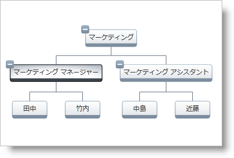

////

|metadata|
{
    "name": "xamorgchart-node-selection-behaviors",
    "controlName": ["xamOrgChart"],
    "tags": ["Events","Getting Started","Selection"],
    "guid": "d1b6d49a-7e56-460f-908a-9e68ce581a3a",  
    "buildFlags": [],
    "createdOn": "2016-05-25T18:21:57.7502726Z"
}
|metadata|
////

= ノード選択動作

このトピックは、xamOrgChart によってサポートされているノード選択動作を紹介し、コードに構成する方法を示します。

[NOTE]
====
*注:*

このトピックは、 link:xamorgchart-adding-xamorgchart-to-your-application.html[「xamOrgChart をアプリケーションに追加」]で作成した組織図を使用します。
====

== 選択動作

xamOrgChart コントロールは、以下の選択動作をサポートします。

* none - ノードは選択できません
* single - 一度に選択できるノードは 1 つだけです。
* multiple - Ctrl または Shift キーを押しながら複数のノードを選択できます
* extended - 1 つのノードとそのすべての子のノードを選択します。マウスの左ボタンをクリックして、分岐の選択を切り替えられます。

[NOTE]
====
*注:*

選択はスペース キーでも実行できます。
====

選択された状態のノードは、Ctrl キーを押しながらクリックすると選択解除することができます。

図 1: 選択された状態のノード

== 選択動作の構成

選択動作は xamOrgChart コントロールの link:{ApiPlatform}controls.maps.xamorgchart{ApiVersion}~infragistics.controls.maps.xamorgchart~selectiontype.html[SelectionType] プロパティから構成できます。有効な値は link:{ApiPlatform}controls.maps.xamorgchart{ApiVersion}~infragistics.controls.maps.orgchartselectiontype.html[None]、 link:{ApiPlatform}controls.maps.xamorgchart{ApiVersion}~infragistics.controls.maps.orgchartselectiontype.html[Single]、 link:{ApiPlatform}controls.maps.xamorgchart{ApiVersion}~infragistics.controls.maps.orgchartselectiontype.html[Multiple] および link:{ApiPlatform}controls.maps.xamorgchart{ApiVersion}~infragistics.controls.maps.orgchartselectiontype.html[Extended] です。それぞれは、前述したように動作を構成します。

*XAML の場合:*

----
<ig:XamOrgChart SelectionType="None|Single|Multiple|Extended">
----

== 選択された状態のノードの操作

xamOrgChart コントロールの link:{ApiPlatform}controls.maps.xamorgchart{ApiVersion}~infragistics.controls.maps.xamorgchart~selectednodes.html[SelectedNodes] プロパティは、現在選択された状態のノードがあるコレクションを返します。

選択が変更されると、 link:{ApiPlatform}controls.maps.xamorgchart{ApiVersion}~infragistics.controls.maps.xamorgchart~selectednodescollectionchanged_ev.html[SelectedNodesCollectionChanged] イベントが発生します。このイベントは、以下の情報を含む link:{ApiPlatform}controls.maps.xamorgchart{ApiVersion}~infragistics.controls.maps.orgchartnodeselectioneventargs.html[OrgChartNodeSelectionEventArgs] オブジェクトを渡します:

* link:{ApiPlatform}controls.maps.xamorgchart{ApiVersion}~infragistics.controls.maps.orgchartnodeselectioneventargs~originalselectednodes.html[OriginalSelectedNodes] - 以前に選択された状態のノードがあるコレクション;
* link:{ApiPlatform}controls.maps.xamorgchart{ApiVersion}~infragistics.controls.maps.orgchartnodeselectioneventargs~currentselectednodes.html[CurrentSelectedNodes] - 現在選択されている状態のノードを含むコレクション。

SelectedNodesCollectionChanged イベントにイベント ハンドラーを添付します:

*XAML の場合:*

----
<ig:XamOrgChart     NodeSelection="Multiple"    SelectedNodesCollectionChanged="SelectedNodesChanged">
----

*Visual Basic の場合:*

----
Private Sub SelectedNodesChanged (sender As Object, e As OrgChartNodeSelectionEventArgs)
    Dim originalSelectedNodes = e.OriginalSelectedNodes
    Dim currentSelectedNodes = e.CurrentSelectedNodes
End Sub
----

*C# の場合:*

----
private void SelectedNodesChanged(object sender, OrgChartNodeSelectionEventArgs e)
{
    var originalSelectedNodes = e.OriginalSelectedNodes;
    var currentSelectedNodes = e.CurrentSelectedNodes; 
}
----

== *関連トピック*

link:xamorgchart-using-xamorgchart.html[xamOrgChart の使用]