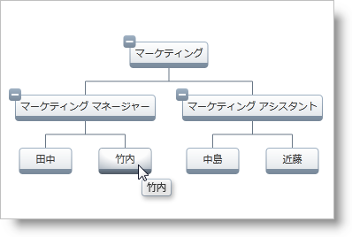

////

|metadata|
{
    "name": "xamorgchart-node-tooltips",
    "controlName": ["xamOrgChart"],
    "tags": ["How Do I"],
    "guid": "b17b95d0-ac15-45d9-8077-f71ff0b92b6b",  
    "buildFlags": [],
    "createdOn": "2016-05-25T18:21:57.7442715Z"
}
|metadata|
////

= ノードのツールチップ

このトピックは、xamOrgChart のノードにツールチップを追加する方法と、そのコンテンツをカスタマイズする方法を示します。

トピックは以下のとおりです。

* <<introduction,概要>>
* <<basic_tooltips,基本的なツールチップ>>
* <<custom_tooltips,カスタム ツールチップ>>

[[introduction]]
== 概要

xamOrgChart および link:{ApiPlatform}controls.maps.xamorgchart{ApiVersion}~infragistics.controls.maps.orgchartnodelayout.html[OrgChartNodeLayout] クラスには、ツールチップの使用に関連するプロパティがあります:

* link:{ApiPlatform}controls.maps.xamorgchart{ApiVersion}~infragistics.controls.maps.orgchartnodelayout~allowtooltips.html[AllowToolTips] - ツールチップを表示するかどうかを決定します
* link:{ApiPlatform}controls.maps.xamorgchart{ApiVersion}~infragistics.controls.maps.orgchartnodelayout~tooltippath.html[ToolTipPath] - ソース オブジェクトのビジュアル表示としての役割を果たす値へのパス
* link:{ApiPlatform}controls.maps.xamorgchart{ApiVersion}~infragistics.controls.maps.orgchartnodelayout~tooltipcontenttemplate.html[ToolTipContentTemplate] - カスタム ツールチップのテンプレート

[NOTE]
====
*注:*

組織図が階層ノード レイアウトを使用してデータを表示する場合、コントロールはルートのノード レイアウトとして動作するので、ツールチップのプロパティは、xamOrgChart コントロールに設定できます。
====

[NOTE]
====
*注:*

このトピックのコードと説明には、 link:xamorgchart-adding-xamorgchart-to-your-application.html[「xamOrgChart をアプリケーションに追加」]で作成した組織図を使用します。
====

[[basic_tooltips]]
== 基本的なツールチップ

ツールチップとして使用されるフィールドは、ToolTipPath プロパティで指定されます。

ToolTipPath="JobTitle" を追加すると、すべての社員ノードにジョブ タイトルを表示するシンプルなツールチップが作成されます。

*XAML の場合:*

[source,xaml]
----
<ig:OrgChartNodeLayout
    TargetTypeName="Employee"
    DisplayMemberPath="FirstName"
    ToolTipPath="JobTitle" />
----

図 1: シンプルなツールチップ

ツールチップを xamOrgChart に追加します:

*XAML の場合:*

[source,xaml]
----
<ig:XamOrgChart
    ToolTipPath="JobTitle">
</ig:XamOrgChart>
----

[[custom_tooltips]]
== カスタム ツールチップ

TooltipContentTemplate プロパティを使用してツールチップにカスタム テンプレートを指定します。

DataTemplate オブジェクトを作成します:

*XAML の場合:*

[source,xaml]
----
<DataTemplate x:Key="EmployeeTooltipTemplate">
    <StackPanel>
        <TextBlock Text="{Binding JobTitle}" FontWeight="Bold" />
        <TextBlock Text="{Binding FirstName}" />
        <TextBlock Text="{Binding LastName}" />
    </StackPanel>
</DataTemplate>
----

*XAML の場合:*

[source,xaml]
----
<ig:OrgChartNodeLayout
    TargetTypeName="Employee"
    DisplayMemberPath="FirstName"
    ToolTipContentTemplate="{StaticResource EmployeeTooltipTemplate}" />
----

image::images/xamOrgChart_Node_Tooltips_02.png[]

図 2: データ テンプレートを使用しているカスタム ツールチップ

カスタム ツールチップを xamOrgChart に追加します:

*XAML の場合:*

[source,xaml]
----
<ig:XamOrgChart
    ToolTipContentTemplate ="{StaticResource EmployeeTooltipTemplate}">
</ig:XamOrgChart>
----

== *関連トピック*

link:xamorgchart-using-xamorgchart.html[xamOrgChart の使用]