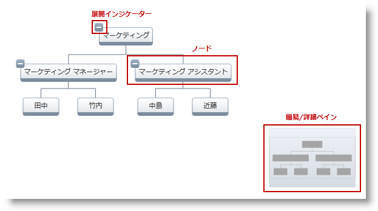

////

|metadata|
{
    "name": "xamorgchart-styling",
    "controlName": ["xamOrgChart"],
    "tags": ["Styling"],
    "guid": "e41752ce-ce55-4351-a650-158a568b7560",  
    "buildFlags": [],
    "createdOn": "2016-05-25T18:21:57.7632645Z"
}
|metadata|
////

= スタイル設定

このトピックは、xamOrgChart のスタイル可能な要素を紹介して、ノード スタイルの設定方法を示します。

トピックは以下のとおりです。

* <<introduction,概要>>
* <<styleable_elements,スタイル可能な要素>>
* <<setting_styles,ノード スタイルの設定>>

** <<orgchart,OrgChart でスタイルを設定>>
** <<nodelayout,ノード レイアウトでスタイルを設定>>
** <<orgchartnode,OrgChartNode オブジェクトでスタイルを設定>>

[[introduction]]
== 概要

xamOrgChart のノードは、 link:{ApiPlatform}controls.maps.xamorgchart{ApiVersion}~infragistics.controls.maps.orgchartnodecontrol.html[OrgChartNodeControl] を使用して視覚化されます。ノードが組織図の表示領域外に移動されると、それに関連する OrgChartNodeControl は破棄されます。ノードが表示領域内に移動されると、新しい OrgChartNodeControl が作成されます。

ノードのデータは、 link:{ApiPlatform}controls.maps.xamorgchart{ApiVersion}~infragistics.controls.maps.orgchartnode.html[OrgChartNode] オブジェクトに保存されます。新しい OrgChartNodeControl が作成されると、OrgChartNode オブジェクトにリンクされます。ノードのビジュアル スタイルは OrgChartNode 項目に保存され、直接または link:{ApiPlatform}controls.maps.xamorgchart{ApiVersion}~infragistics.controls.maps.orgchartnodelayout.html[Node Layouts] から指定できます。

[[styleable_elements]]
== スタイル可能な要素

図 1: xamOrgChart コントロールのスタイル可能な要素

[options="header", cols="a,a,a"]
|====
|ターゲット|プロパティ|ターゲットの種類

|概要と詳細ペイン
| link:{ApiPlatform}datavisualization{ApiVersion}~infragistics.controls.surfaceviewer~overviewplusdetailpanestyle.html[OverviewPlusDetailPaneStyle]
| link:{ApiPlatform}datavisualization{ApiVersion}~infragistics.controls.xamoverviewplusdetailpane.html[XamOverviewPlusDetailPane]

|ノード
| link:{ApiPlatform}controls.maps.xamorgchart{ApiVersion}~infragistics.controls.maps.xamorgchart~nodestyle.html[NodeStyle] (OrgChart から設定された場合) 

link:{ApiPlatform}controls.maps.xamorgchart{ApiVersion}~infragistics.controls.maps.orgchartnodelayout~nodestyle.html[NodeStyle] (ノード レイアウトから設定された場合) 

link:{ApiPlatform}controls.maps.xamorgchart{ApiVersion}~infragistics.controls.maps.orgchartnode~style.html[Style] (OrgChartNode から設定された場合) 
| link:{ApiPlatform}controls.maps.xamorgchart{ApiVersion}~infragistics.controls.maps.orgchartnodecontrol.html[OrgChartNodeControl]

|展開インジケーター
| link:{ApiPlatform}controls.maps.xamorgchart{ApiVersion}~infragistics.controls.maps.xamorgchart~expansionindicatorstyle.html[ExpansionIndicatorStyle] (OrgChart から設定された場合) 

link:{ApiPlatform}controls.maps.xamorgchart{ApiVersion}~infragistics.controls.maps.orgchartnodelayout~expansionindicatorstyle.html[ExpansionIndicatorStyle] (ノード レイアウトから設定された場合) 

link:{ApiPlatform}controls.maps.xamorgchart{ApiVersion}~infragistics.controls.maps.orgchartnode~expansionindicatorstyle.html[ExpansionIndicatorStyle] (OrgChartNode から設定された場合) 
|ToggleButton

|====

表 1: スタイル可能な要素とそのタイプ

[NOTE]
====
*注:*

階層的なノード レイアウトを使用している場合、xamOrgChart はルートのノード レイアウトのように動作し、ノード スタイルおよび展開インジケーター スタイルをそのノードに適用できます。
====

[[setting_styles]]
== ノード スタイルの設定

[[orgchart]]
== OrgChart でスタイルを設定

*XAML の場合:*

[source,xaml]
----
<ig:XamOrgChart
    OverviewPlusDetailPaneStyle="..."
    NodeStyle="..."
    ExpansionIndicatorStyle="...">
</ig:XamOrgChart>
----

[[nodelayout]]
== ノード レイアウトでスタイルを設定

*XAML の場合:*

[source,xaml]
----
<ig:OrgChartNodeLayout
    NodeStyle="..."
    ExpansionIndicatorStyle="...">
</ig:OrgChartNodeLayout>
----

[[orgchartnode]]
== OrgChartNode オブジェクトでスタイルを設定

この例では、ノードをクリックすると OrgChartNode オブジェクトが取得されます。

*XAML の場合:*

[source,xaml]
----
<ig:XamOrgChart
    NodeMouseLeftButtonDown="XamOrgChart_NodeMouseLeftButtonDown">
</ig:XamOrgChart>
----

*C# の場合:*

----
private void XamOrgChart_NodeMouseLeftButtonDown(object sender, OrgChartNodeClickEventArgs e)
{
    e.Node.Node.Style = anOrgChartNodeControlStyle;
    e.Node.Node.ExpansionIndicatorStyle= aToggleButtonStyle;
}
----

*Visual Basic の場合:*

----
Private Sub XamOrgChart_NodeMouseLeftButtonDown(sender As Object, e As OrgChartNodeClickEventArgs)
    e.Node.Node.Style = anOrgChartNodeControlStyle
    e.Node.Node.ExpansionIndicatorStyle= aToggleButtonStyle
End Sub
----

== *関連トピック*

link:xamorgchart-using-xamorgchart.html[xamOrgChart の使用]