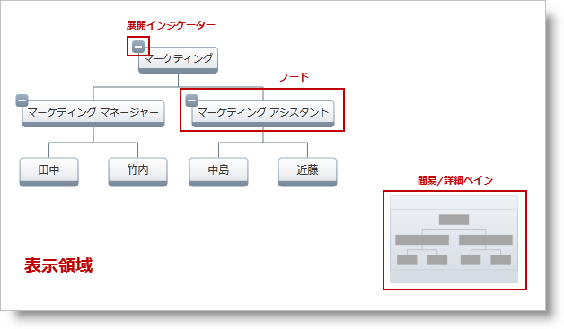
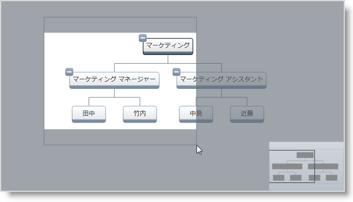
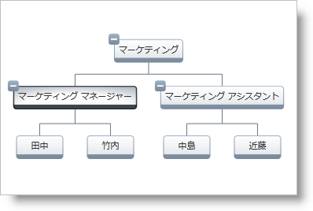
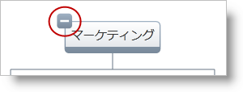

////

|metadata|
{
    "name": "xamorgchart-understanding-xamorgchart",
    "controlName": ["xamOrgChart"],
    "tags": ["Getting Started","Navigation","Selection"],
    "guid": "8d948f4b-7f6a-44c9-b245-1cd1326dffe8",  
    "buildFlags": [],
    "createdOn": "2016-05-25T18:21:57.6692985Z"
}
|metadata|
////

= xamOrgChart の理解

このトピックは、 link:{ApiPlatform}controls.maps.xamorgchart{ApiVersion}~infragistics.controls.maps.xamorgchart.html[xamOrgChart] コントロールを紹介し、その要素と機能を説明します。

== 概要

xamOrgChart は組織図を描画するためのデータ バインドされたコントロールです。このコントロールは、ノードの展開と縮小、パンとズーム、キーボード ナビゲーション、カスタム スタイルおよびテンプレート、複数ノードの選択をはじめとするさまざまな選択タイプをサポートします。

== OrgChart の要素

xamOrgChart コントロールは以下の要素で構成されています (図 1)。

* 表示領域
* ノード

** 展開インジケーター - 各ノードには展開インジケーターがあります

* 概要と詳細ペイン

図 1: OrgChart の要素

== ユーザー相互作用と操作性

== パンとズーム

マウスで、または link:xamoverviewplusdetailpane.html[xamOverviewPlusDetailPane] コントロールを使用することによって、パンとズームを実行できます。

* パン: チャートの面の任意の場所をクリックしてドラッグします
* ズーム:

** マウスのスクロール ボタンを使用します
** Ctrl キーを押している間クリック アンド ドラッグします

図 2: Ctrl キーを押している間ドラッグすることでズーム

== キーボード ナビゲーション

キーボードの矢印キーで xamOrgChart のノードをトラバースしてフォーカスを設定することができます。

図 3: Senior Tool Designer ノードにフォーカスを設定した xamOrgChart

キーボードを使用すると、以下を実行できます。

* スペース キーでノードを選択する (ノードの選択の詳細は「選択」トピックを参照してください)。
* プラス (+) キーとマイナス (-) キーの付いた子ノードを展開する
* Enter キーで子ノードの状態を切り替える
* Ctrl キーを押している間プラス (+) キーとマイナス (-) キーで拡大および縮小する

== 子の展開/縮小

xamOrgChart コントロールのノードには、子ノードを展開/縮小する機能があります。これはノードの展開インジケーターで実行されます。

図 4: 子ノードを展開/縮小する展開インジケーター

== *関連トピック*

link:xamorgchart-adding-xamorgchart-to-your-application.html[xamOrgChart をアプリケーションに追加]

link:xamorgchart-using-xamorgchart.html[xamOrgChart の使用]

link:xamorgchart-api-overview.html[API の概要]