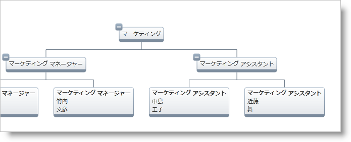

////

|metadata|
{
    "name": "xamorgchart-using-custom-node-item-templates",
    "controlName": ["xamOrgChart"],
    "tags": ["Extending","Styling","Templating"],
    "guid": "6551c1a8-0f2c-4a9d-af81-aafcf05d0b98",  
    "buildFlags": [],
    "createdOn": "2016-05-25T18:21:57.6762691Z"
}
|metadata|
////

= カスタム ノード項目テンプレートの使用

このトピックは、カスタム ノード項目テンプレートを使用して、OrgChart ノードに表示されるデータをカスタマイズする方法を説明します。これは、 link:{ApiPlatform}controls.maps.xamorgchart{ApiVersion}~infragistics.controls.maps.orgchartnodelayout.html[OrgChartNodeLayout] クラスの link:{ApiPlatform}controls.maps.xamorgchart{ApiVersion}~infragistics.controls.maps.orgchartnodelayout~itemtemplate.html[ItemTemplate] プロパティを構成することで実行されます。このプロパティは、ノード レイアウトによってマップされたノードのコンテンツのためのカスタム テンプレートを指定します。

[NOTE]
====
*注* : 「手順」セクションのコードは、 link:xamorgchart-adding-xamorgchart-to-your-application.html[「xamOrgChart をアプリケーションに追加」]トピックで作成した組織図を使用します。
====

== プレビュー

以下は、以下の「手順」のセクションで作成および構成されたカスタム ノード項目テンプレートによって生成された、最終的な結果のプレビューです。

図 1: このトピックで使用されるカスタム ノード項目テンプレートによって生成された組織図

== 手順

[start=1]
. データ テンプレートを作成します。

*XAML の場合:*

[source,xaml]
----
<DataTemplate x:Key="EmployeeTemplate">
    <StackPanel>
        <TextBlock Text="{Binding JobTitle}" FontWeight="Bold" />
        <TextBlock Text="{Binding FirstName}" />
        <TextBlock Text="{Binding LastName}" />
    </StackPanel>
</DataTemplate>
----

[start=2]
. ItemTemplate を構成します。

希望の Node Layout オブジェクトの ItemTemplate をデータ テンプレートになるように設定します。

*XAML の場合:*

[source,xaml]
----
<ig:OrgChartNodeLayout
    TargetTypeName="Employee"
    ItemTemplate="{StaticResource EmployeeTemplate}" />
----

*関連トピック*

link:xamorgchart-using-xamorgchart.html[xamOrgChart の使用]