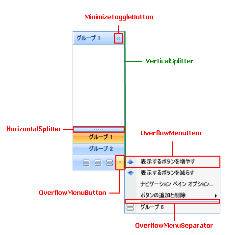
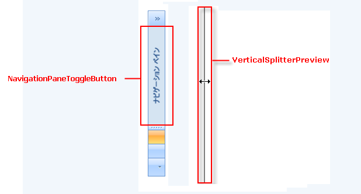
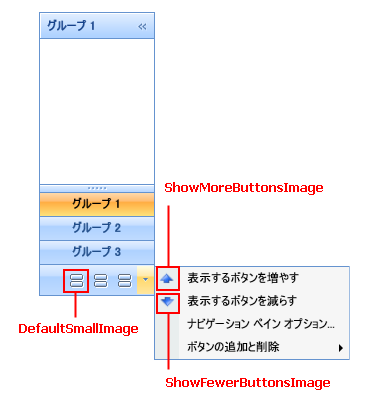

////

|metadata|
{
    "name": "xamoutlookbar-about-styling-xamoutlookbar",
    "controlName": ["xamOutlookBar"],
    "tags": ["Styling"],
    "guid": "{17C7A585-7523-450A-88DE-AB4069C779B2}",  
    "buildFlags": [],
    "createdOn": "2012-01-30T19:39:54.0271585Z"
}
|metadata|
////

= xamOutlookBar のスタイリングについて

Microsoft® Windows® Presentation Foundation のコントロールのように Styles および ControlTemplates を使用して xamOutlookBar™ を再スタイルできます。ただし、xamOutlookBar を構成するさまざまなクラスは、Style または ControlTemplate の Key プロパティとして使用できる静的なプロパティを公開することによってより簡単にスタイリングできます。xamOutlookBar が事前に定義されたキーを使用する Style または ControlTemplate を見つけると、xamOutlookBar コントロールは自動的にユーザーが作成した Style または ControlTemplate を使用します。

以下の表は、ユーザーの Styles および ControlTemplates を作成する時にユーザーがキーとして使用できる静的プロパティをリストしています。各セクションの見出しは、プロパティが公開するクラスです。プロパティ名が「TemplateKey」で終わっている場合、その要素をスタイルするために ControlTemplate を作成する必要があります。プロパティ名が「StyleKey」で終わっている場合、その要素をスタイルするために Style を作成する必要があります。たとえば、xamOutlookBar を最小化するコントロールをスタイルしたい場合、以下の表を使用してクラスとプロパティ名を最初に見つけます。プロパティが見つかれば、そのプロパティの名前に基づいて ControlTemplate または Style を作成します。マークアップ拡張を使用してプロパティに ControlTemplate または Style の Key プロパティを設定します。

*XAML の場合:*

[source]
----
<!--
プロパティ名が「StyleKey」で終わっているのでスタイルを作成します。
コントロール テンプレートの Key プロパティを XamOutlookBar クラスによって公開されている静的プロパティに設定します。
コントロール テンプレートの TargetType プロパティを ToggleButton に設定します。
-->

----

== link:{ApiPlatform}outlookbar{ApiVersion}~infragistics.windows.outlookbar.xamoutlookbar.html[XamOutlookBar] クラス (スタイルおよび ControTemplate キー)

[options="header", cols="a,a"]
|====
|プロパティ名|ターゲット タイプ

| link:{ApiPlatform}outlookbar{ApiVersion}~infragistics.windows.outlookbar.xamoutlookbar~horizontalsplitterstylekey.html[HorizontalSplitterStyleKey]
|Thumb

| link:{ApiPlatform}outlookbar{ApiVersion}~infragistics.windows.outlookbar.xamoutlookbar~minimizetogglebuttonstylekey.html[MinimizeToggleButtonStyleKey]
|ToggleButton

| link:{ApiPlatform}outlookbar{ApiVersion}~infragistics.windows.outlookbar.xamoutlookbar~navigationpanetogglebuttonstylekey.html[NavigationPaneToggleButtonStyleKey]
|ToggleButton

| link:{ApiPlatform}outlookbar{ApiVersion}~infragistics.windows.outlookbar.xamoutlookbar~overflowmenuseparatorstylekey.html[OverflowMenuSeparatorStyleKey]
|Separator

| link:{ApiPlatform}outlookbar{ApiVersion}~infragistics.windows.outlookbar.xamoutlookbar~overflowmenuitemstylekey.html[OverflowMenuItemStyleKey]
|MenuItem

| link:{ApiPlatform}outlookbar{ApiVersion}~infragistics.windows.outlookbar.xamoutlookbar~overflowmenubuttonstylekey.html[OverflowMenuButtonStyleKey]
|MenuItem

| link:{ApiPlatform}outlookbar{ApiVersion}~infragistics.windows.outlookbar.xamoutlookbar~verticalsplitterpreviewstylekey.html[VerticalSplitterPreviewStyleKey]
|None

| link:{ApiPlatform}outlookbar{ApiVersion}~infragistics.windows.outlookbar.xamoutlookbar~verticalsplitterstylekey.html[VerticalSplitterStyleKey]
|Thumb

|====

== XamOutlookBar クラス (画像キー)

XamOutlookBar クラスは、xamOutlookBar コントロール内にある画像を変更するために使用できる複数のキーを公開しています。画像を変更するために、Style または ControlTemplate を作成する必要はありません。その代りに、BitmapImage オブジェクトをリソースディクショナリに追加して、その Key プロパティを XamOutlookBar クラスが公開する静的キー プロパティに設定できます。

[options="header", cols="a,a"]
|====
|プロパティ名|オブジェクト タイプ

| link:{ApiPlatform}outlookbar{ApiVersion}~infragistics.windows.outlookbar.xamoutlookbar~showfewerbuttonsimagekey.html[ShowFewerButtonsImageKey]
|BitmapImage

| link:{ApiPlatform}outlookbar{ApiVersion}~infragistics.windows.outlookbar.xamoutlookbar~showmorebuttonsimagekey.html[ShowMoreButtonsImageKey]
|BitmapImage

| link:{ApiPlatform}outlookbar{ApiVersion}~infragistics.windows.outlookbar.xamoutlookbar~defaultsmallimagekey.html[DefaultSmallImageKey]
|BitmapImage

|====

