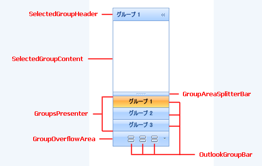
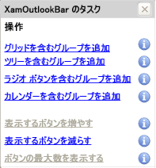
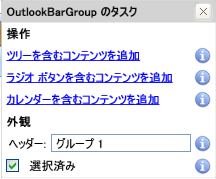

////
|metadata|
{
    "name": "xamoutlookbar-about-xamoutlookbar",
    "controlName": ["xamOutlookBar"],
    "tags": ["Getting Started"],
    "guid": "{0E8FC032-A48B-432B-A077-B528AB69C964}",
    "buildFlags": [],
    "createdOn": "2012-01-30T19:39:54.0291589Z"
}
|metadata|
////

= xamOutlookBar について

xamOutlookBar™ コントロールは Microsoft® Outlook® にあるナビゲーション バーをエミュレートします。Outlook が電子メール関連の機能をカレンダー関連の機能から分離するように、自分自身のアプリケーションタスクを関連する作業のサブセットに整理することができます。xamOutlookBar コントロールは以下の機能を提供します:

* *グループ* - 各グループはさまざまなコントロール セットをホストできるヘッダー付きのコンテンツ コントロールです。
* *縮小可能* - エンドユーザーは画面領域を最大化するために xamOutlookBar を縮小できます。

== xamOutlookBar スマート タグ

xamOutlookBar™ コントロールは、スマート タグを備えています。xamOutlookBar を選択するだけで、スマート タグのアンカーが表示されます。このアンカーをクリックするとポップアップ パネルが表示され、そこから xamOutlookBar の最もよく使うプロパティや設定にすばやく簡単にアクセスできます。スマート タグ内の各項目 (フィールド、ドロップダウン リスト、リンクなど) の説明と、プロパティ ウィンドウの各項目が対応するプロパティについては、以下の表を参照してください。

[options="header", cols="a,a,a"]
|====
|項目|説明|対応するプロパティ

|グリッドを含むグループを追加
|このリンクをクリックすると、 link:{ApiPlatform}outlookbar{ApiVersion}~infragistics.windows.outlookbar.outlookbargroup.html[OutlookBarGroup] オブジェクトが xamOutlookBar に追加されます。グループのコンテンツは、Grid パネルに設定されます。
|なし

|ツリーを含むグループを追加
|このリンクをクリックすると、OutlookBarGroup オブジェクトが xamOutlookBar に追加されます。グループのコンテンツは、TreeView コントロールに設定されます。
|なし

|ラジオ ボタンを含むグループを追加
|このリンクをクリックすると、OutlookBarGroup オブジェクトが xamOutlookBar に追加されます。グループのコンテンツは、2 つの ListBox コントロールに設定されます。最初の ListBox コントロールには TextBlock コントロールが 3 つ含まれ、2 番目の ListBox コントロールには RadioButton コントロールが 3 つ含まれます。
|なし

|カレンダーを含むグループを追加
|このリンクをクリックすると、OutlookBarGroup オブジェクトが xamOutlookBar に追加されます。グループのコンテンツは xamMonthCalendar™ コントロールに設定されます。*Infragistics.WPF.Editors* NuGet パッケージへの参照をまだ追加していない場合は、プロジェクトに追加する必要があります。
|なし

|表示するボタンを増やす
|このリンクをクリックすると、グループ プレゼンターに表示されるグループが多くなります。
|なし

|表示するボタンを減らす
|このリンクをクリックすると、グループ プレゼンターに表示されるグループが少なくなります。
|なし

|ボタンの最大数を表示する
|このリンクをクリックすると、xamOutlookBar コントロールの高さに基づいてグループ プレゼンターに最大数のグループが表示されます。
|なし

|====

== OutlookBarGroup スマート タグ

OutlookBarGroup オブジェクトはスマート タグを備えています。xamOutlookBar でグループを選択するだけで、スマート タグのアンカーが表示されます。このアンカーをクリックするとポップアップ パネルが表示され、そこから OutlookBarGroup の最もよく使うプロパティや設定にすばやく簡単にアクセスできます。スマート タグ内の各項目 (フィールド、ドロップダウン リスト、チェックボックス、リンクなど) の説明と、プロパティ ウィンドウの各項目が対応するプロパティについては、以下の表を参照してください。

[options="header", cols="a,a,a"]
|====
|項目|説明|対応するプロパティ

|ツリーを含むコンテンツを追加
|このリンクをクリックすると、 link:{ApiPlatform}outlookbar{ApiVersion}~infragistics.windows.outlookbar.outlookbargroup.html[OutlookBarGroup] オブジェクトが xamOutlookBar に追加されます。グループのコンテンツは、TreeView コントロールに設定されます。
| link:https://msdn.microsoft.com/ja-jp/library/system.windows.controls.contentcontrol.content(v=vs.110).aspx[Content]

|ラジオ ボタンを含むコンテンツを追加
|このリンクをクリックすると、OutlookBarGroup オブジェクトが xamOutlookBar に追加されます。グループのコンテンツは、2 つの ListBox コントロールに設定されます。最初の ListBox コントロールには TextBlock コントロールが 3 つ含まれ、2 番目の ListBox コントロールには RadioButton コントロールが 3 つ含まれます。
|Content

|カレンダーを含むコンテンツを追加
|このリンクをクリックすると、OutlookBarGroup オブジェクトが xamOutlookBar に追加されます。グループのコンテンツは xamMonthCalendar™ コントロールに設定されます。*Infragistics.WPF.Editors* NuGet パッケージへの参照をまだ追加していない場合は、プロジェクトに追加する必要があります。
|Content

|Header
|これはグループのヘッダーに表示するテキストです。
| link:https://msdn.microsoft.com/ja-jp/library/system.windows.controls.headeredcontentcontrol.header(v=vs.110).aspx[Header]

|選択済み
|このリンクをクリックするとグループが選択されます。
| link:{ApiPlatform}outlookbar{ApiVersion}~infragistics.windows.outlookbar.outlookbargroup~isselected.html[IsSelected]

|====

== 関連トピック

link:xamoutlookbar-adding-xamoutlookbar-to-your-page.html[xamOutlookBar をアプリケーションに追加]

link:xamoutlookbar-using-xamoutlookbar.html[xamOutlookBar の使用]