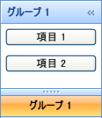

////

|metadata|
{
    "name": "xamoutlookbar-add-content-to-a-group",
    "controlName": ["xamOutlookBar"],
    "tags": ["Editing","Grouping"],
    "guid": "{A43EA43C-8A18-43DE-A28E-BF1E4CB03CC9}",  
    "buildFlags": [],
    "createdOn": "2012-01-30T19:39:54.0321595Z"
}
|metadata|
////

= コンテンツをグループに追加

link:{ApiPlatform}outlookbar{ApiVersion}~infragistics.windows.outlookbar.outlookbargroup.html[OutlookBarGroup] オブジェクトは HeaderedContentControl から派生しているので、このオブジェクトの使用は Microsoft Windows® Presentation Foundation のヘッダー付きコンテンツ コントロールに似ています。Windows Presentation Foundation のコンテンツコントロールと同じように、グループの link:{ApiPlatform}outlookbar{ApiVersion}~infragistics.windows.outlookbar.outlookbargroup.html[Content] プロパティをオブジェクトのインスタンスに設定できます。多くのケースでは、グリッド パネルなどのレイアウト コンテナーをルート要素として使用します (レイアウト コンテナーに補足要素を追加する)。

以下のコード例は、項目をグループに追加する方法を示します。プロシージャー コードは、キー「group1」の OutlookBarGroup オブジェクトを xamOutlookBar™ にすでに追加していることを前提とします。

*XAML の場合:*

----
<igOutlookBar:OutlookBarGroup Header="Group 1" Key="group1">
    <StackPanel>
        <Button Content="Item 1" Margin="5" />
        <Button Content="Item 2" Margin="5" />
    </StackPanel>
</igOutlookBar:OutlookBarGroup>
----

*Visual Basic の場合:*

----
Dim stackPanel1 As New StackPanel()
Me.xamOutlookBar1.Groups("group1").Content = stackPanel1
Dim button1 As New Button() With { .Content = "Item 1", .Margin = New Thickness(5) }
Dim button2 As New Button() With { .Content = "Item 2", .Margin = New Thickness(5) }
stackPanel1.Children.Add(button1)
stackPanel1.Children.Add(button2)
----

*C# の場合:*

----
StackPanel stackPanel1 = new StackPanel();
this.xamOutlookBar1.Groups["group1"].Content = stackPanel1;
Button button1 = new Button()
{ 
    Content = "Item 1",
    Margin = new Thickness(5)
};
Button button2 = new Button()
{ 
    Content = "Item 2",
    Margin = new Thickness(5)
};
stackPanel1.Children.Add(button1);
stackPanel1.Children.Add(button2);
----

== 関連トピック

link:xamoutlookbar-about-styling-xamoutlookbar.html[xamOutlookBar のスタイリングについて]

link:xamoutlookbar-add-groups-to-xamoutlookbar.html[グループを xamOutlookBar に追加]

link:xamoutlookbar-collapse-xamoutlookbar.html[xamOutlookBar の縮小]

link:xamoutlookbar-select-a-group.html[グループの選択]