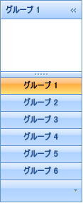

////

|metadata|
{
    "name": "xamoutlookbar-add-groups-to-xamoutlookbar",
    "controlName": ["xamOutlookBar"],
    "tags": ["Editing","Grouping"],
    "guid": "{6E02B83C-CB86-43E7-A29C-B012E01F0F75}",  
    "buildFlags": [],
    "createdOn": "2012-01-30T19:39:54.0341599Z"
}
|metadata|
////

= グループを xamOutlookBar に追加

xamOutlookBar™ のグループはコンテンツのコンテナーとして機能するヘッダー付きのコンテンツ コントロールです。link:{ApiPlatform}outlookbar{ApiVersion}~infragistics.windows.outlookbar.outlookbargroup.html[OutlookBarGroup] オブジェクトのヘッダーにテキストと画像を表示するには、その link:{ApiPlatform}outlookbar{ApiVersion}~infragistics.windows.outlookbar.outlookbargroup.html[Header] プロパティおよび link:{ApiPlatform}outlookbar{ApiVersion}~infragistics.windows.outlookbar.outlookbargroup~largeimage.html[LargeImage] プロパティをそれぞれ設定します。また、OutlookBarGroup オブジェクトの link:{ApiPlatform}outlookbar{ApiVersion}~infragistics.windows.outlookbar.outlookbargroup~smallimage.html[SmallImage] プロパティを設定すると、グループがオーバーフロー領域に到達したときに画像を表示できます。SmallImage プロパティを設定しない場合、xamOutlookBar コントロールはオーバーフロー領域でデフォルトのエンベロープ画像を自動的に使用します。

上記のプロパティのほかに、以下のプロパティがよく使用されます。

* link:{ApiPlatform}outlookbar{ApiVersion}~infragistics.windows.outlookbar.outlookbargroup~key.html[Key] - xamOutlookBar の link:{ApiPlatform}outlookbar{ApiVersion}~infragistics.windows.outlookbar.xamoutlookbar~groups.html[グループ コレクション] にインデックス設定できるようにするために設定するオプションのプロパティです。Key プロパティを設定する場合、各グループの一意の値を提供する必要があります。
* link:{ApiPlatform}outlookbar{ApiVersion}~infragistics.windows.outlookbar.outlookbargroup~isselected.html[IsSelected] - 特定のグループを選択するために XAML またはコードでこのプロパティを設定できます。一度に選択できるグループはひとつだけです。
* link:{ApiPlatform}outlookbar{ApiVersion}~infragistics.windows.outlookbar.outlookbargroup~location.html[Location] - 実行時に、エンド ユーザーはグループを異なる場所に移動できます。配置される場所を決定するためにグループの Location プロパティをクエリできます。

以下のコード例は、xamOutlookBar にグループを追加する方法を示します。アプリケーションで実際の画像を指し示す URI で LargeImage プロパティと SmallImage プロパティのサンプル URI を置き換えることが必要となります。

*XAML の場合:*

----
<igOutlookBar:XamOutlookBar Name="xamOutlookBar1"               HorizontalAlignment="Left">
    <igOutlookBar:XamOutlookBar.Groups>
        <igOutlookBar:OutlookBarGroup 
            Header="Group 1" 
            LargeImage="ReplaceWithYourLargeImage.png" 
            SmallImage="ReplaceWithYourSmallImage.png" 
            Key="group1">
            <!-- TODO: ここでパネルを追加します -->
        </igOutlookBar:OutlookBarGroup>
    </igOutlookBar:XamOutlookBar.Groups>
</igOutlookBar:XamOutlookBar>
----

*Visual Basic の場合:*

----
Imports Infragistics.Windows.OutlookBar
...
Dim group1 As New OutlookBarGroup()
group1.Header = "Group 1"
group1.LargeImage = New BitmapImage(New Uri("pack://application:,,,/ReplaceWithYourLargeImage.png"))
group1.SmallImage = New BitmapImage(New Uri("pack://application:,,,/ReplaceWithYourSmallImage.png"))
group1.Key = "group1"
Me.xamOutlookBar1.Groups.Add(group1)
----

*C# の場合:*

----
using Infragistics.Windows.OutlookBar;
...
OutlookBarGroup group1 = new OutlookBarGroup();
group1.Header = "Group 1";
group1.LargeImage = new BitmapImage(new Uri("pack://application:,,,/ReplaceWithYourLargeImage.png"));
group1.SmallImage = new BitmapImage(new Uri("pack://application:,,,/ReplaceWithYourSmallImage.png"));
group1.Key = "group1";
this.xamOutlookBar1.Groups.Add(group1);
----

== 関連トピック

link:xamoutlookbar-about-styling-xamoutlookbar.html[xamOutlookBar のスタイリングについて]

link:xamoutlookbar-add-content-to-a-group.html[コンテンツをグループに追加]

link:xamoutlookbar-collapse-xamoutlookbar.html[xamOutlookBar の縮小]

link:xamoutlookbar-select-a-group.html[グループの選択]