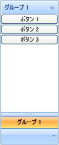

////
|metadata|
{
    "name": "xamoutlookbar-adding-xamoutlookbar-to-your-page",
    "controlName": ["xamOutlookBar"],
    "tags": ["Getting Started"],
    "guid": "db8c7033-be4e-49c8-b0ea-bdbb24fd6428",
    "buildFlags": [],
    "createdOn": "2012-01-30T19:39:54.0561643Z"
}
|metadata|
////

= xamOutlookBar をアプリケーションに追加

== 始める前に

Microsoft® Windows® Presentation Foundation のコントロールと同じパターンを使用して、xamOutlookBar™ を Window に追加できます。このパターンは、Window のメイン コンテンツとしてレイアウト コンテナーを使用し、レイアウト コンテナーの Children コレクションにコントロールを追加することが必要となります。コード ビハインドから参照できるように、XAML のレイアウト コンテナーに名前を付けることが重要です。

== 達成すること

プロシージャ コードまたは XAML を使用して xamOutlookBar を Window に追加します。

完成したプロジェクトを実行すると、以下のスクリーンショットに似た xamOutlookBar コントロールが Window に表示されます。

== 次の手順を実行します

[start=1]
. Microsoft® Windows® Presentation Foundation プロジェクトを作成します。
[start=2]
. 以下の NuGet パッケージ参照をアプリケーションに追加します。

** Infragistics.WPF.OutlookBar

+
NuGet フィードのセットアップと NuGet パッケージの追加の詳細については、link:nuget-feeds.html[NuGet フィード] ドキュメントを参照してください。

[start=3]
. XAML の開始 Window タグ内で xamOutlookBar の XML 名前空間宣言を追加します。コード ビハインドでは、using/Imports のディレクティブが必要です。そうすると、メンバーの完全修飾名を入力する必要がなくなります。

*XAML の場合:*

[source,xaml]
----
xmlns:igOutlookBar="http://infragistics.com/OutlookBar"
----

*Visual Basic の場合:*

[source,vb]
----
Imports Infragistics.Windows.OutlookBar
----

*C# の場合:*

[source,csharp]
----
using Infragistics.Windows.OutlookBar;
----

[start=4]
. Window でデフォルトのグリッド レイアウト パネルに名前を付け、コード ビハインドでそれを参照できます。

*XAML の場合:*

[source,xaml]
----
<Grid Name="layoutRoot">
</Grid>
----

[start=5]
. xamOutlookBar のインスタンスを、layoutRoot グリッド レイアウト パネルに追加します。

.. xamOutlookBar コントロールのインスタンスに名前を付けます。
.. link:{ApiPlatform}outlookbar{ApiVersion}~infragistics.windows.outlookbar.xamoutlookbar.html[HorizontalAlignment] プロパティを Left に設定します。

xamOutlookBar のナビゲーション ペインを縮小すると、グリッド レイアウト パネルはナビゲーション ペインを自動的にセンタリングします。Microsoft® Outlook® のナビゲーション ペインをエミュレートする場合には、この動作は必要ない場合があります。xamOutlookBar のナビゲーション ペインをグリッド レイアウト パネルの端に接続するには、HorizontalAlignment プロパティを Left に設定する、またはグリッド レイアウト コンテナの代わりに DockPanel レイアウト コンテナなどの異なるレイアウト パネルを使用する必要があります。

*XAML の場合:*

[source,xaml]
----
<igOutlookBar:XamOutlookBar Name="xamOutlookBar1" HorizontalAlignment="Left">
    <!-- TODO: OutlookBarGroup オブジェクトをここに追加します -->
</igOutlookBar:XamOutlookBar>
----

InitializeComponent メソッドの後に Window コンストラクターで xamOutlookBar コントロールのインスタンスを作成し、それをグリッドの子コレクションに追加します。

*Visual Basic の場合:*

[source,vb]
----
Dim xamOutlookBar1 As New XamOutlookBar() 
xamOutlookBar1.HorizontalAlignment = HorizontalAlignment.Left
Me.layoutRoot.Children.Add(xamOutlookBar1)
----

*C# の場合:*

[source,csharp]
----
XamOutlookBar xamOutlookBar1 = new XamOutlookBar();
xamOutlookBar1.HorizontalAlignment = HorizontalAlignment.Left;
this.layoutRoot.Children.Add(xamOutlookBar1);
----

[start=6]
. link:{ApiPlatform}outlookbar{ApiVersion}~infragistics.windows.outlookbar.outlookbargroup.html[OutlookBarGroup] オブジェクトを xamOutlookBar のグループ コレクションに追加します。

xamOutlookBar のグループ コレクションのタグを明示的に宣言する必要はありません。

.. link:{ApiPlatform}outlookbar{ApiVersion}~infragistics.windows.outlookbar.outlookbargroup.html[ヘッダー]プロパティ - このプロパティを設定して、グループのヘッダーに値を表示します。
.. link:{ApiPlatform}outlookbar{ApiVersion}~infragistics.windows.outlookbar.outlookbargroup~key.html[キー]プロパティ - このプロパティを設定して、文字列値を使用してグループ コレクションにインデックスを付けます。
.. link:{ApiPlatform}outlookbar{ApiVersion}~infragistics.windows.outlookbar.outlookbargroup~largeimage.html[LargeImage] プロパティ - グループ ヘッダーの横にアイコンを表示するためにこのプロパティを設定します。
.. link:{ApiPlatform}outlookbar{ApiVersion}~infragistics.windows.outlookbar.outlookbargroup~smallimage.html[SmallImage] プロパティ - オーバーフロー領域にある時にグループのアイコンを表示するためにこのプロパティを設定します。このプロパティを設定しない場合、グループがオーバーフロー領域にある時に xamOutlookBar はデフォルトのエンベロープ アイコンを表示します。

*XAML の場合:*

[source,xaml]
----
<igOutlookBar:OutlookBarGroup 
    Header="Group 1" 
    Key="Group1" 
    SmallImage="ReplaceWithYourImage1.jpg" 
    LargeImage="ReplaceWithYourImage2.jpg">
    <!-- TODO: ここにレイアウト パネルを追加します -->
</igOutlookBar:OutlookBarGroup>
----

*Visual Basic の場合:*

[source,vb]
----
Dim group1 As New OutlookBarGroup()
group1.Header = "Group 1"
group1.Key = "Group1"
group1.LargeImage = New BitmapImage(New Uri("ReplaceWithYourImage1.jpg"))
group1.SmallImage = New BitmapImage(New Uri("ReplaceWithYourImage2.jpg"))
xamOutlookBar1.Groups.Add(group1)
----

*C# の場合:*

[source,csharp]
----
OutlookBarGroup group1 = new OutlookBarGroup();
group1.Header = "Group 1";
group1.Key = "Group1";
group1.LargeImage = new BitmapImage(new Uri("ReplaceWithYourImage1.jpg"));
group1.SmallImage = new BitmapImage(new Uri("ReplaceWithYourImage2.jpg"));
xamOutlookBar1.Groups.Add(group1);
----

[start=7]
. OutlookBarGroup オブジェクトの link:{ApiPlatform}outlookbar{ApiVersion}~infragistics.windows.outlookbar.outlookbargroup.html[Content] プロパティを StackPanel のインスタンスに設定します。

*XAML の場合:*

[source,xaml]
----
<StackPanel>
    <!-- 方法: ここにコントロールを追加します -->
</StackPanel>
----

*Visual Basic の場合:*

[source,vb]
----
Dim panel1 As New StackPanel()
group1.Content = panel1
----

*C# の場合:*

[source,csharp]
----
StackPanel panel1 = new StackPanel();
group1.Content = panel1;
----

[start=8]
. StackPanel へのコントロールの追加この例では、3 つのボタン コントロールがグループに追加されます。

*XAML の場合:*

[source,xaml]
----
<Button Content="Button 1" />
<Button Content="Button 2" />
<Button Content="Button 3" />
----

*Visual Basic の場合:*

[source,vb]
----
For i As Integer = 1 To 3 
    Dim btnExample As New Button() 
    btnExample.Content = "Button " + i.ToString() 
    panel1.Children.Add(btnExample) 
Next
----

*C# の場合:*

[source,csharp]
----
for(int i = 1; i <=3; i++)
{
    Button btnExample = new Button();
    btnExample.Content = "Button " + i.ToString();
    panel1.Children.Add(btnExample);
}
----

[start=9]
. プロジェクトを実行します。

== 関連トピック

link:xamoutlookbar-about-xamoutlookbar.html[xamOutlookBar について]

link:xamoutlookbar-using-xamoutlookbar.html[xamOutlookBar の使用]