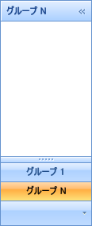

////

|metadata|
{
    "name": "xamoutlookbar-select-a-group",
    "controlName": ["xamOutlookBar"],
    "tags": ["Events","Grouping"],
    "guid": "{9959EAF1-D731-47AB-AC93-1B5FB273A65E}",  
    "buildFlags": [],
    "createdOn": "2012-01-30T19:39:54.0461623Z"
}
|metadata|
////

= グループの選択

エンド ユーザーは、xamOutlookBar™ コントロールのナビゲーション領域またはオーバーフロー領域でヘッダーをクリックするとグループを選択できます。エンド ユーザーがグループを選択すると、メイン コンテンツ領域は選択したグループのコンテンツを表示します。XAML で選択されたグループを定義する、または link:{ApiPlatform}outlookbar{ApiVersion}~infragistics.windows.outlookbar.outlookbargroup.html[OutlookBarGroup] オブジェクトの link:{ApiPlatform}outlookbar{ApiVersion}~infragistics.windows.outlookbar.outlookbargroup~isselected.html[IsSelected] プロパティを True に設定することによってコード ビハインドでグループを動的に選択することも可能です。

以下のコード例は、グループの選択方法を示します。

*XAML の場合:*

----
<igOutlookBar:XamOutlookBar Name="xamOutlookBar1" HorizontalAlignment="Left">
    <igOutlookBar:XamOutlookBar.Groups>
        <igOutlookBar:OutlookBarGroup 
            Header="Group 1"
            Key="group1">
        </igOutlookBar:OutlookBarGroup>
        <!--
        グループ 2
        ...
        グループ n-1
        -->
        <igOutlookBar:OutlookBarGroup 
            Header="Group N"
            Key="groupN"
            IsSelected="True">
        </igOutlookBar:OutlookBarGroup>
    </igOutlookBar:XamOutlookBar.Groups>
</igOutlookBar:XamOutlookBar>
----

*Visual Basic の場合:*

----
Me.xamOutlookBar1.Groups("groupN").IsSelected = True
----

*C# の場合:*

----
this.xamOutlookBar1.Groups["groupN"].IsSelected = true;
----

== 関連トピック

link:xamoutlookbar-about-styling-xamoutlookbar.html[xamOutlookBar のスタイリングについて]

link:xamoutlookbar-add-groups-to-xamoutlookbar.html[グループを xamOutlookBar に追加]

link:xamoutlookbar-add-content-to-a-group.html[コンテンツをグループに追加]

link:xamoutlookbar-collapse-xamoutlookbar.html[xamOutlookBar の縮小]

link:xamoutlookbar-select-a-group.html[グループの選択]