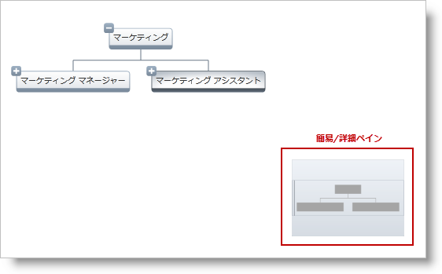
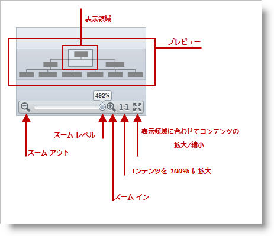

////

|metadata|
{
    "name": "xamoverviewplusdetailpane",
    "controlName": [],
    "tags": ["Getting Started","Navigation","Summaries"],
    "guid": "17c1342a-f82e-443e-a20e-f2195171cd77",  
    "buildFlags": [],
    "createdOn": "2016-05-25T18:21:57.7942661Z"
}
|metadata|
////

= xamOverviewPlusDetailPane

link:{ApiPlatform}datavisualization{ApiVersion}~infragistics.controls.xamoverviewplusdetailpane.html[xamOverviewPlusDetailPane] は、 link:xamorgchart.html[xamOrgChart] や link:xamnetworknode.html[xamNetworkNode] のような link:{ApiPlatform}datavisualization{ApiVersion}~infragistics.controls.surfaceviewer.html[SurfaceViewer] コントロールで使用されるナビゲーション コントロールです。このコントロールは、パンとズーム機能および SurfaceViewer コントロールのコンテンツの概要を提供します。

__   __   __  以下の画像は、ネットワーク ノード レイアウト上でパンとズームを行うための xamOrgChart™ を備えた OverviewPlusDetailPane コントロールを示しています。

図 1: 概要と詳細ペインと xamOrgChart

__   __   __  以下の画像は、ネットワーク ノード レイアウト上でパンとズームを行うための xamNetworkNode™ を備えた OverviewPlusDetailPane コントロール を示しています。

図 2: 概要と詳細ペインと xamNetworkNode

== ユーザー操作と xamOverviewPlusDetailPane の使いやすさ

xamOverviewPlusDetailPane を使用すると、以下を実行できます。

* ズームインとズームアウト
* パンの実行
* サーフェイス ビューアのコンテンツを表示可能領域または 100% に拡大縮小

image::images/xamOverviewPlusDetailPane_03.png[]

図 3: xamOverviewPlusDetailPane の主な機能のグラフィカル表示

image::images/xamOverviewPlusDetailPane_04.png[]

図 4: マウス ポインタをコントロール上に移動するとフル表示される

image::images/xamOverviewPlusDetailPane_05.png[]

図 5: 表示可能領域をクリックしてドラッグするとパンが実行

== xamOverviewPlusDetailPane の配置

概要と詳細ペイン コントロールを配置するには、サーフェイス ビューア コントロールの以下のプロパティを使用します。

* link:{ApiPlatform}datavisualization{ApiVersion}~infragistics.controls.surfaceviewer~horizontaloverviewplusdetailpanealignment.html[HorizontalOverviewPlusDetailPaneAlignment]
* link:{ApiPlatform}datavisualization{ApiVersion}~infragistics.controls.surfaceviewer~verticaloverviewplusdetailpanealignment.html[VerticalOverviewPlusDetailPaneAlignment]
* link:{ApiPlatform}datavisualization{ApiVersion}~infragistics.controls.surfaceviewer~overviewplusdetailpanevisibility.html[OverviewPlusDetailPaneVisibility]

概要と詳細ペインをスタイルするには、 link:{ApiPlatform}datavisualization{ApiVersion}~infragistics.controls.surfaceviewer~overviewplusdetailpanestyle.html[OverviewPlusDetailPaneStyle] プロパティを使用します。

以下のコード・スニペットは、概要と詳細ペイン コントロールに関連した サーフェイス ビューアのプロパティを操作する方法を示します。

== コード例: xamOrgChart

=== 説明

以下のコード例は、 _xamOrgChart_   コントロールで指定されたサーフェイス ビューア プロパティを示しています。

=== コード

*XAML の場合:*

[source,xaml]
----
Code
<ig:XamNetworkNode          
              OverviewPlusDetailPaneVisibility="Visible"
              OverviewPlusDetailPaneStyle="{StaticResource OPDPStyle }"
              HorizontalOverviewPlusDetailPaneAlignment="Center"
              VerticalOverviewPlusDetailPaneAlignment="Bottom">
</ig:XamNetworkNode>
----

== コード例: xamNetworkNode

=== 説明

以下のコード例は、 _xamNetworkNode_   コントロールで指定されたサーフェイス ビューア プロパティを示しています。

=== コード

*XAML の場合:*

[source,xaml]
----
Code
<ig:XamNetworkNode          
              OverviewPlusDetailPaneVisibility="Visible"
              OverviewPlusDetailPaneStyle="{StaticResource OPDPStyle }"
              HorizontalOverviewPlusDetailPaneAlignment="Center"
              VerticalOverviewPlusDetailPaneAlignment="Bottom">
</ig:XamNetworkNode>
----

== 関連コンテンツ

=== トピック

以下のトピックでは、このトピックに関連する情報を提供しています。

[options="header", cols="a,a"]
|====
| *トピック* | *目的* 

|_xamNetworkNode_ を使用した作業の開始
|このトピックは、 link:{ApiPlatform}controls.maps.xamnetworknode{ApiVersion}~infragistics.controls.maps.xamnetworknode_members.html[XamNetworkNode]™ コントロールをアプリケーションに追加する方法を示します。

|_xamOrgChart_ の理解
|このトピックは、 link:{ApiPlatform}controls.maps.xamorgchart{ApiVersion}~infragistics.controls.maps.xamorgchart_members.html[XamOrgChart]™ コントロールを紹介し、その要素と機能を説明します。

|====