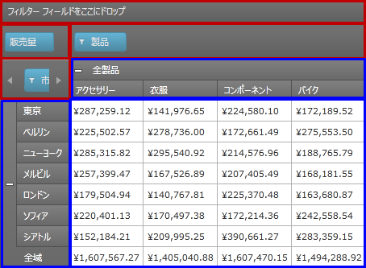

////

|metadata|
{
    "name": "xampivotgrid-component-locking",
    "controlName": ["xamPivotGrid"],
    "tags": ["Grids","How Do I","Layouts","Tips and Tricks","Validation"],
    "guid": "771fa45c-8ccc-48a1-a455-2a81a35d0dae",  
    "buildFlags": [],
    "createdOn": "2016-05-25T18:21:58.2273273Z"
}
|metadata|
////

= コンポーネントのロック

=== 目的

このトピックは、 _xamPivotGrid_™ のロック コンポーネント機能とこの機能が提供するエンドユーザー機能を説明します。

=== 前提条件

以下の表に、このトピックを理解するための前提条件として求められる素材をリストします。

[options="header", cols="a,a"]
|====
|タイプ|コンテンツ

|トピック
|
* link:xampivotgrid-understanding-xampivotgrid.html[xamPivotGrid の概要] 

* link:xampivotgrid-getting-started-with-xampivotgrid.html[xamPivotGrid を使用した作業の開始] 

* link:xampivotgrid-us-assigning-hierarchies-and-measures.html[階層およびメジャーの指定] 

|====

== 概要

=== コンポーネントのロック機能の概要

_xamPivotGrid_   により、行、列、フィルターまたはメジャー エリアの編集を無効にできます。この機能を「コンポーネントのロック機能」と呼びます。この機能は、 _xamPivotGrid_   または  _xamPivotDataSelector_™ のドロップ可能エリアをユーザーが編集できない状態にする場合に便利です。既定のスタイル設定を使用する場合、ロック済みエリアの外観は淡色表示 (グレー表示) になります。以下の図では、行エリアが編集できないよう無効になっています。それらのエリアは、赤で囲んで強調表示しています。

image::images/Locking_Components_(Overview)_1.png[]

既定では、コントロールのコンポーネントは編集できるよう、有効になっています。

行、列、またはメジャーの編集が無効な場合、 _xamPivotGrid_   の行ヘッダー パネル、列ヘッダー パネル、およびデータ セル パネルを視覚的に示すものはありませんが、これらのパネルのドラッグ アンド ドロップは無効になっています。以下の図で、フィルター、メジャー、行および列領域 (赤で強調表示されている) はロックされていますが (ロックされているとして視覚的に示される)、ドラッグ アンド ドロップは、 _xamPivotGrid_   のデータ部分の対応する領域に対しても無効になっており、このための視覚的な表示はありません。

コンポーネントのロック機能は、 link:{ApiPlatform}olap{ApiVersion}~infragistics.olap.datasourcebase~areafieldsettings.html[AreaFieldSettings] クラス オブジェクト内の専用プロパティ (サポートされているエリアごとに 1 つずつ) により管理されています。詳細については、 link:xampivotgrid-componentlocking-lockingunlocking-component-areas.html[コンポーネント エリアのロック/ロック解除]を参照してください。

[[_Styling_of_locked]]
== 関連コンテンツ

=== トピック

以下のトピックでは、このトピックに関連する情報を提供しています。

[options="header", cols="a,a"]
|====
|トピック|目的

| link:xampivotgrid-componentlocking-lockingunlocking-component-areas.html[コンポーネント エリアのロック/ロック解除]
|このトピックは、コード例を使用して、 _xamPivotGrid_ のコンポーネント エリアをロックする、またはロック解除する方法を説明しています。

|====