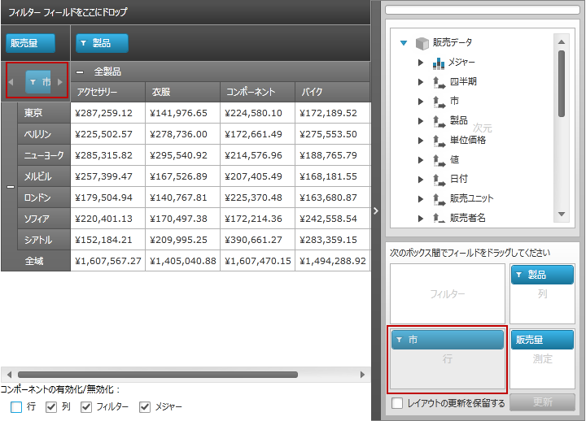

////
|metadata|
{
    "name": "xampivotgrid-componentlocking-lockingunlocking-component-areas",
    "controlName": ["xamPivotGrid"],
    "tags": ["Grids","How Do I","Tips and Tricks"],
    "guid": "6af83be2-7f8d-44cc-93f9-2c8b8b3e82fd",
    "buildFlags": [],
    "createdOn": "2016-05-25T18:21:58.2333295Z"
}
|metadata|
////

= コンポーネント エリアのロック/ロック解除

=== 使用目的

このトピックは、コード例を使用して、 _xamPivotGrid_™ のコンポーネント領域をロック/ロック解除する方法を説明します。

=== 前提条件

以下の表に、このトピックを理解するための前提条件として求められる素材をリストします。

[options="header", cols="a,a"]
|====
|タイプ|コンテンツ

|トピック
|
* link:xampivotgrid-understanding-xampivotgrid.html[xamPivotGrid の概要] 

* link:xampivotgrid-getting-started-with-xampivotgrid.html[xamPivotGrid を使用した作業の開始] 

* link:xampivotgrid-us-assigning-hierarchies-and-measures.html[階層およびメジャーの指定] 

* link:xampivotgrid-component-locking.html[コンポーネントのロック] 

|====

=== このトピックの構成

このトピックには次のセクションがあります。

* <<_Ref320191869,コンポーネント領域のロック/ロック解除 - 概念的概要>>

** <<_Ref320215463,コンポーネント領域のロック/ロック解除の概要>>
** <<_Ref317163245,プロパティ設定>>
** <<_Ref317163255,例>>
** <<_Ref320215478,コード>>

* <<_Ref320015379,コード例: コンポーネント領域のロック/ロック解除>>

** <<_Ref320195473,概要>>
** <<_Ref320195478,プレビュー>>
** <<_Ref320195482,前提条件>>
** <<_Ref320195488,概要>>
** <<_Ref320195492,手順>>

* <<_Ref316548990,関連コンテンツ>>

[[_Ref320015379]]
[[_Ref320191869]]
== コンポーネント領域のロック/ロック解除 - 概念的概要

[[_Ref320215463]]
=== コンポーネント エリアのロック/ロック解除の概要

領域のロック/ロック解除の設定は、Boolean プロパティを含む以下の link:{ApiPlatform}olap{ApiVersion}~infragistics.olap.datasourcebase~areafieldsettings.html[AreaFieldSettings] クラス オブジェクトにより管理されます。

* link:{ApiPlatform}olap{ApiVersion}~infragistics.olap.areafieldsettings~allowrowsediting.html[AllowRowsEditing]
* link:{ApiPlatform}olap{ApiVersion}~infragistics.olap.areafieldsettings~allowcolumnsediting.html[AllowColumnsEditing]
* link:{ApiPlatform}olap{ApiVersion}~infragistics.olap.areafieldsettings~allowfiltersediting.html[AllowFiltersEditing]
* link:{ApiPlatform}olap{ApiVersion}~infragistics.olap.areafieldsettings~allowmeasuresediting.html[AllowMeasuresEditing]

既定では、これらのすべての機能がロック解除されています。(プロパティは  _true_   に設定されています。)

[[_Ref317163245]]

=== プロパティ設定

以下の表は、コンポーネントのロックおよびロック解除に関するタスクと、それらを構成するプロパティ設定の関係を示しています。

[options="header", cols="a,a,a"]
|====
|目的|プロパティ|次に設定

|行エリアのロック
| link:{ApiPlatform}olap{ApiVersion}~infragistics.olap.areafieldsettings~allowrowsediting.html[AllowRowsEditing]
| _false_ 

|列エリアのロック
| link:{ApiPlatform}olap{ApiVersion}~infragistics.olap.areafieldsettings~allowcolumnsediting.html[AllowColumnsEditing]
| _false_ 

|フィルター エリアのロック
| link:{ApiPlatform}olap{ApiVersion}~infragistics.olap.areafieldsettings~allowfiltersediting.html[AllowFiltersEditing]
| _false_ 

|メジャー エリアのロック
| link:{ApiPlatform}olap{ApiVersion}~infragistics.olap.areafieldsettings~allowmeasuresediting.html[AllowMeasuresEditing]
| _false_ 

|行領域のロック解除
| link:{ApiPlatform}olap{ApiVersion}~infragistics.olap.areafieldsettings~allowrowsediting.html[AllowRowsEditing]
| _true_ 

|列エリアのロック解除
| link:{ApiPlatform}olap{ApiVersion}~infragistics.olap.areafieldsettings~allowcolumnsediting.html[AllowColumnsEditing]
| _true_ 

|フィルター エリアのロック解除
| link:{ApiPlatform}olap{ApiVersion}~infragistics.olap.areafieldsettings~allowfiltersediting.html[AllowFiltersEditing]
| _true_ 

|メジャー エリアのロック解除
| link:{ApiPlatform}olap{ApiVersion}~infragistics.olap.areafieldsettings~allowmeasuresediting.html[AllowMeasuresEditing]
| _true_ 

|====

[[_Ref317163255]]

=== 例

以下の設定では、列の編集、およびこの領域にドラッグ アンド ドロップする機能がロックされています。残りの領域はロックされていません。

[options="header", cols="a,a"]
|====
|プロパティ|値

| _AllowRowsEditing_ 
|_true_

| _AllowColumnsEditing_ 
|_false_

| _AllowFiltersEditing_ 
|_true_

| _AllowMeasuresEditing_ 
|_true_

|====

.注:
[NOTE]
====
これらのプロパティそれぞれの既定値は、`true` です。値 `true` の設定は必要なく、デモンストレーションのために表示されているだけです。
====

[[_Ref320215478]]

=== コード

以下のコードは、<<_Ref317163255,Example>> 内で設定を実行します。

*C# の場合:*

[source,csharp]
----
((DataSourceBase)pivotGrid.DataSource).AreaFieldSettings.AllowRowsEditing = true;
((DataSourceBase)pivotGrid.DataSource).AreaFieldSettings.AllowColumnsEditing = false;
((DataSourceBase)pivotGrid.DataSource).AreaFieldSettings.AllowFiltersEditing = true;
((DataSourceBase)pivotGrid.DataSource).AreaFieldSettings.AllowMeasuresEditing = true;
----

*Visual Basic の場合:*

[source,vb]
----
DirectCast(pivotGrid.DataSource, DataSourceBase).AreaFieldSettings.AllowRowsEditing = True
DirectCast(pivotGrid.DataSource, DataSourceBase).AreaFieldSettings.AllowColumnsEditing = False
DirectCast(pivotGrid.DataSource, DataSourceBase).AreaFieldSettings.AllowFiltersEditing = True
DirectCast(pivotGrid.DataSource, DataSourceBase).AreaFieldSettings.AllowMeasuresEditing = True
----

[[_Ref320215493]]
[[_Ref316548990]]
== コンポーネント エリアのロック/ロック解除 - コード例

[[_Ref320195473]]

=== 概要

このコード例では、サンプル データとともに  _xamPivotGrid_   を読み込み、チェック ボックスを使用して、グリッドおよび  _xamPivotDataSelector_™ 上の行、列、フィルター、および測定領域のロックおよびロック解除をプログラムによって有効および無効にしています。

[[_Ref320195478]]

=== プレビュー

以下のスクリーンショットは最終結果のプレビューです。赤色で重なったボックスは、ロック済みコンポーネントを強調表示しています。

[[_Ref320195482]]

=== 前提条件

手順を完了するには、以下が必要です:

* アプリケーション内の SampleFlatDataSourceForLiveUpdate クラス。
* NuGet パッケージの参照:

** Infragistics.WPF.PivotGrid
** Infragistics.WPF.Olap.FlatData
** Infragistics.WPF.Olap.Xmla

.注:
[NOTE]
====
_xamPivotGrid_ コントロールのデータ ソース タイプにより、必要な OLAP NuGet パッケージ参照が決まります。_xamPivotGrid_ コントロールのコンポーネントおよびそのデータ ソースが使用する必要なアセンブリの完全なリストについては、link:developers-guide-deploying-your-application.html[アプリケーションの配備]のトピックを参照してください。
====

[[_Ref320195488]]
=== 概要

このトピックでは、手順を追ってロック可能コンポーネントを実装します。以下はプロセスの概念的概要です。

[start=1]
. 名前空間宣言の追加
[start=2]
. データ ソースの参照
[start=3]
. xamPivotGrid および xamPivotDataSelector コントロールの追加
[start=4]
. データ ソースのバインディング
[start=5]
. ユーザー アクションの処理

[[_Ref320195492]]
=== 手順

以下の手順は、行グループの作成方法を示します。

=== 名前空間宣言を追加します。

*1. 名前空間属性を XAML ソース ファイルの root タグに追加します。*

*XAML の場合:*

[source,xaml]
----
xmlns:ig="http://schemas.infragistics.com/xaml"
xmlns:local="clr-namespace:IGPivotGrid.Controls"
----

*2. コード ビハインドへの**名前空間参照を宣言します。*

*C# の場合:*

[source,csharp]
----
using IGPivotGrid.Controls;
using Infragistics.Olap;
using Infragistics.Olap.Xmla;
----

*Visual Basic の場合:*

[source,vb]
----
Imports IGPivotGrid.Controls
Imports Infragistics.Olap
Imports Infragistics.Olap.Xmla
----

.注:
[NOTE]
====
`IGPivotGrid.Controls` は、`SampleFlatDataSourceForLiveUpdate` クラスが定義される名前空間です。この名前空間は、プロジェクトのどこに `SampleFlatDataSourceForLiveUpdate` クラスを追加するかにより異なります。
====

=== データ ソースを参照します。

*Page.Resources 要素のデータ ソースを参照します。*

*XAML の場合:*

[source,xaml]
----
<Page.Resources>
    <ResourceDictionary>
        <local:SampleFlatDataSourceForLiveUpdate x:Key="FlatDataSource" />            
    </ResourceDictionary>
</Page.Resources>
----

=== xamPivotGrid および xamPivotDataSelector コントロールを追加します。

*1. LayoutRoot グリッドの列レイアウトを定義します。*

*XAML の場合:*

[source,xaml]
----
<Grid.ColumnDefinitions>
    <ColumnDefinition Width="*" />
    <ColumnDefinition Width="Auto" />
</Grid.ColumnDefinitions>
<Grid.RowDefinitions>
    <RowDefinition Height="*" />
    <RowDefinition Height="Auto" />
</Grid.RowDefinitions>
----

*2. xamPivotGrid、オプション*チェック ボックス、および xamPivotDataSelector を追加します。*

DataSource 属性は、Page.Resources で定義される FlatDataSource を参照します。

*XAML の場合:*

[source,xaml]
----
<ig:XamPivotGrid
    x:Name="pivotGrid"
    DataSource="{StaticResource FlatDataSource}" 
    AllowCompactLayout="True"
    BorderThickness="0">
</ig:XamPivotGrid>
<TextBlock Grid.Row="1" 
    Text="{Binding Source={StaticResource Strings}, 
        Path=XPG_EnableDisable_Components}" />
<StackPanel x:Name="SelectorPanel" Grid.Row="1" Orientation="Horizontal" 
                  ScrollViewer.HorizontalScrollBarVisibility="Auto"
                  Margin="5, 15, 5, 5">
    <CheckBox x:Name="RowEditing" IsChecked="True"
        Margin="5" Click="Feature_Click"
        Content="{Binding Source={StaticResource Strings}, Path=XPG_Rows}" />
    <CheckBox x:Name="ColumnsEditing" IsChecked="True"
        Margin="5" Click="Feature_Click"
        Content="{Binding Source={StaticResource Strings}, Path=XPG_Columns}" />
    <CheckBox x:Name="FiltersEditing" IsChecked="True"
        Margin="5" Click="Feature_Click"
        Content="{Binding Source={StaticResource Strings}, Path=XPG_Filters}" />
    <CheckBox x:Name="MeasuresEditing" IsChecked="True"
    Margin="5" Click="Feature_Click"
    Content="{Binding Source={StaticResource Strings}, Path=XPG_Measures}" />
</StackPanel>
<ig:Expander Grid.Column="1" Grid.RowSpan="2" IsExpanded="True">
    <ig:XamPivotDataSelector x:Name="dataSelector" 
        DataSource="{StaticResource FlatDataSource}" />
</ig:Expander>
----

=== データ ソースをバインドします。

*1. コード ビハインドで、呼び出されたメソッド、InitializeComponent の下に Loaded イベントのハンドラーを追加します。*

*C# の場合:*

[source,csharp]
----
public LockableComponents()
{
    InitializeComponent();
    this.Loaded += OnSampleLoaded;
}
----

*Visual Basic の場合:*

[source,vb]
----
Public Sub New()
    InitializeComponent()
    Me.Loaded = OnSampleLoaded
End Sub
----

*2. Loaded イベント ハンドラー内で、データ ソースのスキーマを参照および読み込みます。*

*C# の場合:*

[source,csharp]
----
void OnSampleLoaded(object sender, RoutedEventArgs e)
{
      SampleFlatDataSourceForLiveUpdate dataSource = this.Resources["FlatDataSource"] as SampleFlatDataSourceForLiveUpdate;
      if (dataSource != null)
            dataSource.LoadSchemaAsync();
}
----

*Visual Basic の場合:*

[source,vb]
----
Private Sub OnSampleLoaded(sender As Object, e As RoutedEventArgs)
      Dim dataSource As SampleFlatDataSourceForLiveUpdate = TryCast(Me.Resources("FlatDataSource"), SampleFlatDataSourceForLiveUpdate)
      If dataSource IsNot Nothing Then
            dataSource.LoadSchemaAsync()
      End If
End Sub
----

=== ユーザー アクションを処理します。

コード ビハインドで、CheckBox コントロールの Click イベントのハンドラーを追加します。

*C# の場合:*

[source,csharp]
----
private void Feature_Click(object sender, RoutedEventArgs e)
{
    FrameworkElement element = sender as FrameworkElement;
    CheckBox cb = sender as CheckBox;
    if (element == null || cb == null)
        return;
    switch (element.Name)
    {
        case "RowEditing":
            ((DataSourceBase)pivotGrid.DataSource).AreaFieldSettings.AllowRowsEditing =
                (Boolean)cb.IsChecked;
            break;
        case "ColumnsEditing":
            ((DataSourceBase)pivotGrid.DataSource).AreaFieldSettings.AllowColumnsEditing =
                (Boolean)cb.IsChecked;
            break;
        case "FiltersEditing":
            ((DataSourceBase)pivotGrid.DataSource).AreaFieldSettings.AllowFiltersEditing =
                (Boolean)cb.IsChecked;
            break;
        case "MeasuresEditing":
            ((DataSourceBase)pivotGrid.DataSource).AreaFieldSettings.AllowMeasuresEditing =
                (Boolean)cb.IsChecked;
            break;
      }
}
----

*Visual Basic の場合:*

[source,vb]
----
Private Sub Feature_Click(sender As Object, e As RoutedEventArgs)
    Dim element As FrameworkElement = TryCast(sender, FrameworkElement)
    Dim cb As CheckBox = TryCast(sender, CheckBox)
    If element Is Nothing OrElse cb Is Nothing Then
        Return
    End If
    Select Case element.Name
        Case "RowEditing"
            DirectCast(pivotGrid.DataSource, DataSourceBase).AreaFieldSettings.AllowRowsEditing = DirectCast(cb.IsChecked, [Boolean])
            Exit Select
        Case "ColumnsEditing"
            DirectCast(pivotGrid.DataSource, DataSourceBase).AreaFieldSettings.AllowColumnsEditing = DirectCast(cb.IsChecked, [Boolean])
            Exit Select
        Case "FiltersEditing"
            DirectCast(pivotGrid.DataSource, DataSourceBase).AreaFieldSettings.AllowFiltersEditing = DirectCast(cb.IsChecked, [Boolean])
            Exit Select
        Case "MeasuresEditing"
            DirectCast(pivotGrid.DataSource, DataSourceBase).AreaFieldSettings.AllowMeasuresEditing = DirectCast(cb.IsChecked, [Boolean])
            Exit Select
    End Select
End Sub
----

== 関連コンテンツ

=== トピック

以下のトピックでは、このトピックに関連する情報を提供しています。

[options="header", cols="a,a"]
|====
|トピック|目的

| link:xampivotgrid-component-locking.html[コンポーネントのロック]
|このトピックは、 _xamPivotGrid_™ のコンポーネントのロック機能とそれにより提供されるエンド ユーザー機能を紹介します。

|====