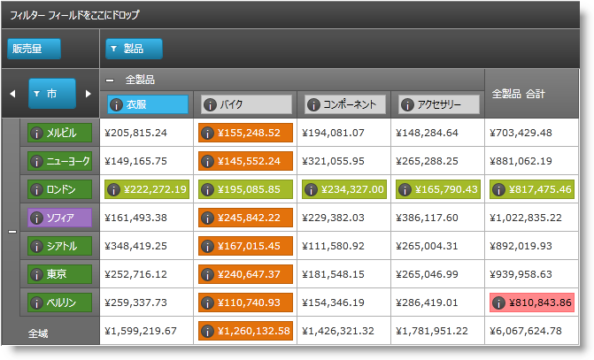

////

|metadata|
{
    "name": "xampivotgrid-customizing-cells-with-templates",
    "controlName": ["xamPivotGrid"],
    "tags": ["Getting Started","Grids","Layouts","Templating"],
    "guid": "bc8e0e82-d985-402d-a861-af3423fe1a57",  
    "buildFlags": [],
    "createdOn": "2016-05-25T18:21:58.2033282Z"
}
|metadata|
////

= テンプレートを使用したセルのカスタマイズ

=== 概要

xamPivotGrid™ コントロールでは、データ セルとヘッダー セルにカスタム `DataTemplates` を指定できます。セルの階層やレベルなどに基づいて、さまざまなセルにさまざまなテンプレートを指定できます。

=== トピック

カスタム `DataTemplates` を適用することによる xamPivotGrid のセルのカスタマイズの詳細については、次のトピックを参照してください。

[options="header", cols="a,a"]
|====
|トピック|目的

| link:xampivotgrid-customizing-cells-with-templates-overview.html[テンプレートを使用したセルのカスタマイズの概要]
|xamPivotGrid コントロールを使用すると、データ セルと、ヘッダー列と行のセルにカスタム データ テンプレートを指定できます。このトピックはこの機能の概要です。

| link:xampivotgrid-customizing-cells-with-templates-procedure-and-code-example.html[テンプレートを使用したセルのカスタマイズ - 手順とコード例]
|このトピックでは、xamPivotGrid セルの内容にカスタム `DataTemplates` を適用することで、セルをカスタマイズする方法について、順を追って説明しています。

| link:xampivotgrid-customizing-cells-with-templates-property-reference.html[テンプレートによるセルのカスタマイズのプロパティ参照]
|これは、xamPivotGrid のセル カスタマイズ機能に関連する最も注意すべきプロパティのリストです。

|====