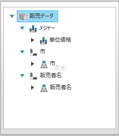

////

|metadata|
{
    "name": "xampivotgrid-dataselector-including-excluding-items-from-the-metadatatree",
    "controlName": ["xamPivotGrid"],
    "tags": ["Data Presentation","Grids","How Do I"],
    "guid": "75d85a4f-fb7d-46b2-a36f-d226782545be",  
    "buildFlags": [],
    "createdOn": "2016-05-25T18:21:58.1542921Z"
}
|metadata|
////

= メタデータ ツリー項目の包含/除外

== トピックの概要

=== 目的

データ ソースを xamPivotDataSelector™ に割り当てる場合、データ ソースのすべての項目 (Measures、Dimensions、Hierarchies など) が自動的にメタデータ ツリーに追加されます。このトピックは、どの項目をメタデータ ツリーに含め、どの項目を含めないか選択する方法を説明します。

=== 前提条件

以下の表に、このトピックを理解するための前提条件として求められるトピックをリストします。

[options="header", cols="a,a"]
|====
|トピック|目的

| link:xampivotgrid-understanding-xampivotgrid.html[xamPivotGrid の概要]
|このセクションは xamPivotGrid コントロールの主要機能について説明します。ここに記載されているトピックでは、アプリケーションで xamPivotGrid コントロールを効果的に使用する方法が説明されています。

| link:xampivotgrid-getting-started-with-xampivotgrid.html[xamPivotGrid を使用した作業の開始]
|このトピックでは、xamPivotGrid™ コントロールを使用して作業を開始する方法について説明するため、このコントロールを {PlatformName} アプリケーションに追加するための手順を順を追って説明しています。

| link:xampivotgrid-dataselector.html[DataSelector]
|このトピックでは xamPivotDataSelector コントロールを紹介します。

|====

=== 本トピックの内容

このトピックには次のセクションがあります。

* <<_Ref319602030,xamPivotDataSelector のメタデータ ツリーへの項目の追加と除外>>

** <<_Ref319602036,概要>>
** <<_Ref319602038,プレビュー>>
** <<_Ref319602040,要件>>
** <<_Ref319602043,概要>>
** <<_Ref319602045,手順>>

* <<_Ref319602047, コード例: xamPivotDataSelector   のメタデータ ツリーへの項目の追加と除外 >>

** <<_Ref319602051,説明>>
** <<_Ref319602054,コード>>

[[_Ref319602030]]
== xamPivotDataSelector のメタデータ ツリーへの項目の追加と除外

[[_Ref319602036]]

=== 概要

どの項目を xamPivotDataSelector のメタデータ ツリーに追加するかは link:{ApiPlatform}controls.grids.xampivotgrid{ApiVersion}~infragistics.controls.grids.xampivotdataselector~datasource.html[DataSource] プロパティに割り当てられているデータ ソースから制御します。これは link:{ApiPlatform}olap{ApiVersion}~infragistics.olap.datasourcebase~metadatatreeitemadding_ev.html[MetadataTreeItemAdding] イベントに加入することで実現します。さらに、 link:{ApiPlatform}olap{ApiVersion}~infragistics.olap.datasourcebase~resetmetadatatree.html[ResetMetadataTree] メソッドが使用できます。

データ選択ウィザードが初期化中の場合、項目がデータ選択ウィザードのメタデータ ツリーに追加される前に必ず `MetadataTreeItemAdding` イベントが発生します。イベントとともに提供されている link:{ApiPlatform}olap{ApiVersion}~infragistics.olap.metadatatreeeventargs_members.html[MetadataTreeEventArgs] インスタンスには、追加中の項目への参照と、項目の追加を中断できる Cancel プロパティが入っています。追加中の link:{ApiPlatform}olap{ApiVersion}~infragistics.olap.metadatatreeeventargs~item.html[Item] を予想し、それをメタデータ ツリーに含めるかどうか判断することとは別に、`MetadataTreeItemAdding` イベントのイベント ハンドラーで、項目を初期化後に展開するかどうか指定することもできます。

初期化後に xamPivotDataSelector のメタデータ ツリーの項目を変更する場合は、`ResetMetadataTree` メソッドを呼び出すことができます。これにより、データ ソースのすべての項目がメタデータ ツリーに再度追加され、項目ごとに再度 `MetadataTreeItemAdding` イベントが発生します。

[[_Ref319602038]]

=== プレビュー

以下のスクリーンショットは xamPivotDataSelector のプレビューです。ここでは、メタデータ ツリーに追加された項目のみ  _AmountOfSale_   メジャーおよび  _Seller_   階層と  _City_   階層になっています。link:salesdatasample.html[SalesDataSample クラス]からのデータ ソースが使用されます。

[[_Ref319602040]]

=== 要件

手順を完了するには、データ ソースとして `SalesDataSample` クラスを備えた xamPivotGrid コントロールと xamPivotDataSelector コントロールが構成された {PlatformName} アプリケーションが必要です。

[[_Ref319602043]]

=== 概要

このトピックでは、ある定義済みの基準を満たす項目のみメタデータ ツリーに追加されている `MetadataTreeItemAdding` イベントのイベント ハンドラーを作成する方法を手順を追って説明します。以下はプロセスの概念的概要です。

1. MetadataTreeItemAdding イベントのイベント ハンドラーの追加。

2. 追加中の項目の検査とその項目を含めるかどうかの判断。

[[_Ref319602045]]

=== 手順

以下の手順は、定義済みの項目のリストのみメタデータ ツリーに追加するために、`MetadataTreeItemAdding` イベントを使用する方法を紹介します。

[start=1]
. MetadataTreeItemAdding イベントのイベント ハンドラーを追加します。

通常は、ページをそのコンストラクターなどに読み込む前にこのイベントに加入します。こうして、xamPivotDataSelector の初期化中に確実にイベントを発行させることができます。

`ResetMetadataTree` メソッドを呼び出す前に、後でいつでもこのイベントに加入することもできます。

[start=2]
. 追加中の項目を検査し、その項目を含めるかどうか判断します。

上記のように、`MetadataTreeItemAdding` イベントの発生とともに提供されるイベント引数には、追加中の実際の項目への参照が含まれています。その link:{ApiPlatform}olap{ApiVersion}~infragistics.olap.hierarchicalitem~itemtype.html[ItemType] プロパティと link:{ApiPlatform}olap{ApiVersion}~infragistics.olap.hierarchicalitem~caption.html[Caption] プロパティの値を期待できますが、これでも項目を含めるかどうか判断するのに十分でない場合は、Hierarchy、Dimension、Level など、基礎となる link:{ApiPlatform}olap{ApiVersion}~infragistics.olap.hierarchicalitem~dataobject.html[DataObject] を期待できます。

[[_Ref319602047]]
== コード例: xamPivotDataSelector のメタデータ ツリーへの項目の追加と除外

[[_Ref319602051]]

=== 説明

以下のコードは、特定の項目のみデータ選択ウィザードのメタデータ ツリーに追加する方法の例です。

[[_Ref319602054]]

=== コード

*C# の場合:*

[source,csharp]
----
Code
using System.Windows.Controls;
using Infragistics.Olap;
using Infragistics.Olap.FlatData;
using Infragistics.Olap.Data;
using Infragistics.Samples.Data.Models;
using System.Linq;
…
// これをページのコンストラクターに配置します。
            ((FlatDataSource)dataSelector.DataSource).MetadataTreeItemAdding += DataSelector_MetadataTreeItemAdding;
…
private static string[] allowedMeasureNames = { "Measures", "AmountOfSale" };
private static string[] allowedDimensionNames = { "[Seller]", "[City]" };
private static string[] allowedHierarchyNames = { "[Seller].[Seller]", "[City].[City]" };
void DataSelector_MetadataTreeItemAdding(object sender, Infragistics.Olap.MetadataTreeEventArgs e)
{
    if (e.Item.ItemType == ItemTypes.Measure &&
        allowedMeasureNames.Contains(e.Item.Caption))
        return;
    if (e.Item.ItemType == ItemTypes.Dimension
        && allowedDimensionNames.Contains(((IDimension)e.Item.DataObject).UniqueName))
    {
        e.Item.ExpandWhenInitialized = true;
        return;
    }
    if (e.Item.ItemType == ItemTypes.UserDefinedHierarchy
        && allowedHierarchyNames.Contains(((IHierarchy)e.Item.DataObject).UniqueName))
        return;
    e.Cancel = true;
}
// メタデータ ツリーをリセットする場合は、以下のメソッドを呼び出します。
// ((DataSourceBase)this.pivotGrid.DataSource).ResetMetadataTree();
----

*Visual Basic の場合:*

[source,vb]
----
Imports System.Windows.Controls
Imports Infragistics.Olap
Imports Infragistics.Olap.FlatData
Imports Infragistics.Olap.Data
Imports Infragistics.Samples.Data.Models
Imports System.Linq
…
' Place this in the constructor of the page.
AddHandler DirectCast(dataSelector.DataSource, FlatDataSource).MetadataTreeItemAdding, AddressOf DataSelector_MetadataTreeItemAdding
…
Private Shared allowedMeasureNames As String() = {"Measures", "AmountOfSale"}
Private Shared allowedDimensionNames As String() = {"[Seller]", "[City]"}
Private Shared allowedHierarchyNames As String() = {"[Seller].[Seller]", "[City].[City]"}
Private Sub DataSelector_MetadataTreeItemAdding(sender As Object, e As Infragistics.Olap.MetadataTreeEventArgs)
      If e.Item.ItemType = ItemTypes.Measure AndAlso allowedMeasureNames.Contains(e.Item.Caption) Then
            Return
      End If
      If e.Item.ItemType = ItemTypes.Dimension AndAlso allowedDimensionNames.Contains(DirectCast(e.Item.DataObject, IDimension).UniqueName) Then
            e.Item.ExpandWhenInitialized = True
            Return
      End If
      If e.Item.ItemType = ItemTypes.UserDefinedHierarchy AndAlso allowedHierarchyNames.Contains(DirectCast(e.Item.DataObject, IHierarchy).UniqueName) Then
            Return
      End If
      e.Cancel = True
End Sub
' If you want to reset the metadata tree and call the following method:
' DirectCast(dataSelector.DataSource, DataSourceBase).ResetMetadataTree()
----
