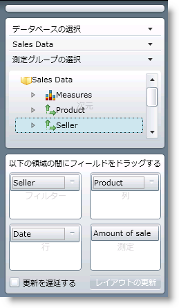

////

|metadata|
{
    "name": "xampivotgrid-dataselector",
    "controlName": ["xamPivotGrid"],
    "tags": ["Getting Started","Grids","How Do I"],
    "guid": "84ad0c36-dcdc-4331-bb6c-ca48b0acfea6",  
    "buildFlags": [],
    "createdOn": "2016-05-25T18:21:58.1482918Z"
}
|metadata|
////

= データ セレクター

== *xamPivotDataSelector について*

xamPivotGrid には xamPivotDataSelector というコントロールがもうひとつ付いています。このコントロールはランタイムでのアプリケーションにおけるデータ操作に大変役立ちます。コントロール名が示すようにこのコントロールの主な目的はエンドユーザーにデータの選択を許可することです。このコントロールの画像を以下に提供します。DataSource (link:xampivotgrid-getting-started-with-xampivotgrid.html[XamPivotGrid で開始]の下の link:xampivotgrid-getting-started-with-xampivotgrid.html[DataSources] 参照) があることを選定として、XamPivotDataSelector は接続先のデータベース (データベースのデータを使用している場合)、データを抽出するキューブそしてメジャーのセットを選択するためのインタラクティブな UI コンポーネントを提供します。これらを選択した時に、すべての使用可能なメジャーのリストとともにそれぞれの階層がついた使用可能なすべてのディメンションでツリーがロードされます。

このツリーと項目は非常に役に立ちます。任意のディメンションを xamPivotGrid コントロールで使用可能な領域のいずれかに選択してドラッグできるからです (行、行ヘッダー、列、列ヘッダー、またはフィルター領域)。メジャー領域にメジャーのひとつをドラッグすることもできますが、データ セル領域にドロップするだけでもかまいません。これはスライス操作を xamPivotGrid コントロールに提供する最も簡単な方法です。xamPivotGrid で階層またはメジャーをそれぞれの領域にドラッグする以外に、xamPivotDataSelector 内の特別な領域が提供されています (上記画像参照)。

関連トピック

link:xampivotgrid-dataselector-including-excluding-items-from-the-metadatatree.html[xamPivotDataSelector のメタデータ ツリーへの項目の包含/除外]