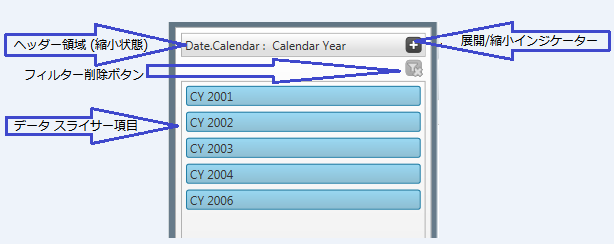
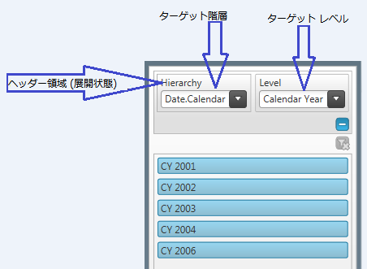

////

|metadata|
{
    "name": "xampivotgrid-dataslicer",
    "controlName": ["xamPivotGrid"],
    "tags": ["Charting","Data Presentation","Getting Started","Grids","How Do I"],
    "guid": "aba1dd96-0078-47f2-bdf3-dcaf28afde1c",  
    "buildFlags": [],
    "createdOn": "2016-05-25T18:21:58.1112837Z"
}
|metadata|
////

= データ スライサー

== 目的

このトピックの目的は、フィルタリング機能の強化されたピボット グリッドの DataSlicer 機能を紹介することにあります。データ スライサにより、列、行およびフィルター領域で選択された階層をピボット グリッドの測定値と併せてフィルタリングできます。

== 本トピックの内容

このトピックには次のセクションがあります。

* <<Configuring,DataSlicer の構成>>
* <<DataBinding,データ バインディング>>
* <<AddingDataSlicer,DataSlicer の追加>>
* <<VisualElementsofDataSlicer,DataSlicer の視覚要素>>

== 前提条件

まず以下のトピックを読む必要があります。

* link:xampivotgrid-getting-started-with-xampivotgrid.html[xamPivotGrid を使用した作業の開始]

== DataSlicer の構成

== データ バインディング

データ バインドについての詳細は、 link:xampivotgrid-binding-data-to-the-xampivotgrid.html[データのバインド] (既存) を参照してください。

== DataSlicer の追加

ピボット グリッド上に表示されるデータは、選択されたスライサー項目および、ピボット グリッドの階層に追加されるフィルターの両方に関係します。

各スライサーは、任意の階層レベルを表示し、操作します。利用可能な階層およびそのレベルについての情報は、XamPivotDataSlicer.SlicerProvider に設定されるインスタンスから取得されます。データ スライサーは、XmlaDataSource と FlatDataSource の両方のインスタンスをサポートします。

*XAML の場合:*

----
<igPivot:XamPivotGrid 
            x:Name="pivotGrid" 
            Grid.Column="1" 
            DataSource="{StaticResource DataSource}" 
            AllowCompactLayout="True">
</igPivot:XamPivotGrid>
<igSlicer:XamPivotDataSlicer
            Grid.Column="0"
            SlicerProvider="{StaticResource DataSource}" 
            TargetHierarchyName="[Date].[Calendar]" 
            TargetLevelIndex="1" 
            SlicerItemsColorScheme="Green" 
            IsHeaderAreaExpanded=">
</igSlicer:XamPivotDataSlicer>
----

== DataSlicer の視覚要素

== 視覚要素表

以下の表は、データ スライサーの異なる視覚要素を説明します。

[options="header", cols="a,a"]
|====
|要素|説明

|ヘッダー領域
|階層名のリストを表示します。

|拡張されたヘッダー領域 

* 階層 

* レベル: 

|階層のターゲット名 

ターゲット名階層のレベルを定義します。 

例: ターゲット階層が年、四半期、月または曜日からなる日付フィールドの場合、レベルは、データ スライス項目が「すべての期間」または「年」など選択的になります。

|[フィルターを削除] トグルボタン
|フィルターされた選択内容を削除するために使用します。フィルタリングは、自動的に項目の選択について設定されます。フィルターを消去するために[フィルターを削除] ボタンをクリック

|項目
|選択された階層内の項目リストを表示します。

|====

以下のスクリーンショットは、IGTheme を使用した DataSlicer を表示します。ユーザー エクスペリエンスを高めるため、各スライサーに異なる色も適用できます。

[NOTE]
====
注: 隣接する、または隣接しない複数の項目を選択するには、 *Ctrl + Click* を押します。すべての適用されたフィルターは、[フィルターを削除] トグルボタンを使用して削除できます。
====

図 SEQ 図 1: ヘッダー領域が折り畳まれた DataSlicer

図 SEQ 図 2: ヘッダー領域が展開された DataSlicer

関連トピック

link:xampivotgrid-getting-started-with-xampivotgrid.html[xamPivotGrid を使用した作業の開始]