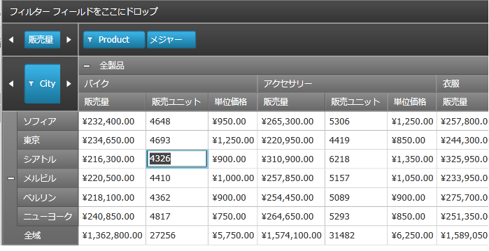

////

|metadata|
{
    "name": "xampivotgrid-editingdatacells",
    "controlName": ["xamPivotGrid"],
    "tags": ["Data Presentation","Drilldown","Getting Started","Grids","How Do I"],
    "guid": "cb575d97-e5d2-4e88-994f-7ac26234e35e",  
    "buildFlags": [],
    "createdOn": "2016-05-25T18:21:58.1042835Z"
}
|metadata|
////

= データ セルの編集

このトピックは link:{ApiPlatform}controls.grids.xampivotgrid{ApiVersion}~infragistics.controls.grids.xampivotgrid.html[xamPivotGrid] コントロール内でデータ セルの編集を有効化し、データ ソースを修正するために編集のイベントを処理する方法を説明します。

このトピックは以下のように構成されています。

* <<Introduction",概要>>
* <<Instructions,方法>>
* <<ValueValidation,値の検証>>

== 概要

セル編集機能によりユーザーは xamPivotGrid コントロールの特定データ セルの値を編集できるようになります。セル編集を有効化するために、開発者は次のステップを実行する必要があります。

* AllowCellEdit プロパティを有効化して xamPivotGrid コントロールのセル編集を有効化します。
* EditableMeasures コレクションで編集が許されているメジャーを指定します。
* CellEdited イベント用のハンドラーでデータのソースを更新し、基本のデータ ソースが xamPivotGrid コントロールのデータ セル内での変更を反映するようにします。

[NOTE]
====
*注:* データ セルを編集後、その値はセル配列または xamPivotGrid コントロールの DataSource.Result プロパティに保存されます。CellEdited イベントが発生した時にセルの値を作成する基本のデータ ソースに値を配布し戻すのはユーザーの責任です (説明セクションの最後のステップを参照してください)。
====

セル編集機能が有効化された場合、セル編集を実行するためにユーザーは xamPivotGrid コントロールのデータ セルをクリックしてセル編集モードに入り、その後特定のデータ セルに新しい値を入力します。

図 1 - データ セルの編集モードでの xamPivotGrid コントロール

表 1 - xamPivotGrid コントロールのセル編集機能で使用されるモジュールのリスト

[options="header", cols="a,a"]
|====
|コンポーネント|説明

|xamPivotGrid.EditorStyle
|編集モード時に Infragistics.Controls.Grids.PivotCell でデータを表示する System.Windows.Controls.TextBox に適用される System.Windows.Style を取得または設定します。

|xamPivotGrid.EditSettings
|セル値の編集の整理についてすべてのプロパティを制御する Infragistics.Controls.Grids.EditSettings オブジェクトへの参照を取得または設定します。

|EditSettings
|xamPivotGrid コントロールの編集機能用の設定を含むオブジェクトを表します。

|EditSettings.AllowCellEdit
|xamPivotGrid コントロールで編集が許可されるかどうかを示す値を取得または設定します。

|EditSettings.EditableMeasures
|xamPivotGrid コントロールで編集が許可されるキューブ内で Infragistics.Olap.Data.IMeasure オブジェクトのコレクションを取得または設定します。

|EditSettings.EditFormatedValue
|セルの書式設定付き値または基本のセル データをテキスト エディターに使用するかどうかを示す値を取得または設定します。

|CellEdited
|ユーザーが xamPivotGrid コントロールの特定セルの編集を終えたことを示す Infragistics.Controls.Grids.PivotCell が編集モードを終了した後に発生するイベントです。

|CellEditing
|エンドユーザーが xamPivotGrid コントロールの特定セルの編集を開始したことを示す Infragistics.Controls.Grids.PivotCell が編集モードを終了する前に発生するイベントです。

|PivotCellEditingEventArgs
|Infragistics.Controls.Grids.PivotCell が編集されるときに必要な情報を含むクラスを表します。

|PivotCellEditedEventArgs
|Infragistics.Controls.Grids.PivotCell が編集を終えたときに必要な情報を含むクラスを表します。

|====

== 方法

このセクションは xamPivotGrid コントロール内でデータ セルの編集を有効化し、データ ソースを修正するために編集のイベントを処理する方法の手順を提供します。

[NOTE]
====
*注:* 以下は項目ソースとして SalesDataSample および xamPivotGrid コントロールの DataSource として FlatDataSourceを使用する例です。このデータ ソースに xamPivotGrid コントロールをバインディングする点については「xamPivotGrid を使用した作業の開始」というトピックに説明されています。
====

[start=1]
. AllowCellEdit プロパティを使用して xamPivotGrid コントロールのセル編集を有効化します。

*XAML の場合:*

----
<ig:XamPivotGrid x:Name="PivotGrid" >
    <ig:XamPivotGrid.EditSettings>
        <ig:EditSettings AllowCellEdit="True" EditableMeasures=""/>
    </ig:XamPivotGrid.EditSettings>
</ig:XamPivotGrid>
----

*Visual Basic の場合:*

----
Imports Infragistics.Controls.Grids
Imports Infragistics.Olap
...
Me.PivotGrid.EditSettings = New EditSettings()
Me.PivotGrid.EditSettings.AllowCellEdit = True
----

*C# の場合:*

----
using Infragistics.Controls.Grids;
using Infragistics.Olap;
...
this.PivotGrid.EditSettings = new EditSettings();
this.PivotGrid.EditSettings.AllowCellEdit = true;
----

[start=2]
. EditableMeasures コレクションで編集が許されているメジャーを指定します。この構成はコード ビハインドでのみ使用可能です。

[NOTE]
====
*注:* メジャーの名前はデータ ソースによって異なり、編集可能なメジャーを追加するためにデータ ソースに一致する次のロジックを更新しなければなりません。
====

*Visual Basic の場合:*

----
Imports System.Collections.Specialized
Imports Infragistics.Olap
Imports Infragistics.Controls.Grids
...
' メジャーがデータ ソースで作成された時に編集可能なメジャーを追加
AddHandler Me.PivotGrid.DataSource.Measures.CollectionChanged, AddressOf OnMeasuresCollectionChanged
...
Private Sub OnMeasuresCollectionChanged(sender As Object, e As NotifyCollectionChangedEventArgs)
  Select Case e.Action
    Case NotifyCollectionChangedAction.Add
        For Each mvm As IMeasureViewModel In e.NewItems
            If mvm.Caption <> "Amount of sale" Then
                 Me.pivotGrid.EditSettings.EditableMeasures.Add(mvm.Measure)
            End If
            If mvm.Caption = "Unit price" Then
                 Me.pivotGrid.DataSource.SetMeasureAggregator(DirectCast(mvm, IMeasureViewModel), AggregationHelper.GetDefaultAverageAggregator(GetType(Double)))
            End If
        Next
        Exit Select
    Case NotifyCollectionChangedAction.Remove
        For Each mvm As IMeasureViewModel In e.OldItems
            Me.pivotGrid.EditSettings.EditableMeasures.Remove(mvm.Measure)
        Next
    Exit Select
  End Select
End Sub
----

*C# の場合:*

----
using System.Collections.Specialized;
using Infragistics.Olap;
using Infragistics.Controls.Grids;
...
// メジャーがデータ ソースで作成された時に編集可能なメジャーを追加
this.PivotGrid.DataSource.Measures.CollectionChanged += OnMeasuresCollectionChanged;
...
void OnMeasuresCollectionChanged(object sender, NotifyCollectionChangedEventArgs e)
{
    switch (e.Action)
    {
        case NotifyCollectionChangedAction.Add:
            foreach (IMeasureViewModel mvm in e.NewItems)
            {
                if (mvm.Caption != "Amount of sale")
                    this.pivotGrid.EditSettings.EditableMeasures.Add(mvm.Measure);
                if (mvm.Caption == "Unit price")
                {
                    this.pivotGrid.DataSource.SetMeasureAggregator(
                        (IMeasureViewModel)mvm,
                        AggregationHelper.GetDefaultAverageAggregator(typeof(double))
                    );
                }
            }
            break;
        case NotifyCollectionChangedAction.Remove:
            foreach (IMeasureViewModel mvm in e.OldItems)
            {
                this.pivotGrid.EditSettings.EditableMeasures.Remove(mvm.Measure);
            }
            break;
    }
}
----

[start=3]
. CellEdited イベント用のハンドラーでデータのソースを更新し、基本のデータ ソースが xamPivotGrid コントロールのデータ セル内での変更を反映するようにします。

*Visual Basic の場合:*

----
Imports Infragistics.Samples.Data.Models  ' SalesDataSamples  
Imports Infragistics.Olap.Data
Imports Infragistics.Olap.FlatData
...
AddHandler Me.PivotGrid.CellEdited, AddressOf OnPivotGridCellEdited
...
Private Sub OnPivotGridCellEdited(sender As Object, e As PivotCellEditedEventArgs)
   Dim newValue As Double = [Double].Parse(e.EditedValue.ToString())
   Dim indexes As List(Of Integer) = DirectCast(Me.PivotGrid.DataSource, FlatDataSource).GetCellItemsIndexes(TryCast(e.Cell.Data, ICell))
   If e.Measure.Caption = "Units sold" Then
      Dim sale As Sale
      For Each index As Integer In indexes
         sale = TryCast(DirectCast(Me.PivotGrid.DataSource, FlatDataSource).GetRecord(index), Sale)
         If sale IsNot Nothing Then
            sale.NumberOfUnits = 0
         End If
      Next
      sale = TryCast(DirectCast(Me.PivotGrid.DataSource, FlatDataSource).GetRecord(indexes(0)), Sale)
      If sale IsNot Nothing Then
         sale.NumberOfUnits = CInt(Math.Truncate(newValue))
      End If
   Else
      For Each index As Integer In indexes
         Dim sale As Sale = TryCast(DirectCast(Me.PivotGrid.DataSource, FlatDataSource).GetRecord(index), Sale)
         If sale IsNot Nothing Then
            sale.UnitPrice = newValue
         End If
      Next
   End If
   Me.PivotGrid.DataSource.RefreshGrid()
End Sub
----

*C# の場合:*

----
using Infragistics.Samples.Data.Models;  // SalesDataSample  
using Infragistics.Olap.Data;
using Infragistics.Olap.FlatData;
...
this.PivotGrid.CellEdited += OnPivotGridCellEdited;
...
void OnPivotGridCellEdited(object sender, PivotCellEditedEventArgs e)
{
    double newValue = Double.Parse(e.EditedValue.ToString());
    List<int> indexes = ((FlatDataSource)this.PivotGrid.DataSource)
        .GetCellItemsIndexes(e.Cell.Data as ICell);
    if (e.Measure.Caption == "Units sold")
    {
        Sale sale;
        foreach (int index in indexes)
        {
            sale = ((FlatDataSource)this.PivotGrid.DataSource).GetRecord(index) as Sale;
            if (sale != null) sale.NumberOfUnits = 0;
        }
        sale = ((FlatDataSource)this.PivotGrid.DataSource).GetRecord(indexes[0]) as Sale;
        if (sale != null) sale.NumberOfUnits = (int)newValue;
    }
    else
    {
        foreach (int index in indexes)
        {
            Sale sale = ((FlatDataSource)this.PivotGrid.DataSource).GetRecord(index) as Sale;
            if (sale != null) sale.UnitPrice = newValue;
        }
    }
    this.PivotGrid.DataSource.RefreshGrid();
}
----

== 値の検証

xamPivotGrid コントロールのデータ セルにエンドユーザーが入力できる値を制限したい場合があります。これは CellEditing イベントが発生した時に値の検証を行うことで可能になります。

image::images/Editing_Data_Cells_02.png[]

図 2 - ユーザー入力の検証を行う xamPivotGrid コントロール

以下はデータ セルの編集を 0 から 10000 の間の値に制限する例です。独自のデータ検証ルールを追加し、以下に示したものと同様に実装することができます。

[start=1]
. ユーザー入力の検証を行う ValueValidation クラスを追加します。

[NOTE]
====
*注:* 以下のコードは、エンドユーザーが整数型の値を表示するデータ セルを変更することを前提としています。これを変更し、異なるデータ タイプの検証を実装することができます。
====

*Visual Basic の場合:*

----
Imports System.Windows.Controls
Imports System.Globalization
...
''' 

''' Value プロパティが正しい値をもっているかどうかをチェックする検証ルールをオーバーライドするオブジェクトを表す。
''' 

Public Class ValueValidation
    Inherits ValidationRule
    Public Property Value() As Object
        Get
            Return _value
        End Get
        Set
            _value = Value
        End Set
    End Property
    Private _value As Object
    Public Property Min() As Integer
        Get
            Return _min
        End Get
        Set
            _min = Value
        End Set
    End Property
    Private _min As Integer
    Public Property Max() As Integer
        Get
            Return _max
        End Get
        Set
            _max = Value
        End Set
    End Property
    Private _max As Integer
    Public Overrides Function Validate(value As Object, cultureInfo As CultureInfo) As ValidationResult
        Dim result As String = ValidateValue(value)
        Return New ValidationResult(result Is Nothing, result)
    End Function
    Public Function ValidateValue(value As Object) As String
        If String.IsNullOrEmpty(DirectCast(value, [String])) Then
            Return "Value cannot be null!"
        End If
        Try
            Dim newValue As Integer = Int32.Parse(DirectCast(value, [String]))
            If (newValue < Me.Min) OrElse (newValue > Me.Max) Then
                Return "Value is out of the range: " & Me.Min & " - " & Me.Max & "."
            End If
        Catch e As Exception
            Return "Value has illegal characters or " + e.Message
        End Try
        Return Nothing
    End Function
End Class
----

*C# の場合:*

----
using System.Windows.Controls;
using System.Globalization;
...
/// 

/// Value プロパティが正しい値をもっているかどうかをチェックする検証ルールをオーバーライドするオブジェクトを表す。
/// 

public class ValueValidation : ValidationRule 
{
    public object Value { get; set; }
    public int Min { get; set; }
    public int Max { get; set; }
    public override ValidationResult Validate(object value, CultureInfo cultureInfo)
    {
        string result = ValidateValue(value);
        return new ValidationResult(result == null, result);
    }
    public string ValidateValue(object value)
    {
        if (string.IsNullOrEmpty((String)value))
        {
            return "Value cannot be null!";
        }
        try
        {
            int newValue = Int32.Parse((String)value);
            if ((newValue < this.Min) || (newValue > this.Max))
            {
                return "Value is out of the range: " + this.Min + " - " + this.Max + ".";
            }
        }
        catch (Exception e)
        {
            return "Value has illegal characters or " + e.Message;
        }
        return null;
    }
}
----

[start=2]
. xamPivotGrid コントロールの CellEditing イベントに関する検証エラーの扱いを実装します。

[NOTE]
====
*注:* このコードは、メジャーのデータ セルまたは SalesDataSamples ソースによって反映される所定の製品が販売された個数を表示するデータ列のユーザー入力に対する検証を追加します。データのソースは異なる名前と値タイプをもつことができるため、必要に応じて次のロジックを更新できます。
====

*Visual Basic の場合:*

----
Imports System.Windows.Controls
Imports Infragistics.Controls.Grids
...
AddHandler Me.PivotGrid.CellEditing, AddressOf OnPivotGridCellEditing
...
Private Sub OnPivotGridCellEditing(sender As Object, e As PivotCellEditingEventArgs)
    If e.Measure.Name = "NumberOfUnits" Then
        Dim evh As EventHandler(Of ValidationErrorEventArgs) = AddressOf OnValueValidationError
        Validation.AddErrorHandler(Me, evh)
        Dim obj As New ValueValidation() With { _
            Key .Value = e.EditedValue _
        }
        Dim b As New Binding("Value")
        b.Source = obj
        b.ValidationRules.Add(New ValueValidation() With { _
            Key .Min = 0, _
            Key .Max = 10000 _
        })
        b.ValidatesOnDataErrors = InlineAssignHelper(b.ValidatesOnExceptions, InlineAssignHelper(b.NotifyOnValidationError, True))
        e.Editor.SetBinding(TextBox.TextProperty, b)
        e.Editor.GetBindingExpression(TextBox.TextProperty).UpdateSource()
        ' ここかまたは OnValueValidationError エラーハンドラーで検証エラーを取り扱う
        If Validation.GetHasError(e.Editor) Then
            e.Cancel = True
            Dim errors As ReadOnlyObservableCollection(Of ValidationError) = Validation.GetErrors(e.Editor)
            For Each [error] As var In errors
                ' ユーザーに各検証エラーについて通知
                Dim message As String = "Invalid value detected: " & Convert.ToString(e.Editor.Text)
                message += Environment.NewLine + [error].ErrorContent
                MessageBox.Show(message, "Validation Error", MessageBoxButton.OK)
            Next
        End If
        Validation.RemoveErrorHandler(Me, evh)
    End If
End Sub
Private Sub OnValueValidationError(sender As Object, e As ValidationErrorEventArgs)
    If e.Action = ValidationErrorEventAction.Added Then
        ' ユーザーに検証エラーについて通知
        Dim message As String = e.[Error].ErrorContent.ToString()
        MessageBox.Show(message, "Validation Error", MessageBoxButton.OK)
    End If
End Sub
----

*C# の場合:*

----
using System.Windows.Controls;
using Infragistics.Controls.Grids;
...
this.PivotGrid.CellEditing += OnPivotGridCellEditing;
...
private void OnPivotGridCellEditing(object sender, PivotCellEditingEventArgs e)
{
    if (e.Measure.Name == "NumberOfUnits")  
    {
        EventHandler<ValidationErrorEventArgs> evh = OnValueValidationError;
        Validation.AddErrorHandler(this, evh);
        ValueValidation obj = new ValueValidation { Value = e.EditedValue };
        Binding b = new Binding("Value");
        b.Source = obj;
        b.ValidationRules.Add(new ValueValidation { Min = 0, Max = 10000 });   
        b.ValidatesOnDataErrors = b.ValidatesOnExceptions = b.NotifyOnValidationError = true;
        e.Editor.SetBinding(TextBox.TextProperty, b);
        e.Editor.GetBindingExpression(TextBox.TextProperty).UpdateSource();
        // ここかまたは OnValueValidationError エラーハンドラーで検証エラーを取り扱う
        if (Validation.GetHasError(e.Editor))
        {
            e.Cancel = true;
            ReadOnlyObservableCollection<ValidationError> errors = Validation.GetErrors(e.Editor);
            foreach (var error in errors)
            {
                // ユーザーに各検証エラーについて通知
                string message = "Invalid value detected: " + e.Editor.Text;
                message += Environment.NewLine + error.ErrorContent;
                MessageBox.Show(message, "Validation Error", MessageBoxButton.OK);
            }
        }
        Validation.RemoveErrorHandler(this, evh);
    }
}
private void OnValueValidationError(object sender, ValidationErrorEventArgs e)
{
    if (e.Action == ValidationErrorEventAction.Added)
    {
        // ユーザーに検証エラーについて通知
        string message = e.Error.ErrorContent.ToString();
        MessageBox.Show(message, "Validation Error", MessageBoxButton.OK);
    }
}
----

関連トピック

link:xampivotgrid-getting-started-with-xampivotgrid.html[xamPivotGrid を使用した作業の開始]

link:xampivotgrid-binding-data-to-the-xampivotgrid.html[データを xamPivotGrid にバインド]

link:xampivotgrid-us-selection-and-cell-interaction.html[選択およびセルの操作]