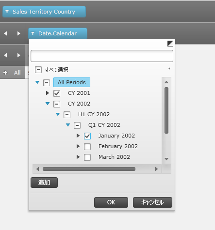
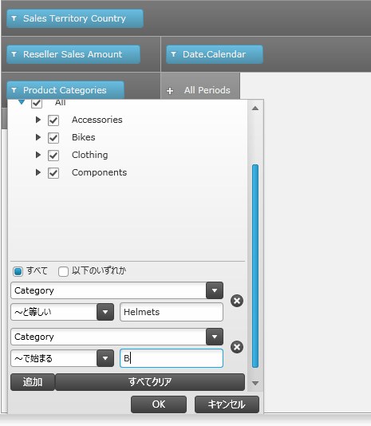

////

|metadata|
{
    "name": "xampivotgrid-excel-style-filtering-overview-and-user-functionality",
    "controlName": ["xamPivotGrid"],
    "tags": ["Drilldown","Filtering","Grids","How Do I"],
    "guid": "d7ee9ed5-cf33-4119-85d6-c01fac49be79",  
    "buildFlags": [],
    "createdOn": "2016-05-25T18:21:58.2643296Z"
}
|metadata|
////

= Excel スタイル フィルタリングの概要とユーザー機能 (xamPivotGrid、xamPivotDataSelector)

== トピックの概要

=== 目的

このトピックでは、 _xamPivotGrid_™/ _xamPivotDataSelector_™ コントロールの Microsoft®-Excel® スタイル フィルタリング機能とそのユーザー機能および操作を紹介します。

=== 前提条件

このトピックを理解するためには、以下のトピックを理解しておく必要があります。

[options="header", cols="a,a"]
|====
|トピック|目的

| link:xampivotgrid-understanding-xampivotgrid.html[xamPivotGrid の概要]
|このトピックでは、 _xamPivotGrid_ コントロールとその主要機能を紹介します。

| link:xampivotgrid-getting-started-with-xampivotgrid.html[xamPivotGrid を使用した作業の開始]
|このトピックでは、 _xamPivotGrid_ コントロールを使用して作業を開始する方法について説明するため、このコントロールを Silverlight アプリケーションに追加するための手順を順を追って説明しています。

| link:xampivotgrid-dataselector.html[DataSelector]
|このトピックでは、 _xamPivotDataSelector_ コントロールを紹介します。

|====

=== 本トピックの内容

このトピックには次のセクションがあります。

* <<_Ref332113295, Excel スタイル フィルタリング機能の概要 >>

** <<_Ref333605487,Excel スタイル フィルタリング機能の概要>>
** <<_Ref333605491,Excel スタイル機能の機能表>>

* <<_Ref332113308, Excel スタイル フィルタリングのユーザー インターフェイスの使用 >>

** <<_Ref333605544,検索>>
** <<_Ref333605551,ラベル フィルタリング>>
** <<_Ref333605575,値フィルタリング>>

* <<_Ref333605609, フィルタリング節の参照 >>

** <<_Ref333604852,ラベル フィルタリング節の参照表>>
** <<_Ref333604853,値フィルタリング節の参照表>>

* <<_Ref332113339, 関連コンテンツ >>

[[_Ref332113295]]
== Excel スタイル フィルタリング機能の概要

[[_Ref333605487]]

=== Excel スタイル フィルタリング機能の概要

Excel スタイル フィルタリング (12.2 リリースで導入) によってユーザーは、_xamPivotGrid_ で MS Excel PivotTables と似た値およびラベルフィルタリングを追加できます(もちろん、行、列、フィルターの階層のためにフィルター メンバー ツリーからフィルター メンバーを手動 (またはコード) で選択/選択を解除することによって、実行することも可能です)。

アプリケーションに link:{ApiPlatform}controls.grids.xampivotgrid{ApiVersion}~infragistics.controls.grids.xampivotgrid_members.html[XamPivotGrid] コントロールまたは link:{ApiPlatform}controls.grids.xampivotgrid{ApiVersion}~infragistics.controls.grids.xampivotdataselector_members.html[XamPivotDataSelector] コントロールがある限り、 link:{ApiPlatform}olap.xmla{ApiVersion}~infragistics.olap.xmla.xmladatasource_members.html[XmlaDataSource] またはこれから派生した任意のクラスから Excel スタイル フィルタリングをデータに適用できます。

[[_Ref333605491]]

=== Excel スタイル機能の機能表

以下の表は、Excel スタイル フィルタリング機能の特定の機能をリストし、それぞれを簡単に説明します。

[options="header", cols="a,a"]
|====
|機能|説明

|検索
|Excel スタイル フィルタリングの検索によってユーザーは階層のすべてのメンバーを検索できます。ユーザーが検索テキスト ボックスにテキストを入力すると、キャプションが入力されたテキストを含むすべてのメンバーが選択され、残りすべては選択が解除されます。検索は大文字と小文字を区別しません。

|ラベル フィルタリング
|ラベル フィルタリングは MS Excel PivotTables のラベル フィルタリングに似ています。これによってユーザーは、メンバーのキャプションのフィルター条件を追加することによって特定レベルのメンバーをフィルタリングできます。ユーザーは複数の条件を追加して、選択状態にするためにメンバー キャプションがすべての条件を満たす必要があるのか、それとも少なくとも 1 つの条件を満たせばいいのかを指定できます。ラベル フィルタリングは大文字と小文字を区別しません。

|値フィルタリング
|値フィルタリングは MS Excel PivotTables の値フィルタリングに似ています。メジャーごとに、ユーザーは階層の任意のレベルで合計の値に対して複数のフィルター条件を適用できます。

|====

[[_Ref332113308]]
== Excel スタイル フィルタリングのユーザー インターフェイスの使用

[[_Ref332113323]]

=== 検索

追加された階層またはメジャーのフィルター アイコン (image:Images/xamPivotGrid_FilterIcon.png[]) をクリックすると、Excel スタイル フィルタリング ダイアログが表示します。階層では、ダイアログの上部分、メンバー ツリーの上に、検索テキスト ボックスがあります。ユーザーがこのフィールドにテキストを入力すると、メンバーツリー全体が検索され、キャプション (ラベル) にユーザーが入力した文字列を含むメンバーが選択されます。検索条件に合致する子を持つメンバーは展開されます。すべての残りのメンバーは縮小され選択が解除された状態になります。

以下の画像は、ユーザーの検索文字列にしたがってフィルタリングされる階層を示します。

[[_Ref332113326]]

=== ラベル フィルタリング

ラベル フィルタリングは、フィルター条件が階層のメンバーのキャプションに適用されるという点で検索機能に似ています。ところが、検索はメンバー ツリー全体に対して実行されますが、これらのラベル フィルター条件は階層の単一レベルのメンバーに定義されます。たとえば、以下の図では、最初のラベル フィルターは Product Categories の Category レベルのメンバーのみに適用されます。

階層の高度なフィルター ダイアログが表示されると、一番下に [追加] ボタンがあります。このボタンは複数のラベル フィルタリングを階層に適用します。複数の条件が定義されると、選択状態にするためにメンバー キャプションがすべての条件を満たす必要があるのか、それとも少なくとも 1 つの条件を満たせばいいのかを指定するオプションが提供されます(デフォルトで、条件の論理演算は _AND_ で、これはすべての条件を満たさなければならないことを意味します)。

ユーザーが検索テキスト ボックスに入力すると実行される検索と異なり、ラベル フィルタリング条件はフィルター ダイアログの OK ボタンを押すと適用されます。

.注:
[NOTE]
====
フィルター条件は OK ボタンを押す前にメンバー ツリー (および選択された子) で選択状態になっているメンバーのみに適用されます。
====

ラベル フィルタリングは指定された階層のメンバーのラベル (表示されるキャプション) に適用される 1 つ以上の条件で構成されます。これらの条件を満たさないメンバーは結果のスライスに含まれません。ラベル フィルタリングの作成では、個別または組み合わせ (つまり式を形成する) で適用可能なさまざまな節があります。使用可能な節のリストは、<<_Ref333604852,ラベル フィルタリング節の参照表>>を参照してください。

[[_Ref332113332]]

=== 値フィルタリング

メジャーのための高度なフィルター ダイアログが表示されると、ユーザーはメジャーの値にフィルター条件を入力できます。各条件は、行または列として追加された階層のそれぞれのレベルで選択されたメジャーの合計値に適用されます。たとえば、以下の画像では、Reseller Sales Amount メジャーのために 2 つのフィルターが定義されています。最初のフィルターは  _Product Categories_   階層の Category レベルの合計に適用されます。同様に、2 番目のフィルターは Date.Calendar 階層の Calendar Year レベルの合計値に適用されます。

image::images/xamPivotGrid_Advanced_Filtering_Overview_and_User_Functionality_03.png[]

.注:
[NOTE]
====
メジャーで値フィルタリングを追加するためには、行と列に追加されるすべての階層は総合計を含む必要があります。
====

.注:
[NOTE]
====
階層の特定のレベルに追加できるのは 1 つの一番上/一番下のフィルターだけです。
====

ラベルの値フィルターは指定された階層のレベルでメジャーの合計値に適用される 1 つ以上の条件で構成されます。これらの条件を満たさない値は結果のスライスに含まれません。値フィルタリングの作成では、個別または組み合わせで適用可能なさまざまな節があります。使用可能な節のリストは、<<_Ref333604853,値フィルタリング節の参照表>>を参照してください。

[[_Ref333605609]]
== フィルタリング節の参照

[[_Ref333604852]]

=== ラベル フィルタリング節の参照表

以下の表はラベル フィルタリング式の節を説明します。

.注:
[NOTE]
====
条件は大文字と小文字を区別しません。
====

[options="header", cols="a,a"]
|====
| *フィルター節* | *説明* 

|等しい
|フィルター文字列で指定されたのと同じキャプションを持つメンバーを返します。

|等しくない
|指定されたフィルター文字列と等しくないキャプションのメンバーを返します。

|～で始まる
|指定されたフィルター文字列で始まるキャプションのメンバーを返します。

|～始まらない
|指定されたフィルター文字列で始まらないキャプションのメンバーを返します。

|～で終わる
|指定されたフィルター文字列で終わるキャプションのメンバーを返します。

|～で終わらない
|指定されたフィルター文字列で終わらないキャプションのメンバーを返します。

|含む
|指定されたフィルター文字列を含むキャプションのメンバーを返します。

|含まない
|指定されたフィルター文字列で含まないキャプションのメンバーを返します。

|より大きい
|指定された文字列をメンバーのキャプションと辞書的に比較し、指定されたフィルター文字列よりも厳密に大きいキャプションのメンバーを返します。

|以上
|指定された文字列をメンバーのキャプションと辞書的に比較し、指定されたフィルター文字列より大きいまたは等しいキャプションのメンバーを返します。

|より小さい
|指定された文字列をメンバーのキャプションと辞書的に比較し、指定されたフィルター文字列よりも厳密に小さいキャプションのメンバーを返します。

|以下
|指定された文字列をメンバーのキャプションと辞書的に比較し、指定されたフィルター文字列より小さいまたは等しいキャプションのメンバーを返します。

|====

[[_Ref333604853]]

=== 値フィルタリング節の参照表

以下の表は値フィルタリング式の節を説明します。

.注:
[NOTE]
====
説明で、 _n_   はユーザーによって入力された実際の値を表します。
====

[options="header", cols="a,a"]
|====
| *フィルター節* | *説明* 

|上位の項目
|指定されたレベルにある最高の _n_ 値を返します。

|上位の割合
|選択されたレベルの総合計の最低の _n%_ を構成する最高値を返します。

|上位の合計
|_n_ 以上の合計を持つ選択されたレベルからの最高値を返します。

|下位の項目
|指定されたレベルにある最低の _n_ 値を返します。

|下位の割合
|選択されたレベルの総合計の最低の _n%_ を構成する最低値を返します。

|下位の合計
|_n_ 以上の合計を持つ選択されたレベルからの最低値を返します。

|等しい
|_n_ に等しい選択されたレベルの値を持つ項目を返します。

|より大きい
|選択されたレベルの値が _n_ よりも厳密に大きいすべての項目を返します。

|以上
|選択されたレベルの値が _n_ に等しいまたはよりも大きいすべての項目を返します。

|より小さい
|選択されたレベルの値が _n_ よりも厳密に小さいすべての項目を返します。

|以下
|選択されたレベルの値が _n_ に等しいまたはよりも小さいすべての項目を返します。

|====

[[_Ref332113339]]
== 関連コンテンツ

このトピックについては、以下のトピックも参照してください。

[options="header", cols="a,a"]
|====
|トピック|目的

| link:xampivotgrid-us-filtering.html[フィルタリング]
|このトピックでは、 _xamPivotGrid_ でフィルタリングを使用する方法について説明しています。

| link:xampivotgrid-enabling-advanced-filtering.html[Excel スタイル フィルタリングを有効にする (xamPivotGrid、xamPivotDataSelector)]
|このトピックでは、 _xamPivotGrid_ / _xamPivotDataSelector_ コントロールの Excel スタイル フィルタリング機能を有効にする方法を説明します。

|====
